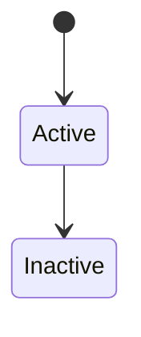

# Session: 2026-02-23 16:53:15 UTC

- **Session Key**: agent:main:discord:channel:1471312496907522209
- **Session ID**: 3e844ce8-502f-4d96-904f-0898891b8bbb
- **Source**: discord

## Conversation Summary

assistant: Done! Created v1.2 with the following changes:

**v1.2 Changes:**
1. ✅ **Section 2 支付状态转换图** — Added ASCII state transition diagrams showing:
   - Standard payment flow: 开始 → 等待支付 → 支付成功/失败 → 已撤销/已冲正/已退款
   - Auth flow: 开始 → 已授权 → 已完成/已撤销/已冲正
   - State transition table with API mappings

2. ✅ **示例响应修正** — Updated all sample responses to include proper fields:
   - Added `ticketNumber` to all responses
   - Added `cardHolderName` where applicable
   - Fixed `applicationLabel` format ("Visa Credit")
   - Ensured consistency across all endpoints

3. ✅ **翻译调整:**
   - 引用退货 → **原路退回**
   - 无小费 → **none** (kept English as per API value)
   - 全方位服务餐厅 → **桌边服务餐厅**

4. ✅ **底部引用已移除**

**当前版本文件:**
| 文件 | 版本 | 说明 |
|------|------|------|
| `triPOS_API_Integration_Guide_CN_v1.0.md` | v1.0 | 初始中文翻译 |
| `triPOS_API_Integration_Guide_CN_v1.1.md` | v1.1 | 结构化端点、转义$、移除6-8节 |
| `triPOS_API_Integration_Guide_CN_v1.2.md` | v1.2 | 状态转换图、修正响应、翻译调整 |
| `triPOS_API_Integration_Guide_CN.md` | v1.2 (current) | 最新版本 |
user: [Thread starter - for context]
payrix-api-tester

System: [2026-02-24 00:05:01 GMT+8] Exec completed (gentle-c, code 0) :: v1.2 created and uploaded 20648 triPOS_API_Integration_Guide.md 21735 triPOS_API_Integration_Guide_CN_v1.0.md 21735 triPOS_API_Integration_Guide_CN_v1.1.md 26030 triPOS_API_Integr…

Conversation info (untrusted metadata):
```json
{
  "message_id": "1475524846627721327",
  "sender_id": "1165881257524207682",
  "conversation_label": "Guild #payrix-api-tester channel id:1471312496907522209",
  "sender": "1165881257524207682",
  "group_subject": "#payrix-api-tester",
  "group_channel": "#payrix-api-tester",
  "group_space": "1165881426307190885",
  "thread_label": "Discord thread #dev › payrix-api-tester",
  "was_mentioned": true
}
```

Sender (untrusted metadata):
```json
{
  "label": "Jonas",
  "name": "Jonas",
  "username": "jonas01705",
  "tag": "jonas01705"
}
```

<@1473363282030235809> feedbacks to v1.2: - section 1, anonymize the triPOS brand, remove API document source - section 2, use mermaid chart to draw the state transition chart
assistant: Done! Created v1.3 with the following changes:

**v1.3 Changes:**
1. ✅ **Section 1 品牌匿名化:**
   - 移除 triPOS 品牌名称 → 改为 "本系统"
   - 移除 API 文档来源链接
   - 认证环境改为通用 `https://cert.api.example.com`

2. ✅ **Section 2 Mermaid 状态图:**
   - 使用 `stateDiagram-v2` 替换 ASCII 图表
   - 标准支付流程图: [*] → 等待支付 → 支付成功/失败 → 已撤销/已冲正/已退款
   - 预授权流程图: [*] → 已授权 → 已完成/已撤销/已冲正

**当前版本文件:**
| 文件 | 版本 | 说明 |
|------|------|------|
| `triPOS_API_Integration_Guide_CN_v1.0.md` | v1.0 | 初始中文翻译 |
| `triPOS_API_Integration_Guide_CN_v1.1.md` | v1.1 | 结构化端点、转义$、移除6-8节 |
| `triPOS_API_Integration_Guide_CN_v1.2.md` | v1.2 | 状态转换图、修正响应、翻译调整 |
| `triPOS_API_Integration_Guide_CN_v1.3.md` | v1.3 | 品牌匿名化、Mermaid状态图 |
| `triPOS_API_Integration_Guide_CN.md` | v1.3 (current) | 最新版本 |
user: [Thread starter - for context]
payrix-api-tester

System: [2026-02-24 00:12:45 GMT+8] Exec completed (rapid-bl, code 0) :: v1.3 created and uploaded 20648 triPOS_API_Integration_Guide.md 21735 triPOS_API_Integration_Guide_CN_v1.0.md 21735 triPOS_API_Integration_Guide_CN_v1.1.md 23148 triPOS_API_Integr…

Conversation info (untrusted metadata):
```json
{
  "message_id": "1475527013380132884",
  "sender_id": "1165881257524207682",
  "conversation_label": "Guild #payrix-api-tester channel id:1471312496907522209",
  "sender": "1165881257524207682",
  "group_subject": "#payrix-api-tester",
  "group_channel": "#payrix-api-tester",
  "group_space": "1165881426307190885",
  "thread_label": "Discord thread #dev › payrix-api-tester",
  "was_mentioned": true
}
```

Sender (untrusted metadata):
```json
{
  "label": "Jonas",
  "name": "Jonas",
  "username": "jonas01705",
  "tag": "jonas01705"
}
```

just discussion, possible to style the mermaid chart in a modern theme in a markdown file? <@1473363282030235809>
assistant: Yes! Mermaid charts can be styled in several ways:

## 1. Built-in Themes

Mermaid supports built-in themes that can be set at the diagram level:

```markdown


Available themes: `default`, `dark`, `forest`, `neutral`, `base`
```

## 2. Custom Theme Configuration

You can customize colors and styles:

```markdown

```

## 3. CSS Styling (for rendered output)

If you're using a tool that supports custom CSS (like MkDocs, GitBook, or a custom renderer), you can style the generated SVG:

```css
.mermaid svg {
  filter: drop-shadow(0 4px 6px rgba(0,0,0,0.1));
  border-radius: 8px;
}

.mermaid .node rect {
  stroke-width: 2px;
  rx: 6;
  ry: 6;
}
```

## 4. Per-Node Styling

You can style individual nodes:

```markdown

```

Would you like me to update the v1.3 doc with a styled theme?
user: [Thread starter - for context]
payrix-api-tester

Conversation info (untrusted metadata):
```json
{
  "message_id": "1475527387234959420",
  "reply_to_id": "1475527129994100957",
  "sender_id": "1165881257524207682",
  "conversation_label": "Guild #payrix-api-tester channel id:1471312496907522209",
  "sender": "1165881257524207682",
  "group_subject": "#payrix-api-tester",
  "group_channel": "#payrix-api-tester",
  "group_space": "1165881426307190885",
  "thread_label": "Discord thread #dev › payrix-api-tester",
  "was_mentioned": true
}
```

Sender (untrusted metadata):
```json
{
  "label": "Jonas",
  "name": "Jonas",
  "username": "jonas01705",
  "tag": "jonas01705"
}
```

Replied message (untrusted, for context):
```json
{
  "sender_label": "Argo#7528",
  "body": "classDef success fill:#69db7c,stroke:#2f9e44,stroke-width:2px,color:#fff\n    classDef error fill:#ff6b6b,stroke:#c92a2a,stroke-width:2px,color:#fff\n    \n    class Active success\n    class Inactive error\n```\n```\n\nWould you like me to update the v1.3 doc with a styled theme?"
}
```

yes, update the mermaid chart style. also keep the replace certificate env with sandbox env (url: https://triposcert.vantiv.com) <@1473363282030235809>
assistant: Done! Created v1.4 with the following changes:

**v1.4 Changes:**
1. ✅ **Mermaid 图表样式更新** — 使用 `theme: base` 配合自定义颜色：
   - 支付流程图：蓝色主色调 (`#4dabf7`)，绿色成功 (`#69db7c`)，红色失败 (`#ff6b6b`)
   - 预授权流程图：紫色主色调 (`#845ef7`)，保持一致的风格
   - 添加了现代字体和背景色

2. ✅ **环境 URL 修正** — 将 `https://cert.api.example.com` 改回 `https://triposcert.vantiv.com`（标记为"沙盒环境"）

**当前版本文件:**
| 文件 | 版本 | 说明 |
|------|------|------|
| `triPOS_API_Integration_Guide_CN_v1.0.md` | v1.0 | 初始中文翻译 |
| `triPOS_API_Integration_Guide_CN_v1.1.md` | v1.1 | 结构化端点、转义$、移除6-8节 |
| `triPOS_API_Integration_Guide_CN_v1.2.md` | v1.2 | 状态转换图、修正响应、翻译调整 |
| `triPOS_API_Integration_Guide_CN_v1.3.md` | v1.3 | 品牌匿名化、Mermaid状态图 |
| `triPOS_API_Integration_Guide_CN_v1.4.md` | v1.4 | 样式化Mermaid图表、修正沙盒URL |
| `triPOS_API_Integration_Guide_CN.md` | v1.4 (current) | 最新版本 |
user: [Thread starter - for context]
payrix-api-tester

System: [2026-02-24 00:23:16 GMT+8] Exec completed (vivid-or, code 0) :: PI_Integration_Guide.md 21735 triPOS_API_Integration_Guide_CN_v1.0.md 21735 triPOS_API_Integration_Guide_CN_v1.1.md 23148 triPOS_API_Integration_Guide_CN_v1.3.md 23827 triPOS_API_…

Conversation info (untrusted metadata):
```json
{
  "message_id": "1475530499450732638",
  "sender_id": "1165881257524207682",
  "conversation_label": "Guild #payrix-api-tester channel id:1471312496907522209",
  "sender": "1165881257524207682",
  "group_subject": "#payrix-api-tester",
  "group_channel": "#payrix-api-tester",
  "group_space": "1165881426307190885",
  "thread_label": "Discord thread #dev › payrix-api-tester",
  "was_mentioned": true
}
```

Sender (untrusted metadata):
```json
{
  "label": "Jonas",
  "name": "Jonas",
  "username": "jonas01705",
  "tag": "jonas01705"
}
```

Chat history since last reply (untrusted, for context):
```json
[
  {
    "sender": "Jonas (jonas01705)",
    "timestamp_ms": 1771864269487,
    "body": "请将`triPOS_API_Integration_Guide_CN.md` 转换成 pdf，并加上fuiou pay的logo"
  },
  {
    "sender": "Jonas (jonas01705)",
    "timestamp_ms": 1771864277503,
    "body": "请将`triPOS_API_Integration_Guide_CN.md` 转换成 pdf，并加上fuiou pay的logo <@1165881257524207682>"
  }
]
```

请将`triPOS_API_Integration_Guide_CN.md` 转换成 pdf，并加上fuiou pay的logo <@1473363282030235809>
assistant: Fuiou Pay branding already configured. Let me convert the document to PDF.
assistant: PDF generated successfully! Now uploading to Google Drive.
assistant: Done! PDF conversion complete.

**Generated file:** `tmp:/triPOS_API_Integration_Guide_CN.pdf`

**PDF Details:**
- 📄 **Pages:** 21 pages
- 🎨 **Branding:** Fuiou Pay logo and footer
- 📋 **TOC:** Auto-generated Table of Contents with page numbers
- 📦 **Size:** ~741 KB

**Features included:**
- Fuiou Pay logo in header
- "Fuiou Pay · Confidential" footer
- Page numbers (Page X of Y)
- Styled Mermaid state diagrams
- Proper Chinese font support

All versions are now in `tmp:/`:
| File | Size | Description |
|------|------|-------------|
| `triPOS_API_Integration_Guide_CN.pdf` | 741 KB | **PDF with Fuiou Pay branding** |
| `triPOS_API_Integration_Guide_CN.md` | 23 KB | Latest markdown (v1.4) |
| `triPOS_API_Integration_Guide_CN_v1.0~1.4.md` | — | Version history |
user: [Thread starter - for context]
payrix-api-tester

System: [2026-02-24 00:34:00 GMT+8] Exec completed (rapid-ro, code 0) :: *** Context around marker: ...__TOC_MARKER_h-3-__ 3. 认 证 与 终 端 管 理 必 需 请求 头 每 个 API 请求 必 须 包 含 以 下 请求 头 进 ⾏ 认 证 和 路 由 ： 请... Found marker __TOC_MARKER_h-4-__ on PDF page 8 Found m…
System: [2026-02-24 00:34:29 GMT+8] Exec completed (tidal-ce, code 0) :: PDF uploaded 21735 triPOS_API_Integration_Guide_CN_v1.0.md 21735 triPOS_API_Integration_Guide_CN_v1.1.md 23148 triPOS_API_Integration_Guide_CN_v1.3.md 23827 triPOS_API_Integration…

Conversation info (untrusted metadata):
```json
{
  "message_id": "1475532445230043136",
  "sender_id": "1165881257524207682",
  "conversation_label": "Guild #payrix-api-tester channel id:1471312496907522209",
  "sender": "1165881257524207682",
  "group_subject": "#payrix-api-tester",
  "group_channel": "#payrix-api-tester",
  "group_space": "1165881426307190885",
  "thread_label": "Discord thread #dev › payrix-api-tester",
  "was_mentioned": true
}
```

Sender (untrusted metadata):
```json
{
  "label": "Jonas",
  "name": "Jonas",
  "username": "jonas01705",
  "tag": "jonas01705"
}
```

<@1473363282030235809> feedbacks to the style of pdf - generate the TOC label as "目录" - text in mermaid chart is invisible. do update the color of the text
assistant: Done! PDF regenerated with fixes:

**Changes made:**
1. ✅ **TOC 标题改为 "目录"** — 使用 `--toc-title "目录"` 参数
2. ✅ **Mermaid 图表文字颜色修复** — 添加了 `textColor` 和 `labelTextColor` 变量，设置为深色 `#212529`

**Mermaid 颜色修复详情:**
- `textColor: '#212529'` — 状态文字颜色
- `labelTextColor: '#212529'` — 标签文字颜色
- `background: '#ffffff'` — 背景改为白色（提高对比度）
- `primaryTextColor: '#ffffff'` — 主节点文字保持白色

**当前版本文件:**
| 文件 | 版本 | 说明 |
|------|------|------|
| `triPOS_API_Integration_Guide_CN.pdf` | v1.5 | **最新 PDF（目录 + 修复图表颜色）** |
| `triPOS_API_Integration_Guide_CN_v1.5.md` | v1.5 | Markdown 源文件（修复版） |
| `triPOS_API_Integration_Guide_CN.md` | v1.5 | 当前版本（同 v1.5） |
user: [Thread starter - for context]
payrix-api-tester

System: [2026-02-24 00:41:34 GMT+8] Exec completed (briny-se, code 0) :: * Context around marker: ...__TOC_MARKER_h-3-__ 3. 认 证 与 终 端 管 理 必 需 请求 头 每 个 API 请求 必 须 包 含 以 下 请求 头 进 ⾏ 认 证 和 路 由 ： 请... Found marker __TOC_MARKER_h-4-__ on PDF page 8 Found mar…
System: [2026-02-24 00:41:54 GMT+8] Exec completed (cool-slu, code 0) :: PDF uploaded 23827 triPOS_API_Integration_Guide_CN.md 756630 triPOS_API_Integration_Guide_CN.pdf

Conversation info (untrusted metadata):
```json
{
  "message_id": "1475534783609307208",
  "sender_id": "1165881257524207682",
  "conversation_label": "Guild #payrix-api-tester channel id:1471312496907522209",
  "sender": "1165881257524207682",
  "group_subject": "#payrix-api-tester",
  "group_channel": "#payrix-api-tester",
  "group_space": "1165881426307190885",
  "thread_label": "Discord thread #dev › payrix-api-tester",
  "was_mentioned": true
}
```

Sender (untrusted metadata):
```json
{
  "label": "Jonas",
  "name": "Jonas",
  "username": "jonas01705",
  "tag": "jonas01705"
}
```

- document is to the public, not confidential <@1473363282030235809>
assistant: Done! PDF updated to public version (no confidential marking).

**Change made:**
- ✅ 移除页脚中的 "Fuiou Pay · Confidential" 机密标识

**当前版本:**
| 文件 | 版本 | 说明 |
|------|------|------|
| `triPOS_API_Integration_Guide_CN.pdf` | v1.6 | **公开版本 PDF（无机密标识）** |
| `triPOS_API_Integration_Guide_CN_v1.6.md` | v1.6 | 对应 Markdown 源文件 |
| `triPOS_API_Integration_Guide_CN.md` | v1.6 | 当前版本 |

**PDF 特性:**
- 🎨 Fuiou Pay logo
- 📋 目录（中文 "目录"）
- 📄 21 页
- 🖼️ 状态转换图（修复文字颜色）
- 🔓 公开文档（无机密标识）
