# Mermaid Advanced Cheatsheet

Quick reference for advanced Mermaid patterns beyond basics.

---

## Advanced Flowchart Features

### Custom Styling with classDef

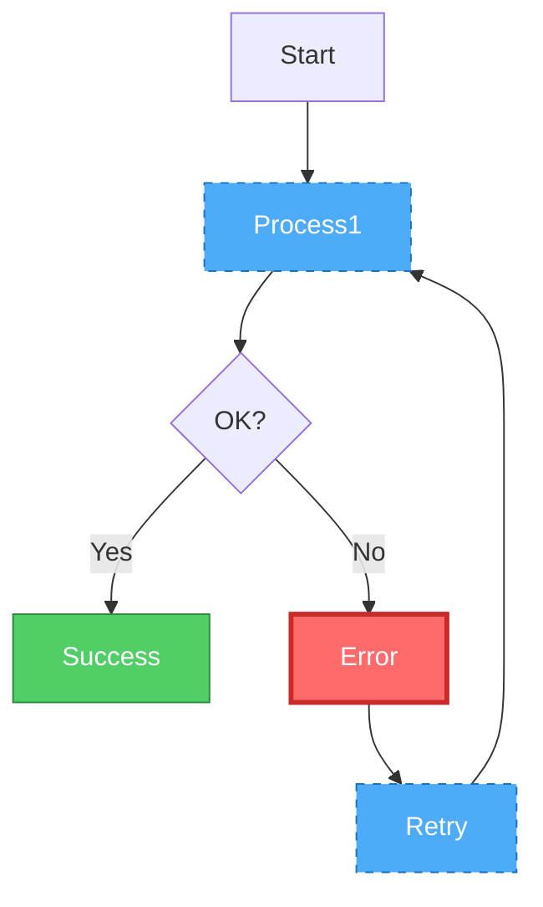
```mermaid
flowchart TD
    Start --> Process1 --> Decision{OK?}
    Decision -->|Yes| Success
    Decision -->|No| Error
    Error --> Retry --> Process1

    classDef errorStyle fill:#ff6b6b,stroke:#c92a2a,color:#fff,stroke-width:3px
    classDef successStyle fill:#51cf66,stroke:#2b8a3e,color:#fff
    classDef processStyle fill:#4dabf7,stroke:#1971c2,color:#fff,stroke-dasharray: 5 5

    class Error errorStyle
    class Success successStyle
    class Process1,Retry processStyle
```

### Multiple Subgraphs with Custom Direction

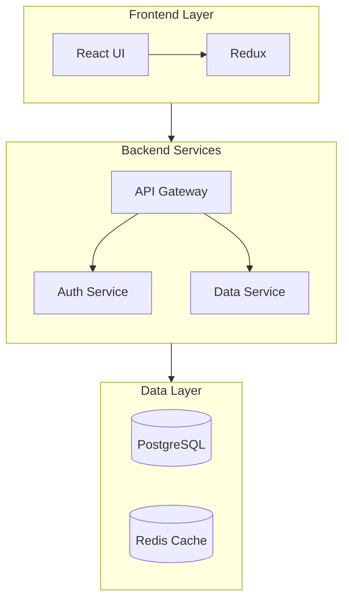
```mermaid
flowchart TB
    subgraph Frontend ["Frontend Layer"]
        direction LR
        UI[React UI]
        State[Redux]
        UI --> State
    end

    subgraph Backend ["Backend Services"]
        direction TB
        API[API Gateway]
        Auth[Auth Service]
        Data[Data Service]
        API --> Auth
        API --> Data
    end

    subgraph Database ["Data Layer"]
        direction LR
        Postgres[(PostgreSQL)]
        Redis[(Redis Cache)]
    end

    Frontend --> Backend
    Backend --> Database
```

### Interactive Links

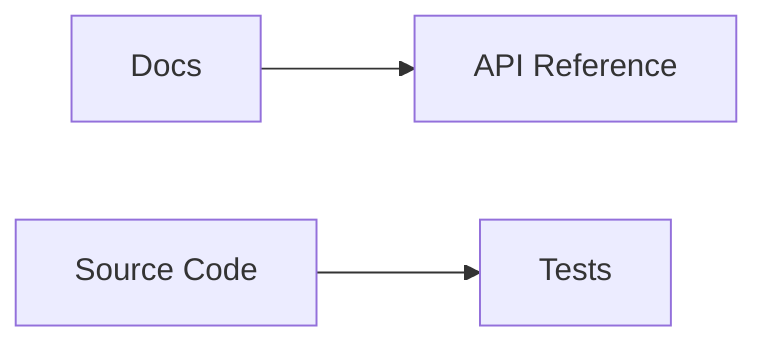
```mermaid
flowchart LR
    A[Docs] --> B[API Reference]
    C[Source Code] --> D[Tests]

    click A "https://docs.example.com" "Open Documentation"
    click B href "https://api.example.com" "API Docs"
    click C call handleClick() "View Source"
```

### Complex Edge Styling

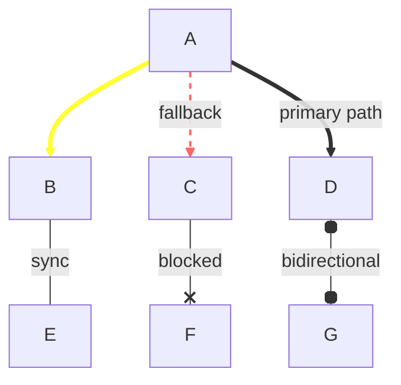
```mermaid
flowchart TD
    A --> B
    A -.->|"fallback"| C
    A ==>|"primary path"| D
    B ---|"sync"| E
    C --x|"blocked"| F
    D o--o|"bidirectional"| G

    linkStyle 0 stroke:#ff3,stroke-width:4px
    linkStyle 1 stroke:#f66,stroke-width:2px,stroke-dasharray: 5 5
```

---

## Advanced Sequence Diagrams

### Loops, Alternatives, and Parallel

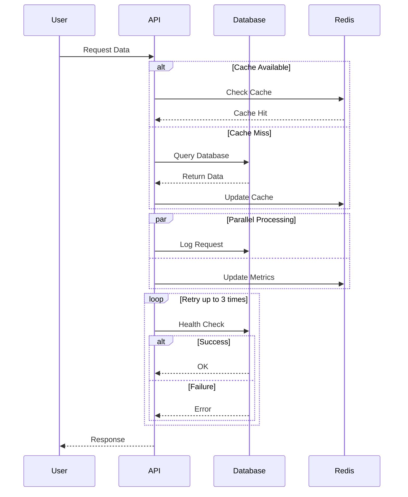
```mermaid
sequenceDiagram
    participant U as User
    participant A as API
    participant DB as Database
    participant Cache as Redis

    U->>A: Request Data

    alt Cache Available
        A->>Cache: Check Cache
        Cache-->>A: Cache Hit
    else Cache Miss
        A->>DB: Query Database
        DB-->>A: Return Data
        A->>Cache: Update Cache
    end

    par Parallel Processing
        A->>DB: Log Request
    and
        A->>Cache: Update Metrics
    end

    loop Retry up to 3 times
        A->>DB: Health Check
        alt Success
            DB-->>A: OK
        else Failure
            DB-->>A: Error
        end
    end

    A-->>U: Response
```

### Critical Regions and Breaks

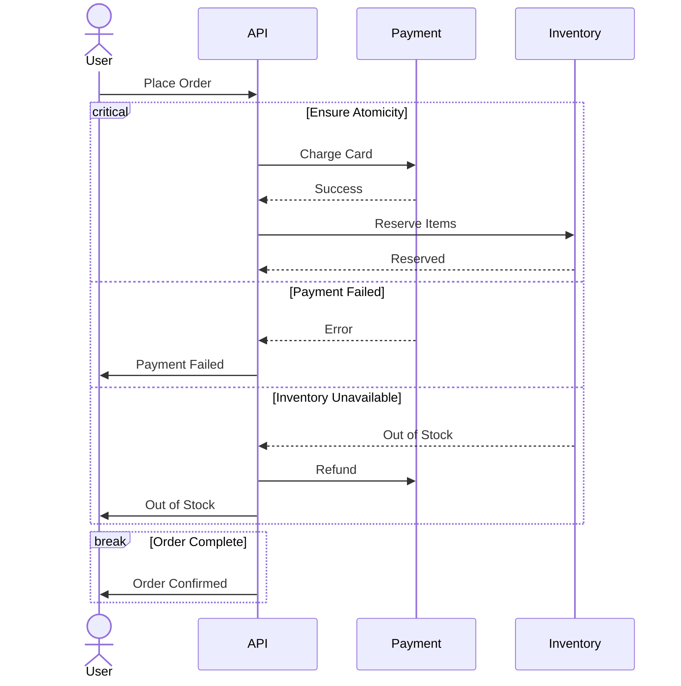
```mermaid
sequenceDiagram
    actor User
    participant API
    participant Payment
    participant Inventory

    User->>API: Place Order

    critical Ensure Atomicity
        API->>Payment: Charge Card
        Payment-->>API: Success
        API->>Inventory: Reserve Items
        Inventory-->>API: Reserved
    option Payment Failed
        Payment-->>API: Error
        API->>User: Payment Failed
    option Inventory Unavailable
        Inventory-->>API: Out of Stock
        API->>Payment: Refund
        API->>User: Out of Stock
    end

    break Order Complete
        API->>User: Order Confirmed
    end
```

### Backgrounds and Notes

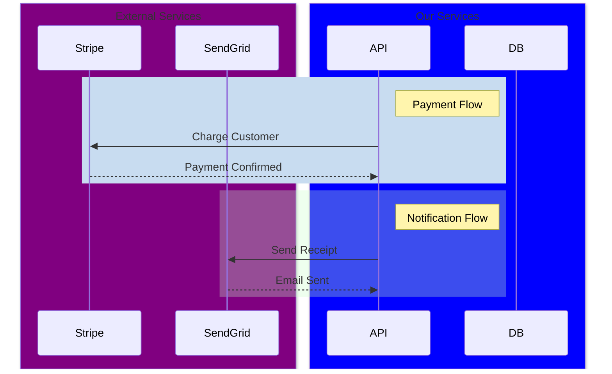
```mermaid
sequenceDiagram
    box Purple External Services
        participant Stripe
        participant SendGrid
    end

    box Blue Our Services
        participant API
        participant DB
    end

    rect rgb(200, 220, 240)
        note right of API: Payment Flow
        API->>Stripe: Charge Customer
        Stripe-->>API: Payment Confirmed
    end

    rect rgba(200, 255, 200, 0.3)
        note right of API: Notification Flow
        API->>SendGrid: Send Receipt
        SendGrid-->>API: Email Sent
    end
```

---

## Advanced ER Diagrams

### Complex Relationships with Attributes

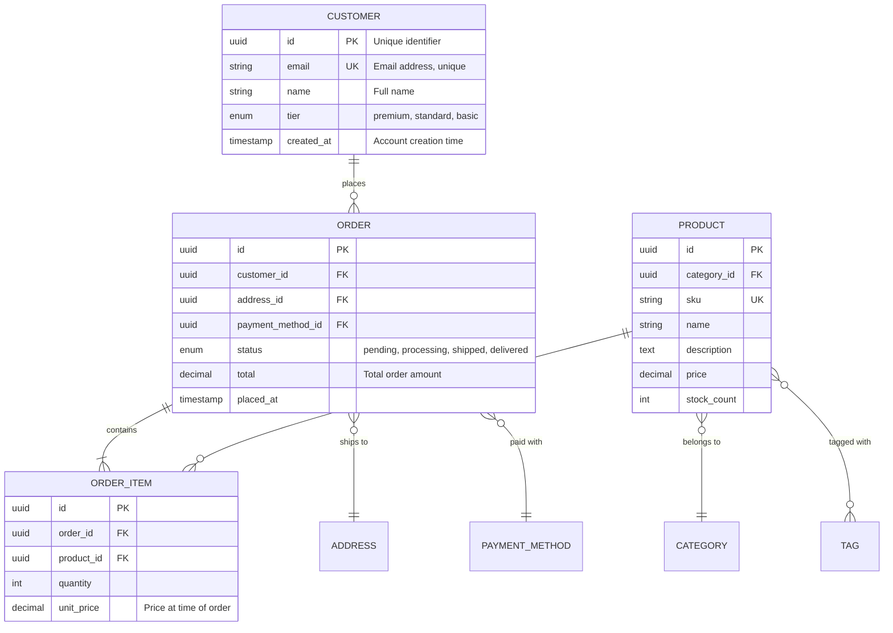
```mermaid
erDiagram
    CUSTOMER ||--o{ ORDER : places
    CUSTOMER {
        uuid id PK "Unique identifier"
        string email UK "Email address, unique"
        string name "Full name"
        enum tier "premium, standard, basic"
        timestamp created_at "Account creation time"
    }

    ORDER ||--|{ ORDER_ITEM : contains
    ORDER }o--|| ADDRESS : "ships to"
    ORDER }o--|| PAYMENT_METHOD : "paid with"
    ORDER {
        uuid id PK
        uuid customer_id FK
        uuid address_id FK
        uuid payment_method_id FK
        enum status "pending, processing, shipped, delivered"
        decimal total "Total order amount"
        timestamp placed_at
    }

    PRODUCT ||--o{ ORDER_ITEM : "ordered as"
    PRODUCT }o--|| CATEGORY : "belongs to"
    PRODUCT }o--o{ TAG : "tagged with"
    PRODUCT {
        uuid id PK
        uuid category_id FK
        string sku UK
        string name
        text description
        decimal price
        int stock_count
    }

    ORDER_ITEM {
        uuid id PK
        uuid order_id FK
        uuid product_id FK
        int quantity
        decimal unit_price "Price at time of order"
    }
```

---

## Advanced State Diagrams

### Nested States and Concurrent States

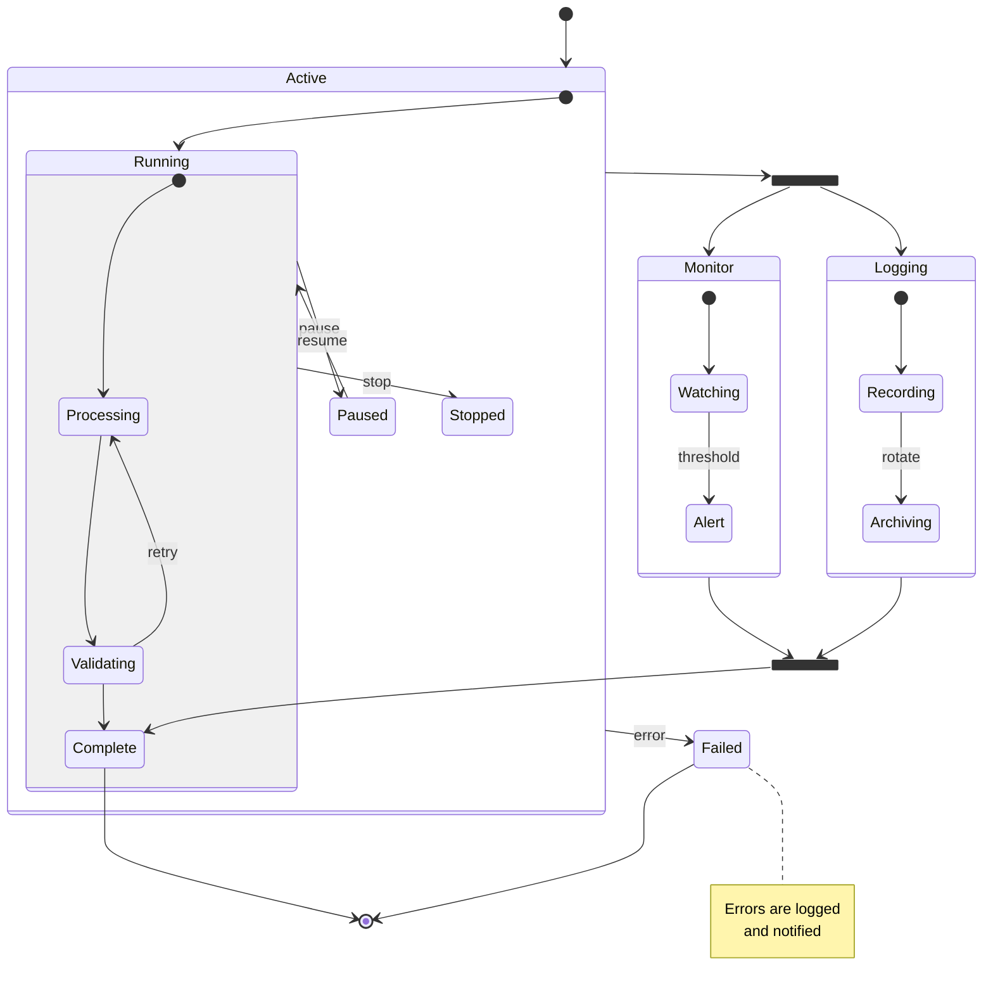
```mermaid
stateDiagram-v2
    [*] --> Active

    state Active {
        [*] --> Running
        Running --> Paused : pause
        Paused --> Running : resume
        Running --> Stopped : stop

        state Running {
            [*] --> Processing
            Processing --> Validating
            Validating --> Processing : retry
            Validating --> Complete
        }
    }

    state Concurrent <<fork>>
        Active --> Concurrent
        Concurrent --> Monitor
        Concurrent --> Logging

        state Monitor {
            [*] --> Watching
            Watching --> Alert : threshold
        }

        state Logging {
            [*] --> Recording
            Recording --> Archiving : rotate
        }

    state join <<join>>
        Monitor --> join
        Logging --> join
        join --> Complete

    Active --> Failed : error
    Complete --> [*]
    Failed --> [*]

    note right of Failed
        Errors are logged
        and notified
    end note
```

### State Transitions with Guards

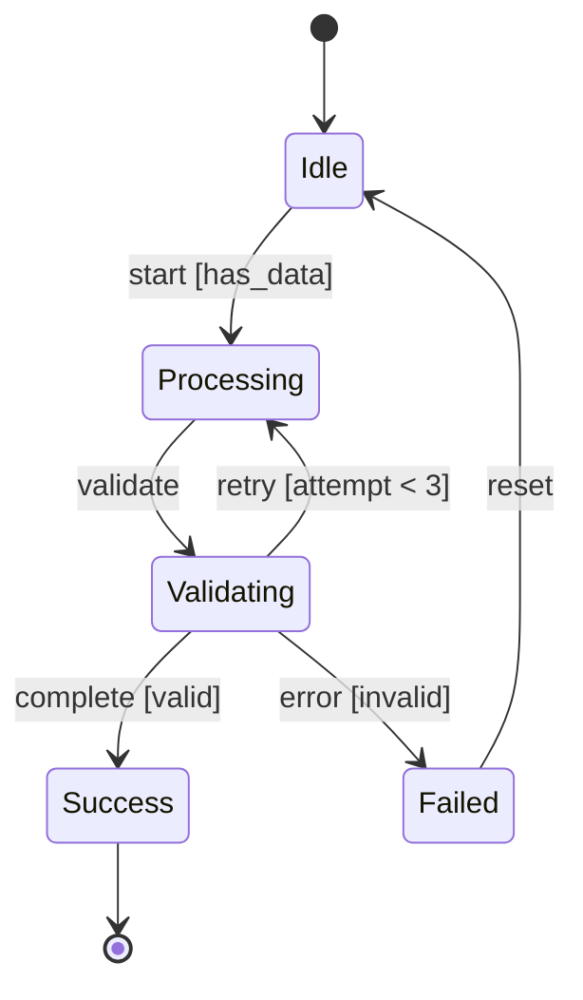
```mermaid
stateDiagram-v2
    [*] --> Idle
    Idle --> Processing : start [has_data]
    Processing --> Validating : validate
    Validating --> Processing : retry [attempt < 3]
    Validating --> Success : complete [valid]
    Validating --> Failed : error [invalid]
    Success --> [*]
    Failed --> Idle : reset
```

---

## Advanced Class Diagrams

### Generics, Interfaces, and Annotations

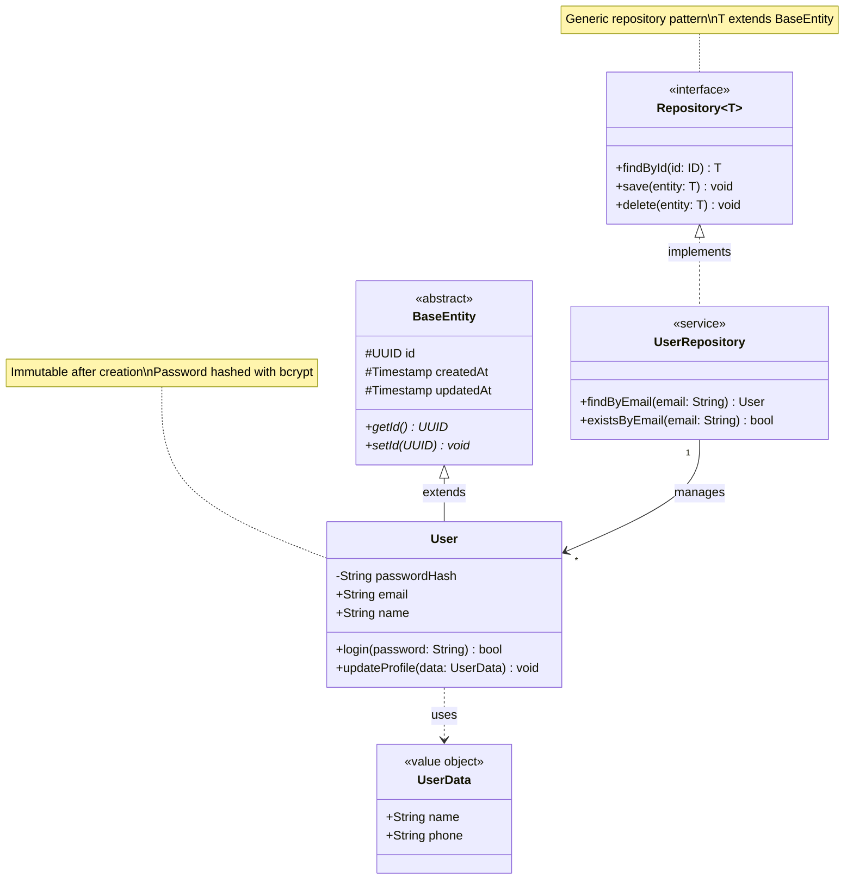
```mermaid
classDiagram
    class Repository~T~ {
        <<interface>>
        +findById(id: ID) T
        +save(entity: T) void
        +delete(entity: T) void
    }

    class UserRepository {
        <<service>>
        +findByEmail(email: String) User
        +existsByEmail(email: String) bool
    }

    class BaseEntity {
        <<abstract>>
        #UUID id
        #Timestamp createdAt
        #Timestamp updatedAt
        +getId() UUID*
        +setId(UUID) void*
    }

    class User {
        -String passwordHash
        +String email
        +String name
        +login(password: String) bool
        +updateProfile(data: UserData) void
    }

    class UserData {
        <<value object>>
        +String name
        +String phone
    }

    Repository <|.. UserRepository : implements
    BaseEntity <|-- User : extends
    User ..> UserData : uses
    UserRepository "1" --> "*" User : manages

    note for User "Immutable after creation\nPassword hashed with bcrypt"
    note for Repository "Generic repository pattern\nT extends BaseEntity"
```

### Composition vs Aggregation

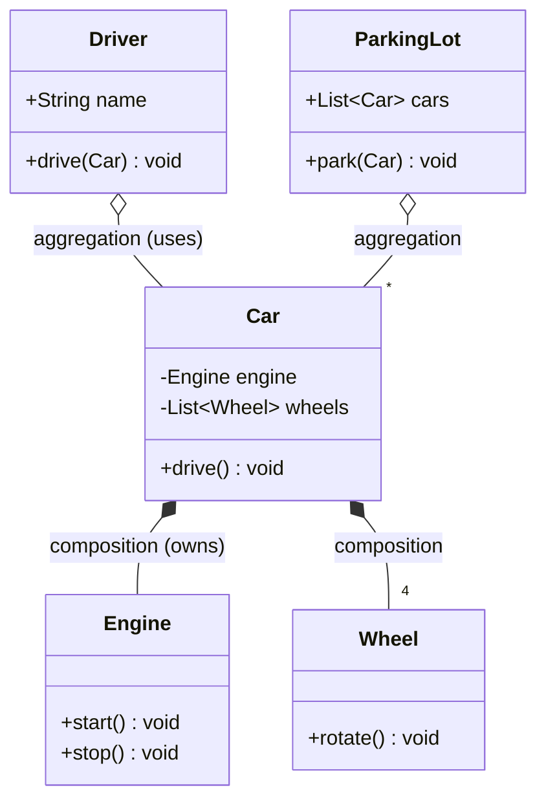
```mermaid
classDiagram
    class Engine {
        +start() void
        +stop() void
    }

    class Wheel {
        +rotate() void
    }

    class Car {
        -Engine engine
        -List~Wheel~ wheels
        +drive() void
    }

    class Driver {
        +String name
        +drive(Car) void
    }

    class ParkingLot {
        +List~Car~ cars
        +park(Car) void
    }

    Car *-- Engine : composition (owns)
    Car *-- "4" Wheel : composition
    Driver o-- Car : aggregation (uses)
    ParkingLot o-- "*" Car : aggregation
```

---

## Advanced Gantt Features

### Dependencies, Milestones, and Sections

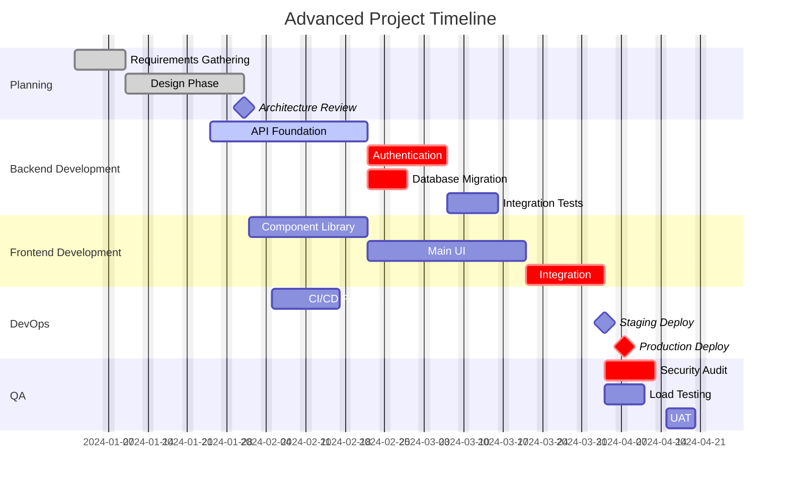
```mermaid
gantt
    title Advanced Project Timeline
    dateFormat YYYY-MM-DD
    excludes weekends

    section Planning
        Requirements Gathering    :done, req1, 2024-01-01, 2024-01-10
        Design Phase              :done, des1, after req1, 15d
        Architecture Review       :milestone, after des1, 0d

    section Backend Development
        API Foundation            :active, api1, 2024-01-25, 20d
        Authentication           :crit, auth1, after api1, 10d
        Database Migration       :crit, db1, after api1, 5d
        Integration Tests        :test1, after auth1 db1, 7d

    section Frontend Development
        Component Library        :ui1, 2024-02-01, 15d
        Main UI                  :ui2, after ui1, 20d
        Integration              :crit, int1, after ui2 test1, 10d

    section DevOps
        CI/CD Pipeline           :ops1, 2024-02-05, 10d
        Staging Deploy           :milestone, after int1, 0d
        Production Deploy        :milestone, crit, after int1, 5d

    section QA
        Security Audit           :crit, sec1, after int1, 7d
        Load Testing             :load1, after int1, 5d
        UAT                      :uat1, after sec1 load1, 5d
```

---

## New Diagram Types (Mermaid v9+)

### Quadrant Chart

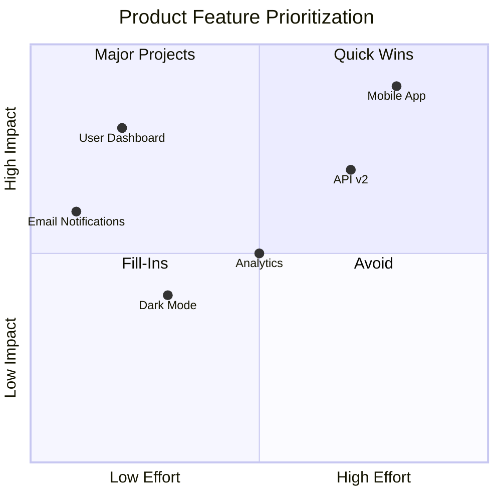
```mermaid
quadrantChart
    title Product Feature Prioritization
    x-axis "Low Effort" --> "High Effort"
    y-axis "Low Impact" --> "High Impact"
    quadrant-1 "Quick Wins"
    quadrant-2 "Major Projects"
    quadrant-3 "Fill-Ins"
    quadrant-4 "Avoid"

    User Dashboard: [0.2, 0.8]
    Mobile App: [0.8, 0.9]
    Email Notifications: [0.1, 0.6]
    API v2: [0.7, 0.7]
    Dark Mode: [0.3, 0.4]
    Analytics: [0.5, 0.5]
```

### Requirement Diagram

```mermaid
requirementDiagram
    requirement UserAuth {
        id: 1
        text: Users must authenticate
        risk: high
        verifymethod: test
    }

    requirement PasswordPolicy {
        id: 1.1
        text: Password must be 8+ chars
        risk: medium
        verifymethod: test
    }

    functionalRequirement EmailLogin {
        id: 1.2
        text: Support email login
        risk: low
        verifymethod: demo
    }

    performanceRequirement ResponseTime {
        id: 2
        text: API response < 200ms
        risk: medium
        verifymethod: analysis
    }

    element LoginPage {
        type: UI
        docref: /docs/ui/login
    }

    element AuthService {
        type: Service
    }

    UserAuth - contains -> PasswordPolicy
    UserAuth - contains -> EmailLogin
    EmailLogin - satisfies -> LoginPage
    EmailLogin - satisfies -> AuthService
    ResponseTime - verifies -> AuthService
```

### Mindmap

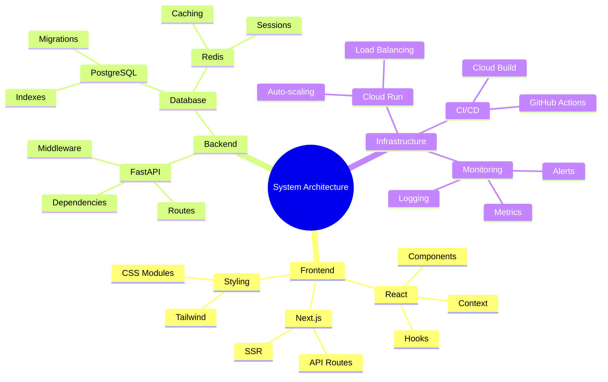
```mermaid
mindmap
    root((System Architecture))
        Frontend
            React
                Components
                Hooks
                Context
            Next.js
                SSR
                API Routes
            Styling
                Tailwind
                CSS Modules
        Backend
            FastAPI
                Routes
                Dependencies
                Middleware
            Database
                PostgreSQL
                    Migrations
                    Indexes
                Redis
                    Caching
                    Sessions
        Infrastructure
            Cloud Run
                Auto-scaling
                Load Balancing
            CI/CD
                GitHub Actions
                Cloud Build
            Monitoring
                Logging
                Metrics
                Alerts
```

---

## Performance Tips for Large Diagrams

### 1. Split Complex Diagrams

Instead of one massive flowchart:

```
[Avoid] One diagram with 50+ nodes
[Prefer] 3-5 smaller diagrams showing different aspects
```

### 2. Use Subgraphs Strategically

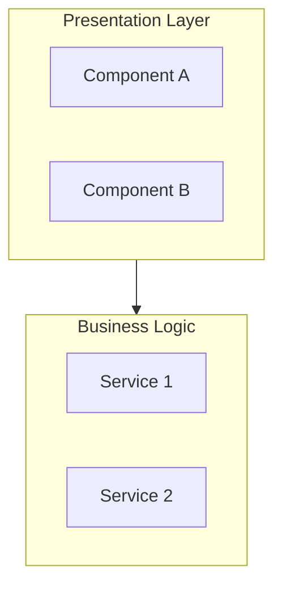
```mermaid
flowchart TD
    subgraph Layer1 ["Presentation Layer"]
        A1[Component A]
        A2[Component B]
    end

    subgraph Layer2 ["Business Logic"]
        B1[Service 1]
        B2[Service 2]
    end

    Layer1 --> Layer2
```

### 3. Limit Styling

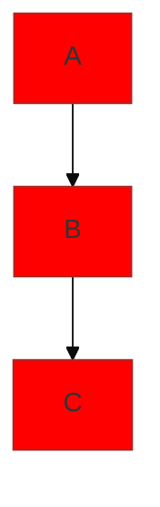
```mermaid
%%{init: {'theme':'base', 'themeVariables': { 'primaryColor':'#ff0000'}}}%%
flowchart TD
    A --> B --> C
```

### 4. Simplify Labels

```
[Avoid] A["This is a very long description that explains everything about this node in detail"]
[Prefer] A["User Service"]
         note: Add details in documentation
```

---

## Custom Themes

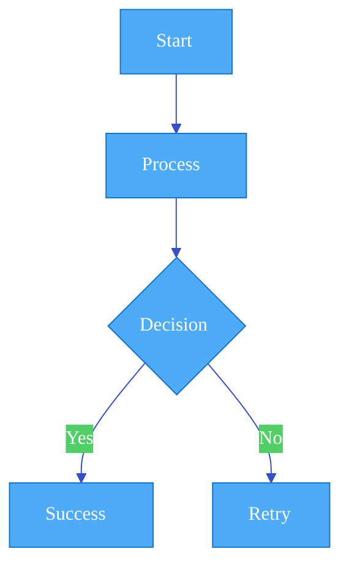
```mermaid
%%{init: {
  'theme': 'base',
  'themeVariables': {
    'primaryColor': '#4dabf7',
    'primaryTextColor': '#fff',
    'primaryBorderColor': '#1971c2',
    'lineColor': '#364fc7',
    'secondaryColor': '#51cf66',
    'tertiaryColor': '#ff6b6b',
    'fontSize': '16px',
    'fontFamily': 'Inter, system-ui, sans-serif'
  }
}}%%
flowchart TD
    A[Start] --> B[Process]
    B --> C{Decision}
    C -->|Yes| D[Success]
    C -->|No| E[Retry]
```

---

## Markdown Integration Patterns

### In Documentation

````markdown
# API Architecture

The following diagram shows our microservices setup:

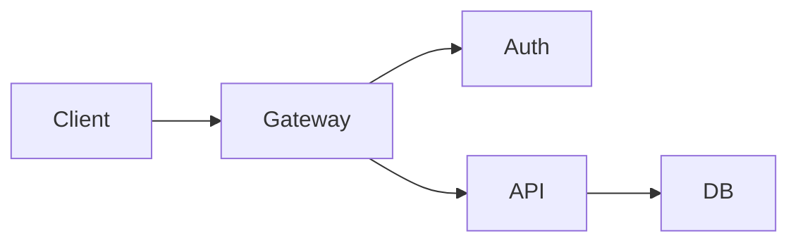
```mermaid
flowchart LR
    Client --> Gateway
    Gateway --> Auth
    Gateway --> API
    API --> DB
```

See [detailed docs](./api-details.md) for more.
````

### With Code Blocks

````markdown
```python
# Implementation matches this flow:
```

```mermaid
sequenceDiagram
    User->>API: login()
    API->>DB: verify()
    DB-->>API: ok
    API-->>User: token
```
````

---

## Debugging Complex Diagrams

1. **Test incrementally** — add nodes one at a time
2. **Use mermaid.live** for real-time validation
3. **Check quotes** around special characters
4. **Validate syntax** with comments:

```mermaid
flowchart TD
    %% Working section
    A --> B

    %% TODO: Fix this section
    %% C --> D
```

5. **Simplify** if layout breaks — split into multiple diagrams

---

## Quick Reference: Diagram Type Selection

| Need to show... | Use... |
|----------------|--------|
| Process flow, algorithm | `flowchart TD` |
| API interaction, message sequence | `sequenceDiagram` |
| Database schema | `erDiagram` |
| Object relationships | `classDiagram` |
| Lifecycle, workflow stages | `stateDiagram-v2` |
| Git branches | `gitGraph` |
| Project timeline | `gantt` |
| Feature prioritization | `quadrantChart` |
| System concepts | `mindmap` |
| Requirements tracing | `requirementDiagram` |

---

## External Resources

- Official Docs: https://mermaid.js.org
- Live Editor: https://mermaid.live
- GitHub Support: Native rendering in .md files
- VSCode Extension: "Mermaid Preview"
