# Mermaid Flowchart Customization Guide

Deep dive into flowchart customization — shapes, colors, layout, styling, and advanced patterns.

---

## Node Shapes

Every shape has semantic meaning. Choose based on the node's purpose.

```mermaid
flowchart TD
    A[Rectangle - Process]
    B([Rounded - Start/End])
    C[(Database)]
    D{{Hexagon - Prepare/Setup}}
    E[/Parallelogram - Input/]
    F[\Parallelogram - Output\]
    G((Circle - Connection Point))
    H>Flag - Legacy]
    I{Diamond - Decision}
    J{{Double Hexagon}}
    K[["Subroutine"]]
    L[[("Cylindrical DB")]]
    M(("Double Circle"))
    N>"Asymmetric - Choice"]
```

**Shape Syntax Quick Reference:**

| Shape | Syntax | Use Case |
|-------|--------|----------|
| Rectangle | `[text]` | Standard process |
| Rounded | `([text])` | Start/end points |
| Stadium | `([text])` | Same as rounded |
| Subroutine | `[[text]]` | Function call |
| Cylindrical | `[(text)]` | Database |
| Circle | `((text))` | Connection point |
| Double Circle | `(((text)))` | - |
| Asymmetric | `>text]` | Choice/flag |
| Rhombus | `{text}` | Decision |
| Hexagon | `{{text}}` | Preparation |
| Parallelogram (input) | `[/text/]` | Input data |
| Parallelogram (output) | `[\text\]` | Output data |
| Trapezoid | `[/text\]` | Manual operation |
| Inverted Trapezoid | `[\text/]` | - |

---

## Arrow Types and Line Styles

Arrows communicate relationships. Mix types to show different connection meanings.

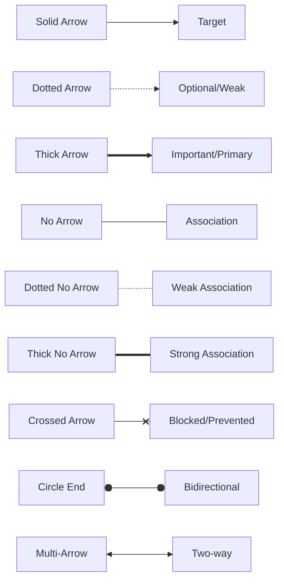

**Arrow Syntax:**

| Pattern | Code | Meaning |
|---------|------|---------|
| Solid line, arrow | `-->` | Standard flow |
| Dotted line, arrow | `-.->` | Optional/fallback |
| Thick line, arrow | `==>` | Primary/critical path |
| Solid line, no arrow | `---` | Association |
| Dotted line, no arrow | `-.-` | Weak association |
| Crossed | `--x` | Blocked |
| Circle ends | `o--o` | Bidirectional |
| Double arrow | `<-->` | Two-way communication |

**Adding Labels:**

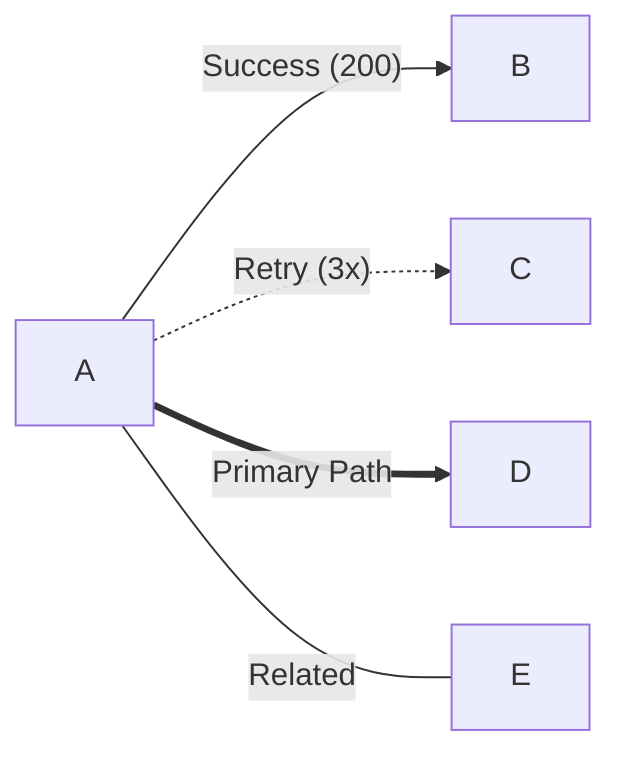

**Longer Arrows (add dashes):**

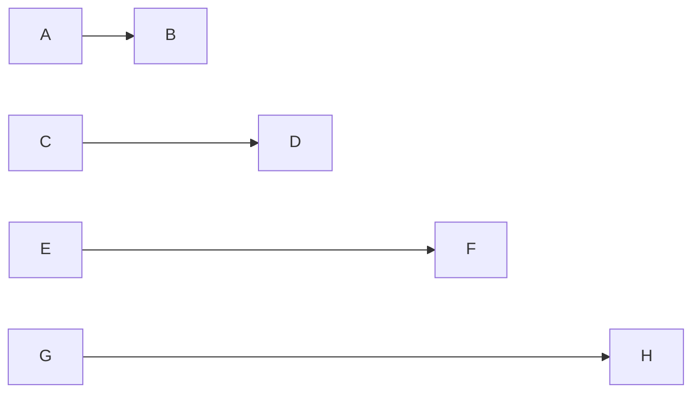

---

## Color and Styling with classDef

`classDef` creates reusable style classes. Apply to multiple nodes for consistency.

### Basic classDef Pattern

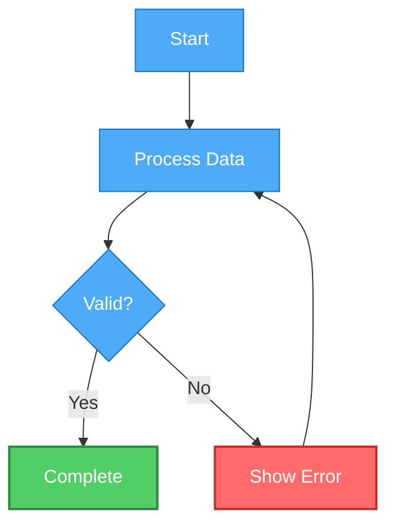

**classDef Syntax:**

```
classDef <className> <property>:<value>,<property>:<value>,...
class <nodeId> <className>
```

**Common Properties:**

| Property | Values | Example |
|----------|--------|---------|
| `fill` | Color hex/rgb | `fill:#ff6b6b` |
| `stroke` | Border color | `stroke:#c92a2a` |
| `stroke-width` | Border thickness | `stroke-width:3px` |
| `color` | Text color | `color:#fff` |
| `stroke-dasharray` | Dash pattern | `stroke-dasharray: 5 5` |
| `rx` | Corner radius | `rx:10px` |
| `ry` | Corner radius | `ry:10px` |

### Multiple Classes on One Node

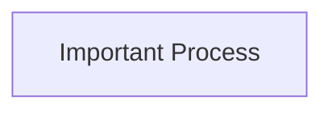

### Inline Styling (Quick One-offs)

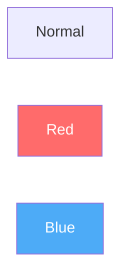

---

## Theme Customization

Apply global themes to entire diagrams.

### Pre-built Themes

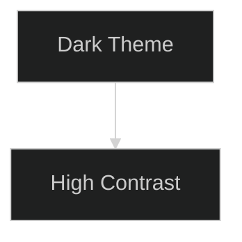

Available themes: `default`, `dark`, `forest`, `neutral`, `base`

### Custom Theme Variables

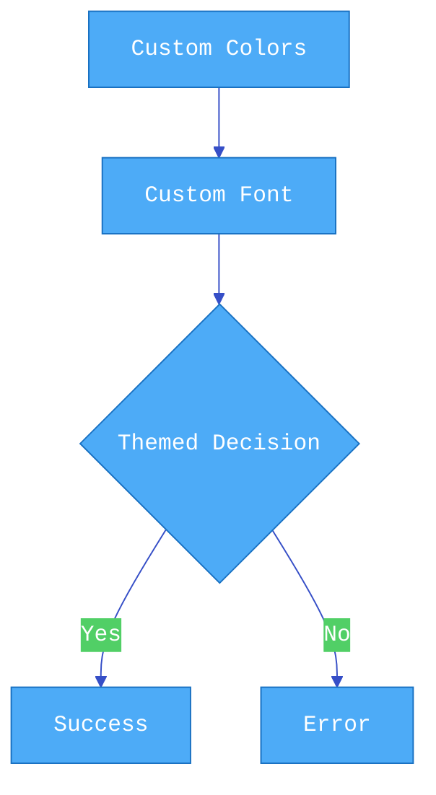

**Common Theme Variables:**

```javascript
{
  'primaryColor': '#color',        // Main nodes
  'primaryTextColor': '#color',    // Text on primary
  'primaryBorderColor': '#color',  // Border on primary
  'secondaryColor': '#color',      // Secondary nodes
  'tertiaryColor': '#color',       // Tertiary nodes
  'lineColor': '#color',           // Connector lines
  'fontSize': '16px',              // Base font size
  'fontFamily': 'sans-serif',      // Font family
  'background': '#color',          // Diagram background
  'mainBkg': '#color',             // Node background
  'textColor': '#color',           // Default text color
  'edgeLabelBackground': '#color'  // Label background
}
```

---

## Layout and Direction

Control diagram orientation and flow.

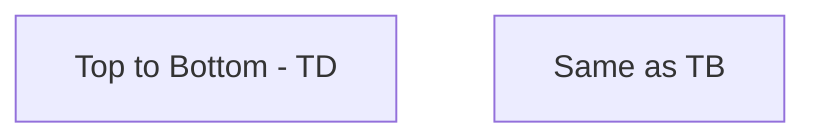

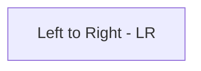

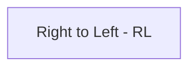

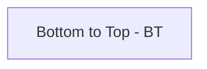

**Direction Codes:**

- `TD` or `TB` — Top Down / Top to Bottom (default)
- `LR` — Left to Right
- `RL` — Right to Left
- `BT` — Bottom to Top

---

## Subgraphs for Grouping

Subgraphs visually group related nodes and can have their own direction.

### Basic Subgraph

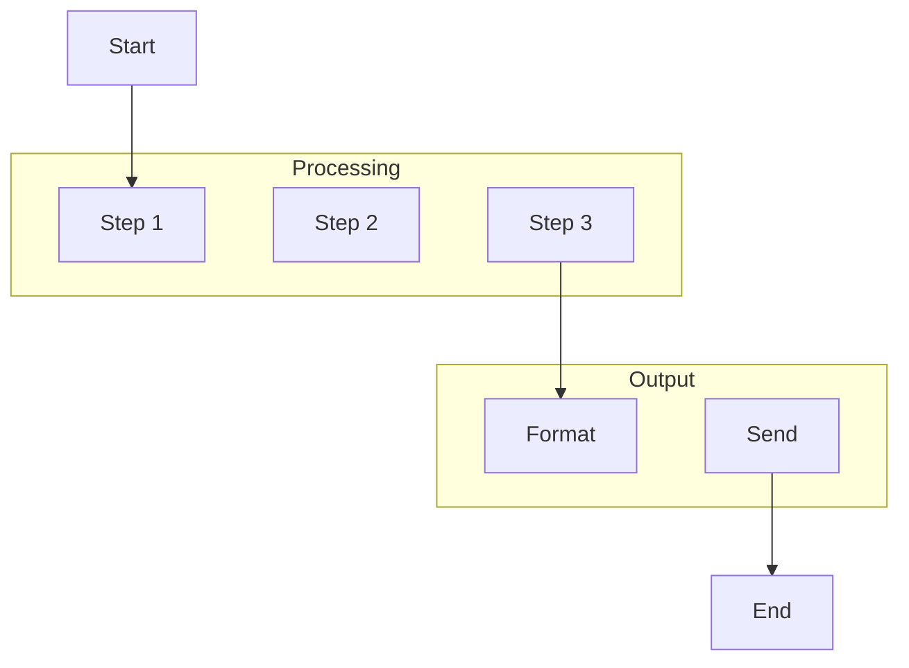

### Named Subgraphs with Custom Direction

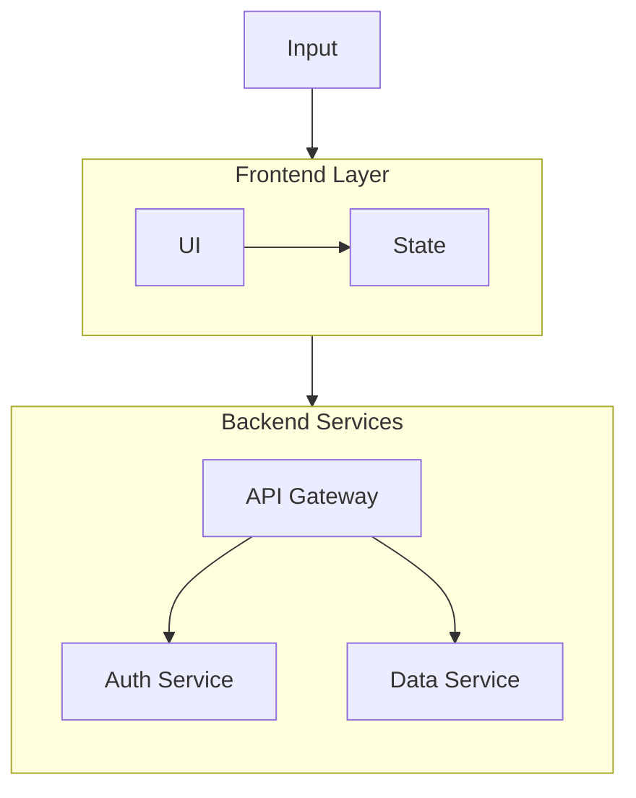

### Nested Subgraphs

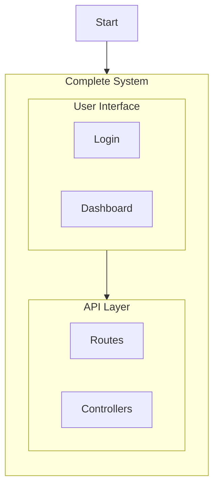

### Styled Subgraphs

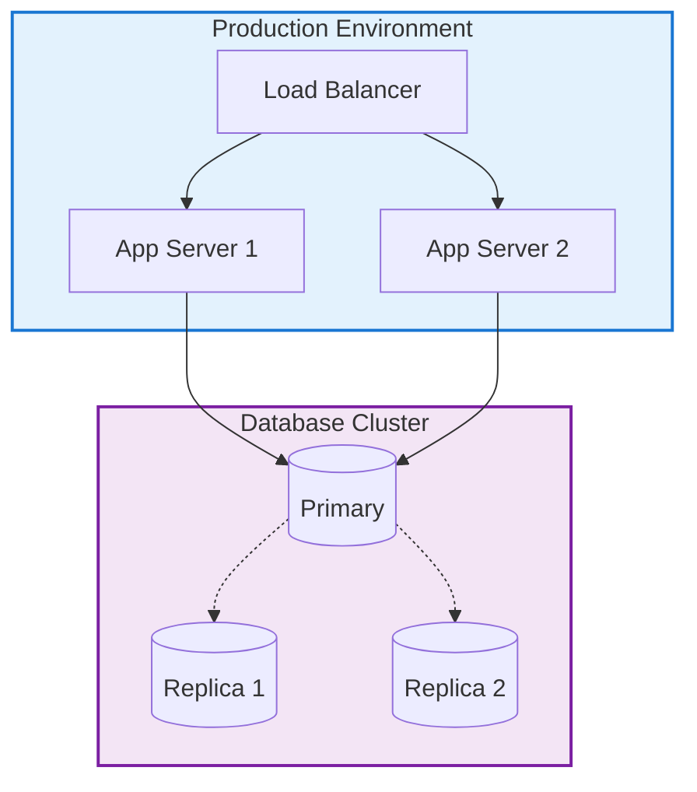

---

## Advanced Styling Patterns

### Individual Node Styling

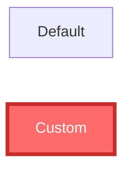

### Link Styling by Index

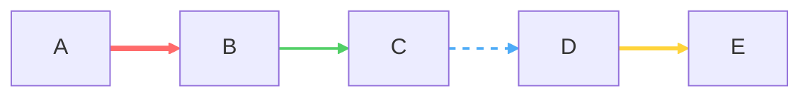

**Link Styling Properties:**

```
linkStyle <index> stroke:<color>,stroke-width:<width>,stroke-dasharray:<pattern>
```

### Default Styles for All Nodes/Links

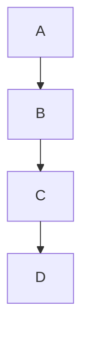

**Curve Options:**

- `basis` — Smooth curves
- `linear` — Straight lines
- `step` — Step-like connections
- `stepBefore` — Step before
- `stepAfter` — Step after

---

## Practical Styling Patterns

### Status Indicators

```mermaid
flowchart TD
    A[Process Start] --> B{Check Status}

    B -->|Running| C[In Progress]
    B -->|Success| D[Completed]
    B -->|Failed| E[Error State]
    B -->|Pending| F[Waiting]

    C --> G[Continue]
    D --> H[Archive]
    E --> I[Alert Team]
    F --> J[Queue]

    classDef running fill:#ffd43b,stroke:#f59f00,color:#000
    classDef success fill:#51cf66,stroke:#2b8a3e,color:#fff
    classDef error fill:#ff6b6b,stroke:#c92a2a,color:#fff
    classDef pending fill:#adb5bd,stroke:#495057,color:#fff

    class C,G running
    class D,H success
    class E,I error
    class F,J pending
```

### Priority Levels

```mermaid
flowchart LR
    A[Backlog] --> B{Prioritize}

    B --> C[P0 - Critical]
    B --> D[P1 - High]
    B --> E[P2 - Medium]
    B --> F[P3 - Low]

    classDef p0 fill:#fa5252,stroke:#c92a2a,color:#fff,stroke-width:3px
    classDef p1 fill:#ff922b,stroke:#e8590c,color:#fff,stroke-width:2px
    classDef p2 fill:#ffd43b,stroke:#fab005,color:#000
    classDef p3 fill:#adb5bd,stroke:#868e96,color:#fff

    class C p0
    class D p1
    class E p2
    class F p3
```

### Environment Layers

```mermaid
flowchart TB
    subgraph DEV ["Development"]
        D1[Local]
        D2[Dev Server]
    end

    subgraph STAGING ["Staging"]
        S1[Staging API]
        S2[Test DB]
    end

    subgraph PROD ["Production"]
        P1[Load Balancer]
        P2[App Cluster]
        P3[DB Cluster]
    end

    DEV --> STAGING
    STAGING --> PROD

    style DEV fill:#e3f2fd,stroke:#1976d2,stroke-width:2px,stroke-dasharray: 5 5
    style STAGING fill:#fff3e0,stroke:#f57c00,stroke-width:2px
    style PROD fill:#ffebee,stroke:#c62828,stroke-width:3px
```

### Data Flow with Emphasis

```mermaid
flowchart LR
    User[User Input] ==> Validate{Validate}
    Validate ==>|Valid| Process["Process Data"]
    Validate -.->|Invalid| Error[Show Error]

    Process ==> Save[(Save to DB)]
    Process ==> Cache[(Update Cache)]

    Save ==> Success[Return Success]
    Cache -.-> Success

    Error -.-> User

    classDef criticalPath fill:#4dabf7,stroke:#1971c2,color:#fff,stroke-width:3px
    classDef errorPath fill:#ff6b6b,stroke:#c92a2a,color:#fff

    class Validate,Process,Save,Success criticalPath
    class Error errorPath

    linkStyle 0,1,3,4,5 stroke:#1971c2,stroke-width:3px
    linkStyle 2,6 stroke:#c92a2a,stroke-width:2px,stroke-dasharray: 5 5
```

---

## Interactive Features

### Clickable Nodes

```mermaid
flowchart LR
    A[Documentation] --> B[API Reference]
    C[Source Code] --> D[Tests]

    click A "https://docs.example.com" "Open Documentation" _blank
    click B href "https://api.example.com" "View API Docs"
    click C callback "viewSource()" "View Source Code"
```

**Click Syntax:**

```
click <nodeId> "<url>" "<tooltip>" [_blank/_self/_parent/_top]
click <nodeId> href "<url>" "<tooltip>"
click <nodeId> call <function>() "<tooltip>"
```

### Tooltips (via title attribute)

```mermaid
flowchart TD
    A[Hover for Info]

    style A title:"This node has a tooltip"
```

---

## Layout Optimization

### Managing Complex Layouts

**Problem: Messy crossing lines**

```mermaid
flowchart TD
    A --> B
    A --> C
    A --> D
    B --> E
    C --> E
    D --> E
    E --> F
```

**Solution: Use invisible nodes for routing**

```mermaid
flowchart TD
    A --> B
    A --> C
    A --> D
    B --> E
    C --> E
    D --> E
    E --> F

    %% Invisible routing nodes
    A ~~~ X1[ ]
    X1 ~~~ X2[ ]

    style X1 opacity:0
    style X2 opacity:0
```

### Rank Separation Control

Force nodes onto the same level:

```mermaid
flowchart LR
    A --> B
    A --> C
    A --> D

    %% Force B, C, D on same level
    B ~~~ C ~~~ D
```

---

## Real-World Examples

### CI/CD Pipeline

```mermaid
flowchart LR
    Start([Code Push]) --> Lint[Lint Code]
    Lint --> Test[Run Tests]
    Test --> Build[Build Docker Image]
    Build --> Security[Security Scan]
    Security --> Push[Push to Registry]
    Push --> Deploy{Deploy?}

    Deploy -->|Staging| DeployStaging[Deploy to Staging]
    Deploy -->|Production| DeployProd[Deploy to Production]

    Test -.->|Fail| Notify1[Notify Team]
    Security -.->|Vulnerabilities| Notify2[Block & Notify]

    DeployStaging --> Verify1[Run E2E Tests]
    Verify1 -->|Pass| Success1([Staging Ready])
    Verify1 -.->|Fail| Rollback1[Auto Rollback]

    DeployProd --> Verify2[Health Check]
    Verify2 -->|Pass| Success2([Live])
    Verify2 -.->|Fail| Rollback2[Emergency Rollback]

    classDef buildStep fill:#4dabf7,stroke:#1971c2,color:#fff
    classDef testStep fill:#51cf66,stroke:#2b8a3e,color:#fff
    classDef deployStep fill:#ffd43b,stroke:#f59f00,color:#000
    classDef errorStep fill:#ff6b6b,stroke:#c92a2a,color:#fff
    classDef successStep fill:#51cf66,stroke:#2b8a3e,color:#fff,stroke-width:3px

    class Lint,Build,Push buildStep
    class Test,Security,Verify1,Verify2 testStep
    class DeployStaging,DeployProd deployStep
    class Notify1,Notify2,Rollback1,Rollback2 errorStep
    class Success1,Success2 successStep

    linkStyle 8,9,12,14 stroke:#ff6b6b,stroke-width:2px,stroke-dasharray: 5 5
```

### Authentication Flow with Error Handling

```mermaid
flowchart TD
    Start([User Visits]) --> CheckSession{Has Session?}

    CheckSession -->|Yes| ValidateToken{Token Valid?}
    CheckSession -->|No| LoginForm[Show Login Form]

    ValidateToken -->|Yes| Dashboard[Load Dashboard]
    ValidateToken -->|No| Refresh{Can Refresh?}

    Refresh -->|Yes| RefreshToken[Refresh Token]
    Refresh -->|No| LoginForm

    RefreshToken --> Dashboard

    LoginForm --> Submit[User Submits]
    Submit --> Validate{Credentials Valid?}

    Validate -->|Yes| CreateSession[Create Session]
    Validate -->|No| RateLimit{Rate Limited?}

    RateLimit -->|Yes| Block[Block & Show Captcha]
    RateLimit -->|No| Error[Show Error]

    Error --> LoginForm
    Block --> LoginForm
    CreateSession --> Dashboard

    Dashboard --> End([User Active])

    classDef authStep fill:#4dabf7,stroke:#1971c2,color:#fff
    classDef successStep fill:#51cf66,stroke:#2b8a3e,color:#fff
    classDef errorStep fill:#ff6b6b,stroke:#c92a2a,color:#fff
    classDef decisionStep fill:#ffd43b,stroke:#f59f00,color:#000

    class LoginForm,Submit,CreateSession,RefreshToken authStep
    class Dashboard,End successStep
    class Error,Block errorStep
    class CheckSession,ValidateToken,Validate,Refresh,RateLimit decisionStep
```

---

## Debugging Tips

1. **Test incrementally** — Add nodes/styling one at a time
2. **Use mermaid.live** for real-time preview
3. **Comment out sections** to isolate issues:

```mermaid
flowchart TD
    A --> B
    %% B --> C
    %% C --> D
```

4. **Validate class names** — must be alphanumeric
5. **Check link indices** — `linkStyle 0` is the first arrow, counting from top

---

## Cheat Sheet: Property Values

**Colors:**
- Hex: `#ff6b6b`
- RGB: `rgb(255, 107, 107)`
- RGBA: `rgba(255, 107, 107, 0.5)`
- Named: `red`, `blue`, `green`

**Sizes:**
- Pixels: `2px`, `10px`
- Percent: `50%`
- Em: `1.5em`

**Stroke Patterns:**
- Solid: `stroke-width:2px`
- Dashed: `stroke-dasharray: 5 5`
- Dotted: `stroke-dasharray: 1 3`
- Long dash: `stroke-dasharray: 10 5`

**Font Families:**
- `monospace`
- `sans-serif`
- `serif`
- `'Inter', system-ui, sans-serif`

---

## Common Color Palettes

### Status Colors (Friendly)

```
Success: fill:#51cf66,stroke:#2b8a3e,color:#fff
Warning: fill:#ffd43b,stroke:#f59f00,color:#000
Error: fill:#ff6b6b,stroke:#c92a2a,color:#fff
Info: fill:#4dabf7,stroke:#1971c2,color:#fff
Neutral: fill:#adb5bd,stroke:#495057,color:#fff
```

### Priority Levels

```
P0 Critical: fill:#fa5252,stroke:#c92a2a,color:#fff
P1 High: fill:#ff922b,stroke:#e8590c,color:#fff
P2 Medium: fill:#ffd43b,stroke:#fab005,color:#000
P3 Low: fill:#94d82d,stroke:#5c940d,color:#000
```

### Environment Tiers

```
Dev: fill:#e3f2fd,stroke:#1976d2,color:#000
Staging: fill:#fff3e0,stroke:#f57c00,color:#000
Production: fill:#ffebee,stroke:#c62828,color:#000
```

---

## Quick Customization Workflow

1. **Build structure** (nodes + arrows)
2. **Define classDef** for common styles
3. **Apply classes** to nodes
4. **Style links** if needed
5. **Add subgraphs** for grouping
6. **Apply theme** if needed
7. **Test and refine**

**Template:**

```mermaid
flowchart TD
    %% 1. Structure
    A[Start] --> B[Process]
    B --> C{Decision}
    C -->|Yes| D[Success]
    C -->|No| E[Error]

    %% 2. Define styles
    classDef successStyle fill:#51cf66,stroke:#2b8a3e,color:#fff
    classDef errorStyle fill:#ff6b6b,stroke:#c92a2a,color:#fff

    %% 3. Apply styles
    class D successStyle
    class E errorStyle

    %% 4. Style links (optional)
    linkStyle 2 stroke:#51cf66,stroke-width:2px
    linkStyle 3 stroke:#ff6b6b,stroke-width:2px
```
