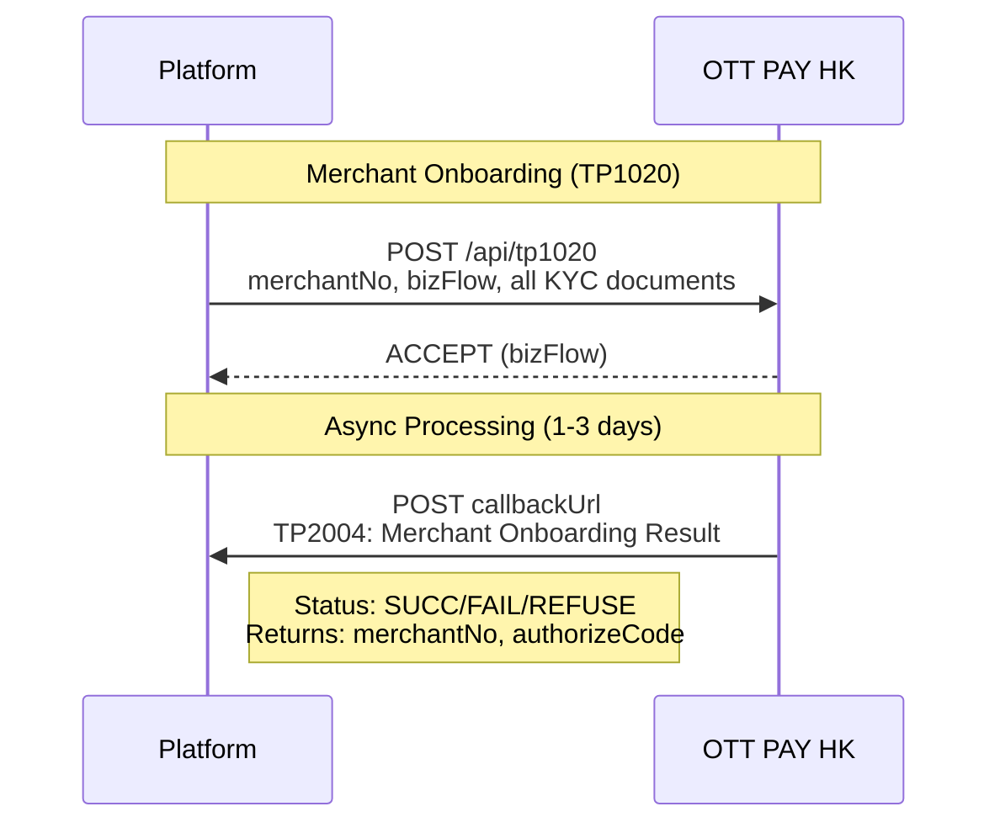
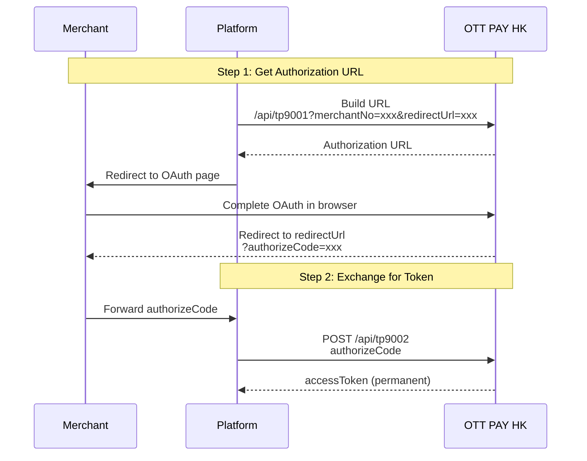
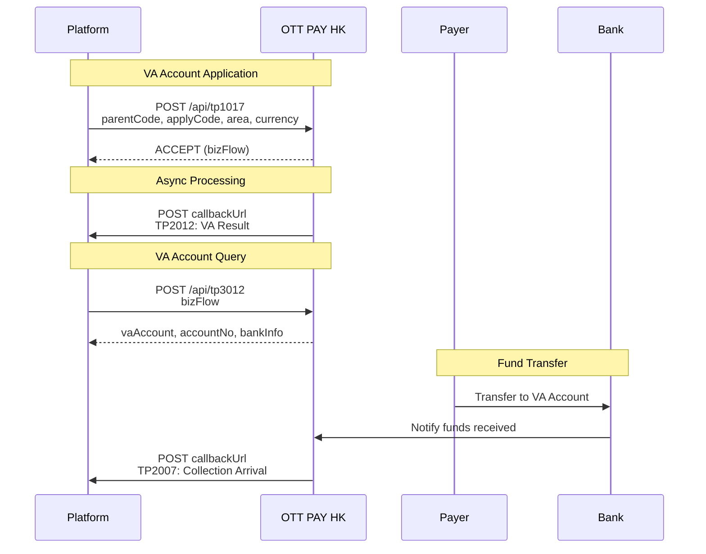
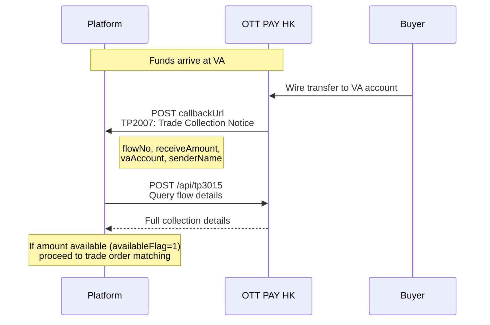
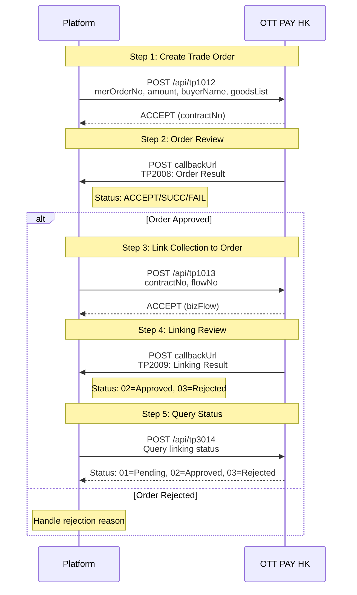
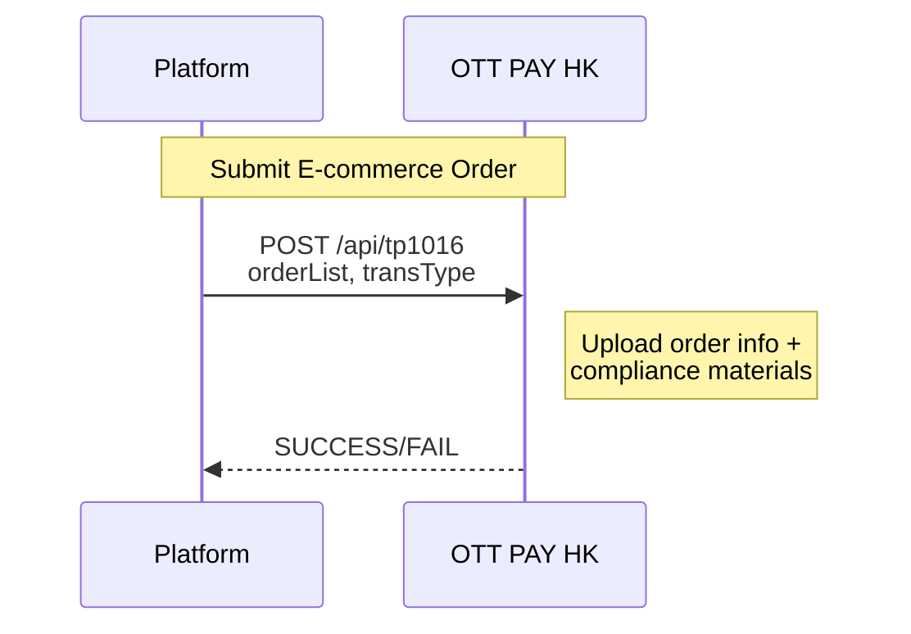
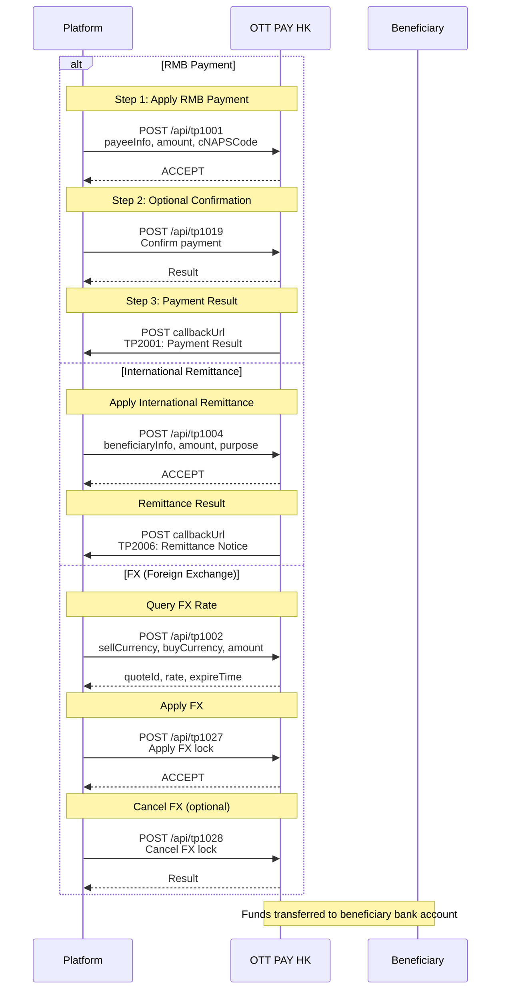
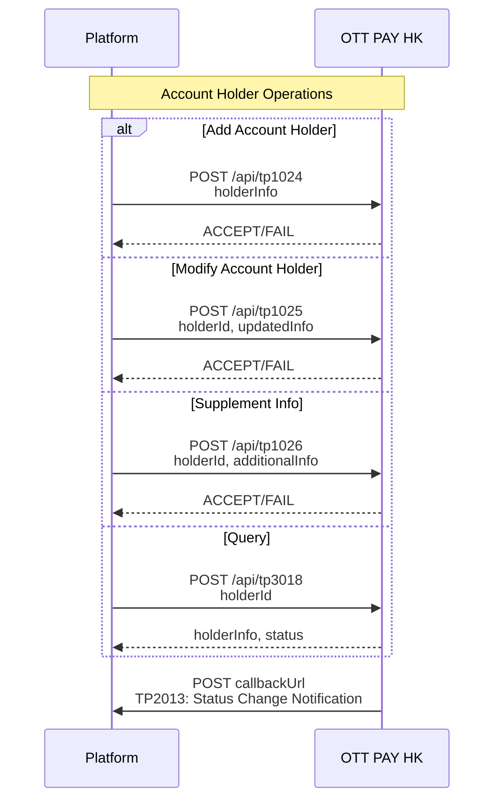
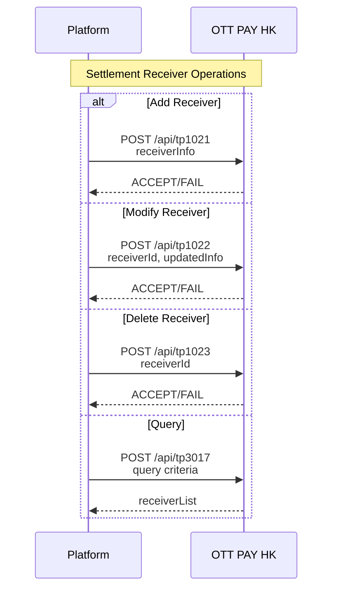
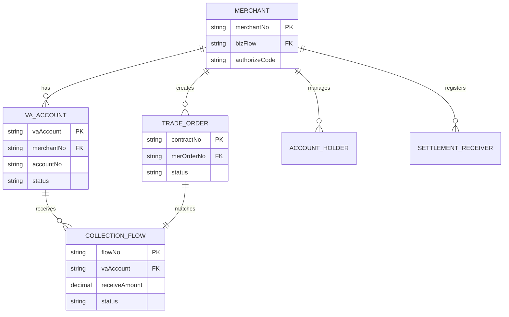

# OTT PAY HK API Business Flow Documentation

> Generated from API Spec: https://docs.hksd.ottpayhk.com/

---

## Table of Contents

1. [Overview](#overview)
2. [Merchant Onboarding Flow](#1-merchant-onboarding-flow)
3. [Authorization Flow](#2-authorization-flow)
4. [VA Collection Flow](#3-va-virtual-account-collection-flow)
5. [Trade Collection Flow](#4-trade-collection-flow)
6. [Trade Order & Matching Flow](#5-trade-order--matching-flow)
7. [E-commerce Order Flow](#6-e-commerce-order-flow)
8. [Payment/Disbursement Flow](#7-paymentdisbursement-flow)
9. [Account Holder Management](#8-account-holder-management)
10. [Settlement Receiver Management](#9-settlement-receiver-management)
11. [Entity Relationships](#10-entity-relationships)
12. [Status Codes](#11-status-codes)

---

## Overview

| Item | Value |
|------|-------|
| Protocol | HTTPS + JSON |
| Security | RSA Encryption + SHA1withRSA Signature |
| Base URL (Prod) | `https://xxx.ottpayhk.com` |
| Base URL (Test) | `https://xxx.uat.ottpayhk.com` |

### Request Structure

```json
{
  "head": {
    "version": "1.0.0",
    "tradeType": "00",
    "tradeTime": "1551341750",
    "tradeCode": "tpXXXX",
    "language": "cn"
  },
  "body": { }
}
```

### Response Structure

```json
{
  "head": {
    "version": "1.0.0",
    "tradeType": "01",
    "tradeTime": "1551341750",
    "tradeCode": "tpXXXX",
    "respCode": "S00000",
    "respDesc": "请求成功"
  },
  "body": { }
}
```

---

## 1. Merchant Onboarding Flow

### Flow Diagram



### API Summary

| Code | Name | Type | Description |
|------|------|------|-------------|
| **TP1020** | Agent Merchant Onboarding + VA | Request | Submit merchant KYC docs |
| **TP2004** | Onboarding Result Notification | Callback | Returns merchantNo, authorizeCode |

### TP1020 Request Fields

| Field | Type | Required | Description |
|-------|------|----------|-------------|
| `merOrderNo` | String(32) | O | Merchant order number |
| `email` | String(255) | M | Registration email |
| `phoneAreaCode` | String(10) | M | Phone area code |
| `phoneNum` | String(32) | M | Phone number |
| `referralChannel` | String(16) | M | Agent code (test: 0000000000) |
| `countryCode` | String(2) | M | Country ISO code |
| `merNameEn` | String(255) | M | Merchant English name |
| `certificate` | List | M | Business license docs |
| `shareholder` | List | M | 25%+ shareholders info |
| `legalPerson` | List | C | Legal rep (required for CN) |
| `vaFlag` | String(1) | M | 0=No VA, 1=With VA |
| `vaInfo` | List | C | VA account details |

### TP2004 Callback Fields

| Field | Type | Description |
|-------|------|-------------|
| `bizFlow` | String(32) | Business flow ID |
| `merchantNo` | String(32) | Assigned merchant ID |
| `status` | String(6) | SUCC/FAIL/REFUSE |
| `authorizeCode` | String(32) | Authorization code |

---

## 2. Authorization Flow

### Flow Diagram



### API Summary

| Code | Name | Type | Description |
|------|------|------|-------------|
| **TP9001** | Apply Authorization | Redirect | Get OAuth URL |
| **TP9002** | Get accessToken | Request | Exchange code for token |

### TP9001 Request

```
GET /api/tp9001?merchantNo=xxx&redirectUrl=xxx
```

| Parameter | Required | Description |
|-----------|----------|-------------|
| `merchantNo` | M | Agent's merchant number |
| `redirectUrl` | M | OAuth completion redirect URL |

### TP9002 Request

```json
{
  "authorizeCode": "e10adc3949ba59abbe56e057f20f883e"
}
```

### TP9002 Response

```json
{
  "accessToken": "7c4a8d09ca3762af61e59520943dc26494"
}
```

> ⚠️ **Note**: Token is currently permanent (no expiration)

---

## 3. VA (Virtual Account) Collection Flow

### Flow Diagram



### API Summary

| Code | Name | Type | Description |
|------|------|------|-------------|
| **TP1017** | VA Account Application | Request | Apply for VA |
| **TP2012** | VA Result Notification | Callback | VA approval result |
| **TP3012** | VA Account Query | Query | Get VA details |
| **TP2007** | Collection Arrival Notice | Callback | Funds received |

### VA Account Types (parentCode)

| Code | Type | Description |
|------|------|-------------|
| S | Platform E-commerce | 平台电商 |
| D | Independent Site | 独立站电商 |
| T | Offline Goods Trade | 线下一般货贸 |
| F | Service Trade | 服务贸易 |

### TP3012 Response Example

```json
{
  "list": [{
    "bizFlow": "80823082314163300199",
    "merOrderNo": "LNQ1692771393185",
    "vaInfos": [{
      "accountName": "XDT-GUANGZHOU HELIBAO PAYMENT CO LTD",
      "accountNo": "8808999911436641",
      "swiftCode": "0090081",
      "bankName": "Bank Negara Indonesia (BNI)",
      "currency": "IDR",
      "status": "ON"
    }]
  }]
}
```

---

## 4. Trade Collection Flow

### Flow Diagram



### TP2007 Callback Fields

| Field | Type | Description |
|-------|------|-------------|
| `flowNo` | String(32) | Collection flow ID |
| `receiveAmount` | Decimal | Amount received |
| `vaAccount` | String(16) | VA account number |
| `senderName` | String(64) | Payer name |
| `availableFlag` | String(1) | 0=Unavailable, 1=Available |
| `receiveType` | String(1) | S/D/T/F (VA type) |

---

## 5. Trade Order & Matching Flow

### Flow Diagram



### API Summary

| Code | Name | Type | Description |
|------|------|------|-------------|
| **TP1012** | Trade Order Application | Request | Create trade contract |
| **TP2008** | Order Result Notification | Callback | Order approval result |
| **TP3013** | Trade Order Query | Query | Query order status |
| **TP1013** | Link Collection to Order | Request | Match flow to contract |
| **TP2009** | Linking Result Notification | Callback | Matching result |
| **TP3014** | Linking Query | Query | Query linking status |

### Trade Order Types (tradeType)

| Code | Type | Description |
|------|------|-------------|
| 00 | Goods Trade | 货物贸易 |
| 01 | Service Trade | 服务贸易 |

---

## 6. E-commerce Order Flow

### Flow Diagram



### API Summary

| Code | Name | Type | Description |
|------|------|------|-------------|
| **TP1016** | E-commerce Order Application | Request | Submit e-commerce order info |

### Order Types (transType)

| Code | Type | Description |
|------|------|-------------|
| S | Platform E-commerce | 平台电商 |
| D | Independent Site | 独立站电商 |

---

## 7. Payment/Disbursement Flow

### Flow Diagram



### API Summary

| Code | Name | Description |
|------|------|-------------|
| **TP1001** | RMB Payment | CNY disbursement to China |
| **TP1019** | RMB Payment Confirmation | Confirm RMB payment |
| **TP2001** | RMB Payment Result | Payment notification |
| **TP1004** | International Remittance | Cross-border wire transfer |
| **TP2006** | Remittance Notice | Remittance notification |
| **TP1002** | FX Rate Query | Query exchange rate |
| **TP1027** | FX Application | Lock in exchange rate |
| **TP1028** | FX Cancellation | Cancel FX lock |

---

## 8. Account Holder Management

### Flow Diagram



### API Summary

| Code | Name | Description |
|------|------|-------------|
| **TP1024** | Add Account Holder | Add new account holder |
| **TP1025** | Modify Account Holder | Update holder info |
| **TP1026** | Supplement Account Holder Info | Add additional docs |
| **TP3018** | Query Account Holder | Get holder details |
| **TP2013** | Holder Status Change Notification | Status update callback |

---

## 9. Settlement Receiver Management

### Flow Diagram



### API Summary

| Code | Name | Description |
|------|------|-------------|
| **TP1021** | Add Settlement Receiver | Add receiver for settlements |
| **TP1022** | Modify Settlement Receiver | Update receiver info |
| **TP1023** | Delete Settlement Receiver | Remove receiver |
| **TP3017** | Query Settlement Receiver | List receivers |

---

## 10. Entity Relationships

### Entity Diagram



### Key ID Mapping

| Entity | Key Field | Description |
|--------|-----------|-------------|
| Merchant | `merchantNo` | Assigned by OTT after onboarding |
| Application | `bizFlow` | OTT's business flow ID |
| Trade Order | `contractNo` | From TP1012 |
| Collection Flow | `flowNo` | From TP2007/TP3015 |
| VA Account | `vaAccount` / `accountNo` | Virtual account number |
| Authorization | `authorizeCode` | OAuth code |
| Access Token | `accessToken` | Permanent API token |

---

## 11. Status Codes

### Application Status

| Status | Code | Description |
|--------|------|-------------|
| ACCEPT | 5.1.x | Received, processing |
| SUCC | 5.x.x | Success |
| FAIL | 5.x.x | Failed |
| REFUSE | 5.1.x | Rejected |

### VA Account Status

| Status | Description |
|--------|-------------|
| ON | Active / Enabled |
| OFF | Disabled / Rejected |
| OPENING | Account opening in progress |

### Collection Available Flag

| Flag | Description |
|------|-------------|
| 0 | Not available (pending review) |
| 1 | Available for use |

### Trade Order Status

| Status | Description |
|--------|-------------|
| ACCEPT | Processing |
| SUCC | Approved |
| FAIL | Failed |

### Linking Status

| Status | Description |
|--------|-------------|
| 01 | Pending review |
| 02 | Approved |
| 03 | Rejected |

---

## Appendix: API Quick Reference

| Category | Code | Method | Description |
|----------|------|--------|-------------|
| **Onboarding** | TP1020 | POST | Merchant onboarding + VA |
| | TP2004 | Callback | Onboarding result |
| **Auth** | TP9001 | GET | OAuth URL |
| | TP9002 | POST | Get token |
| **VA** | TP1017 | POST | VA application |
| | TP2012 | Callback | VA result |
| | TP3012 | POST | VA query |
| **Collection** | TP2007 | Callback | Collection notice |
| | TP3015 | POST | Collection query |
| **Trade** | TP1012 | POST | Trade order |
| | TP2008 | Callback | Order result |
| | TP3013 | POST | Order query |
| | TP1013 | POST | Link collection |
| | TP2009 | Callback | Linking result |
| | TP3014 | POST | Linking query |
| **E-commerce** | TP1016 | POST | E-commerce order |
| **Payment** | TP1001 | POST | RMB payment |
| | TP1019 | POST | Payment confirm |
| | TP2001 | Callback | Payment result |
| | TP1004 | POST | International remittance |
| | TP2006 | Callback | Remittance notice |
| **FX** | TP1002 | POST | FX rate query |
| | TP1027 | POST | FX application |
| | TP1028 | POST | FX cancel |
| **Account Holder** | TP1024 | POST | Add holder |
| | TP1025 | POST | Modify holder |
| | TP1026 | POST | Supplement holder |
| | TP3018 | POST | Query holder |
| | TP2013 | Callback | Status change |
| **Settlement** | TP1021 | POST | Add receiver |
| | TP1022 | POST | Modify receiver |
| | TP1023 | POST | Delete receiver |
| | TP3017 | POST | Query receiver |

---

*Document generated from OTT PAY HK API Documentation*
