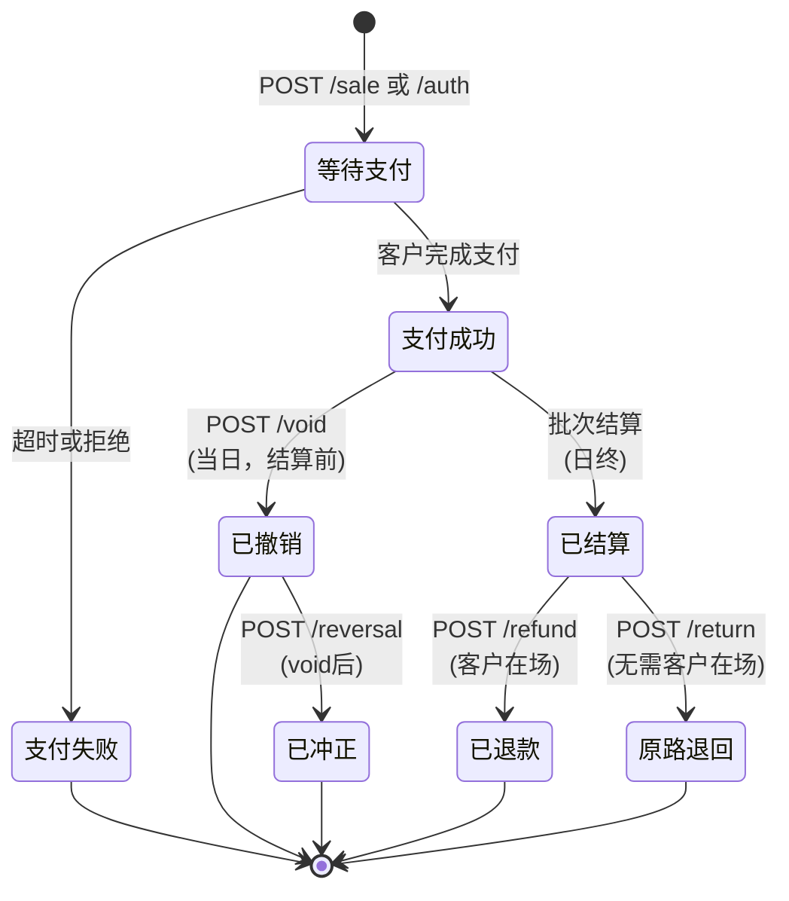
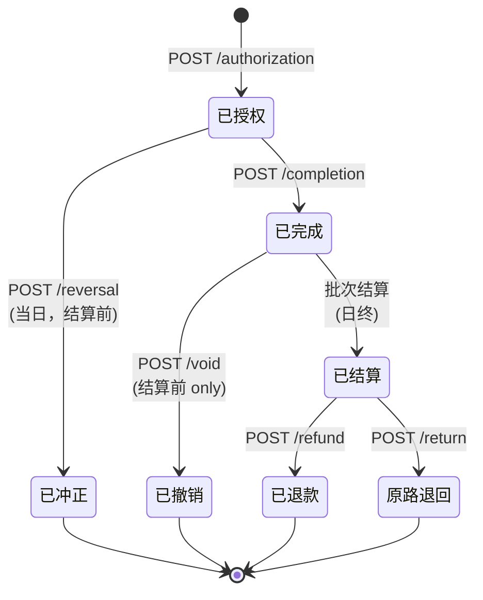

# 面对面支付 API 集成指南

欢迎使用面对面支付 API 集成指南。本文档概述了构建无缝、安全的商户面对面（持卡人当面）支付体验所需的一切内容。

---

## 1. 概述与架构

本系统采用**半集成架构**。与信用卡数据流经销售点（POS）软件的传统系统不同，本系统将敏感数据完全隔离在 POS 之外。

* **工作原理：** 您的 POS 软件向支付 API 发送支付请求（金额、交易类型）。API 将其路由到实体支付终端。终端读取卡片、加密数据，并直接发送到处理器。
* **优势：** 这种方法大幅降低了商户的 PCI-DSS 合规范围，因为 POS 软件永远不会接触未加密的主账号（PAN）。

### 环境
* **沙盒环境：** `https://triposcert.vantiv.com`

### 关键要求
* **Authorization 请求头：** `Version=1.0`
* **ReferenceNumber：** 必填，唯一数字 ≤16 位
* **TicketNumber：** 交换所需，唯一数字 ≤6 位
* **格式：** 仅 JSON
* **处理：** 每个终端串行处理 - 无并发请求
* **响应检查：** 先检查 HTTP 状态，再检查系统状态码

---

## 2. 面对面支付流程

如果您习惯电子商务在线支付，面对面支付需要稍微转变思维。持卡人当面交易是**异步的**，严重依赖实体硬件交互。

### 支付状态转换图



### 预授权流程状态转换



### 状态转换说明

| 当前状态 | API 调用 | 目标状态 | 说明 |
|----------|----------|----------|------|
| 开始 | `POST /sale` | 等待支付 | 发起销售交易 |
| 开始 | `POST /authorization` | 等待支付 | 发起预授权 |
| 等待支付 | 客户完成支付 | 支付成功/失败 | 终端交互完成 |
| 支付成功 | 批次结算 | 已结算 | 日终自动结算 |
| 支付成功 | `POST /void` | 已撤销 | 当日批次结算前取消 |
| 已撤销 | `POST /reversal` | 已冲正 | void后冲正 |
| 已结算 | `POST /refund` | 已退款 | 独立退款（客户在场） |
| 已结算 | `POST /return` | 原路退回 | 原路退回（无需客户在场） |
| 已授权 | `POST /completion` | 已完成 | 完成预授权，扣款 |
| 已完成 | `POST /void` | 已撤销 | 完成预授权后，结算前撤销 |
| 已完成 | 批次结算 | 已结算 | 日终自动结算 |
| 已结算 | `POST /refund` | 已退款 | 独立退款（客户在场） |
| 已结算 | `POST /return` | 原路退回 | 原路退回（无需客户在场） |
| 已授权 | `POST /reversal` | 已冲正 | 冲正预授权（完成前） |

### 标准交易流程
1. **发起：** POS 向 API 发送 POST 请求，包含交易金额。
2. **设备锁定：** API 锁定实体终端并在屏幕上显示金额。
3. **客户交互（等待）：** 终端提示客户拍卡、插卡或刷卡。*注意：在此步骤期间，您的 API 调用将保持打开并"等待"，根据客户操作可能需要 30-60 秒。*
4. **处理：** 终端加密卡片数据并直接与支付网关通信。
5. **响应：** API 将批准或拒绝的有效负载返回给 POS。
6. **收据：** POS 使用有效负载中返回的必需 EMV 数据打印收据。

### 重要时间考量
* **串行处理：** 同一终端/PIN 密码键盘不能处理并发请求。您必须等待上一个请求 100% 完成后才能发送下一个。
* **超时：** 如果客户未支付就离开，终端将超时。API 将返回指示 `超时` 的错误。POS 应清除交易状态。

---

## 3. 认证与终端管理

### 必需请求头
每个 API 请求必须包含以下请求头进行认证和路由：

| 请求头 | 值 | 说明 |
|--------|-------|-------------|
| `tp-application-id` | 您的应用 ID | 标识您的 POS 应用程序 |
| `tp-application-name` | 您的应用名称 | 应用程序名称 |
| `tp-application-version` | 版本字符串 | 应用程序版本 |
| `tp-authorization` | `Version=1.0` | 认证版本 |
| `tp-express-acceptor-id` | 来自门户 | 商户接收方 ID |
| `tp-express-account-id` | 来自门户 | 商户账户 ID |
| `tp-express-account-token` | 来自门户 | 商户账户令牌 |
| `tp-request-id` | 每次请求的唯一 UUID | 幂等性密钥（防止重复扣款） |
| `Content-Type` | `application/json` | 用于 POST 请求 |

### 终端（通道）管理
在本系统中，实体终端被分配一个 `laneId`。发起请求时，您必须指定 `laneId`，以便 API 知道要激活哪个实体设备。

#### 创建通道 — `POST /cloudapi/v1/lanes/`
使用 PIN 密码键盘上显示的激活码配对 PIN 密码键盘终端。

**必需参数：**
* `laneId` — 通道标识符
* `terminalId` — 终端标识符
* `activationCode` — PIN 密码键盘上显示的代码

```bash
export TP_REQUEST_ID="$(uuidgen)"
curl -sS -X POST "\${HOST}/cloudapi/v1/lanes/" \
  -H "Content-Type: application/json" \
  -H "tp-application-id: \${TP_APP_ID}" \
  -H "tp-application-name: \${TP_APP_NAME}" \
  -H "tp-application-version: \${TP_APP_VERSION}" \
  -H "tp-request-id: \${TP_REQUEST_ID}" \
  -H "tp-express-acceptor-id: \${TP_EXPRESS_ACCEPTOR_ID}" \
  -H "tp-express-account-id: \${TP_EXPRESS_ACCOUNT_ID}" \
  -H "tp-express-account-token: \${TP_EXPRESS_ACCOUNT_TOKEN}" \
  -d @- <<EOF
{
  "laneId": "\${LANE_ID}",
  "terminalId": "\${TERMINAL_ID}",
  "activationCode": "\${ACTIVATION_CODE}"
}
EOF
```

#### 检查通道状态 — `GET /cloudapi/v1/lanes/{laneId}/connectionstatus`
在发送有效负载前使用此接口 ping 终端，确保其在线且空闲。

```bash
export TP_REQUEST_ID="$(uuidgen)"
curl -sS "\${HOST}/cloudapi/v1/lanes/\${LANE_ID}/connectionstatus" \
  -H "tp-application-id: \${TP_APP_ID}" \
  -H "tp-application-name: \${TP_APP_NAME}" \
  -H "tp-application-version: \${TP_APP_VERSION}" \
  -H "tp-request-id: \${TP_REQUEST_ID}" \
  -H "tp-express-acceptor-id: \${TP_EXPRESS_ACCEPTOR_ID}" \
  -H "tp-express-account-id: \${TP_EXPRESS_ACCOUNT_ID}" \
  -H "tp-express-account-token: \${TP_EXPRESS_ACCOUNT_TOKEN}"
```

#### 删除通道 — `DELETE /cloudapi/v1/lanes/{laneId}`
取消配对并移除终端设备（认证所需）。

```bash
export TP_REQUEST_ID="$(uuidgen)"
curl -sS -X DELETE "\${HOST}/cloudapi/v1/lanes/\${LANE_ID}" \
  -H "tp-application-id: \${TP_APP_ID}" \
  -H "tp-application-name: \${TP_APP_NAME}" \
  -H "tp-application-version: \${TP_APP_VERSION}" \
  -H "tp-request-id: \${TP_REQUEST_ID}" \
  -H "tp-express-acceptor-id: \${TP_EXPRESS_ACCEPTOR_ID}" \
  -H "tp-express-account-id: \${TP_EXPRESS_ACCOUNT_ID}" \
  -H "tp-express-account-token: \${TP_EXPRESS_ACCOUNT_TOKEN}"
```

---

## 4. 核心支付流程

### POST `/api/v1/sale` — 销售交易

#### 使用场景
立即捕获资金的主要端点（例如零售）。触发终端提示付款。这是最常见的交易类型，资金会立即从客户账户扣除并结算给商户。

#### 必需参数

| 参数 | 类型 | 说明 |
|-----------|------|-------------|
| `laneId` | integer | 通道 ID（终端标识符） |
| `transactionAmount` | string | 交易金额（例如 "10.00"） |

#### 强烈建议参数

| 参数 | 类型 | 说明 |
|-----------|------|-------------|
| `referenceNumber` | string | 唯一交易引用（最多 16 位数字） |
| `ticketNumber` | string | 交换票据编号（最多 6 位数字） |

#### 可选配置参数

| 参数 | 类型 | 说明 |
|-----------|------|-------------|
| `invokeManualEntry` | boolean | 强制手动卡片输入（用于手输交易） |
| `requestedCashbackAmount` | string | 请求的返现金额（仅限借记卡） |
| `configuration.allowPartialApprovals` | boolean | 允许部分批准（用于预付卡/礼品卡） |
| `configuration.allowDebit` | boolean | 允许借记卡交易 |
| `configuration.enableTipPrompt` | boolean | 启用设备端小费提示 |
| `configuration.tipPromptOptions` | array | 小费选项（例如 ["15", "18", "20", "none"]） |
| `tipAmount` | string | 预置小费金额（与 enableTipPrompt 互斥） |

#### curl 示例

```bash
export TP_REQUEST_ID="$(uuidgen)"
curl -sS -X POST "\${HOST}/api/v1/sale" \
  -H "Content-Type: application/json" \
  -H "tp-application-id: \${TP_APP_ID}" \
  -H "tp-application-name: \${TP_APP_NAME}" \
  -H "tp-application-version: \${TP_APP_VERSION}" \
  -H "tp-request-id: \${TP_REQUEST_ID}" \
  -H "tp-authorization: \${TP_AUTH}" \
  -H "tp-express-acceptor-id: \${TP_EXPRESS_ACCEPTOR_ID}" \
  -H "tp-express-account-id: \${TP_EXPRESS_ACCOUNT_ID}" \
  -H "tp-express-account-token: \${TP_EXPRESS_ACCOUNT_TOKEN}" \
  -d @- <<EOF
{
  "laneId": \${LANE_ID},
  "transactionAmount": "10.00",
  "referenceNumber": "12345678901234",
  "ticketNumber": "123456"
}
EOF
```

#### 示例响应

```json
{
  "statusCode": 0,
  "statusMessage": "Approved",
  "transactionId": "1234567890",
  "referenceNumber": "12345678901234",
  "ticketNumber": "123456",
  "transactionAmount": "10.00",
  "subTotalAmount": "10.00",
  "tipAmount": "0.00",
  "accountNumber": "************1234",
  "cardHolderName": "JOHN DOE",
  "paymentType": "Credit",
  "entryMode": "EMV",
  "approvalNumber": "123456",
  "emv": {
    "applicationIdentifier": "A0000000031010",
    "applicationLabel": "Visa Credit",
    "cryptogram": "1234567890ABCDEF",
    "terminalVerificationResults": "0000000000",
    "transactionStatusInformation": "E800"
  }
}
```

---

### POST `/api/v1/authorization` — 预授权

#### 使用场景
冻结资金但暂不扣款的端点。常用于酒店、租车和餐厅等需要稍后完成交易的场景。预授权会冻结客户账户中的资金，但不会立即结算。

#### 必需参数

| 参数 | 类型 | 说明 |
|-----------|------|-------------|
| `laneId` | integer | 通道 ID（终端标识符） |
| `transactionAmount` | string | 预授权金额 |

#### 强烈建议参数

| 参数 | 类型 | 说明 |
|-----------|------|-------------|
| `referenceNumber` | string | 唯一交易引用（最多 16 位数字） |
| `ticketNumber` | string | 交换票据编号（最多 6 位数字） |

#### 可选配置参数

| 参数 | 类型 | 说明 |
|-----------|------|-------------|
| `invokeManualEntry` | boolean | 强制手动卡片输入 |
| `configuration.allowPartialApprovals` | boolean | 允许部分批准 |
| `configuration.allowDebit` | boolean | 允许借记卡 |

#### curl 示例

```bash
export TP_REQUEST_ID="$(uuidgen)"
curl -sS -X POST "\${HOST}/api/v1/authorization" \
  -H "Content-Type: application/json" \
  -H "tp-application-id: \${TP_APP_ID}" \
  -H "tp-application-name: \${TP_APP_NAME}" \
  -H "tp-application-version: \${TP_APP_VERSION}" \
  -H "tp-request-id: \${TP_REQUEST_ID}" \
  -H "tp-authorization: \${TP_AUTH}" \
  -H "tp-express-acceptor-id: \${TP_EXPRESS_ACCEPTOR_ID}" \
  -H "tp-express-account-id: \${TP_EXPRESS_ACCOUNT_ID}" \
  -H "tp-express-account-token: \${TP_EXPRESS_ACCOUNT_TOKEN}" \
  -d @- <<EOF
{
  "laneId": \${LANE_ID},
  "transactionAmount": "100.00",
  "referenceNumber": "\${REFERENCE_NUMBER}",
  "ticketNumber": "\${TICKET_NUMBER}"
}
EOF
```

#### 示例响应

```json
{
  "statusCode": 0,
  "statusMessage": "Approved",
  "transactionId": "1234567890",
  "referenceNumber": "12345678901234",
  "ticketNumber": "123456",
  "transactionAmount": "100.00",
  "accountNumber": "************1234",
  "cardHolderName": "JOHN DOE",
  "paymentType": "Credit",
  "entryMode": "EMV",
  "approvalNumber": "123456"
}
```

---

### POST `/api/v1/authorization/{transactionId}/completion` — 预授权完成

#### 使用场景
完成（捕获）先前预授权的交易，将冻结的资金转为实际扣款。完成金额可以与原始预授权金额不同（例如餐厅小费调整）。

#### 必需参数

| 参数 | 类型 | 位置 | 说明 |
|-----------|------|----------|-------------|
| `transactionId` | string | Path | 来自预授权响应的交易 ID |
| `laneId` | integer | Body | 通道 ID |
| `transactionAmount` | string | Body | 完成金额（可与预授权不同） |

#### curl 示例

```bash
export TP_REQUEST_ID="$(uuidgen)"
export AUTH_TXN_ID="1234567890"
curl -sS -X POST "\${HOST}/api/v1/authorization/\${AUTH_TXN_ID}/completion" \
  -H "Content-Type: application/json" \
  -H "tp-application-id: \${TP_APP_ID}" \
  -H "tp-application-name: \${TP_APP_NAME}" \
  -H "tp-application-version: \${TP_APP_VERSION}" \
  -H "tp-request-id: \${TP_REQUEST_ID}" \
  -H "tp-authorization: \${TP_AUTH}" \
  -H "tp-express-acceptor-id: \${TP_EXPRESS_ACCEPTOR_ID}" \
  -H "tp-express-account-id: \${TP_EXPRESS_ACCOUNT_ID}" \
  -H "tp-express-account-token: \${TP_EXPRESS_ACCOUNT_TOKEN}" \
  -d @- <<EOF
{
  "laneId": \${LANE_ID},
  "transactionAmount": "100.00"
}
EOF
```

#### 示例响应

```json
{
  "statusCode": 0,
  "statusMessage": "Approved",
  "transactionId": "9876543210",
  "referenceNumber": "12345678901234",
  "ticketNumber": "123456",
  "transactionAmount": "100.00",
  "accountNumber": "************1234",
  "paymentType": "Credit",
  "approvalNumber": "123456"
}
```

---

### POST `/api/v1/refund` — 独立退款

#### 使用场景
需要终端交互（持卡人当面）的独立退款操作。与原路退回不同，此端点不需要原始交易 ID，客户需要在终端上刷卡/插卡。

#### 必需参数

| 参数 | 类型 | 说明 |
|-----------|------|-------------|
| `laneId` | integer | 通道 ID |
| `transactionAmount` | string | 退款金额 |

#### 强烈建议参数

| 参数 | 类型 | 说明 |
|-----------|------|-------------|
| `referenceNumber` | string | 唯一交易引用 |
| `ticketNumber` | string | 交换票据编号 |

#### 可选配置参数

| 参数 | 类型 | 说明 |
|-----------|------|-------------|
| `configuration.allowDebit` | boolean | 允许借记卡退款 |

#### curl 示例

```bash
export TP_REQUEST_ID="$(uuidgen)"
curl -sS -X POST "\${HOST}/api/v1/refund" \
  -H "Content-Type: application/json" \
  -H "tp-application-id: \${TP_APP_ID}" \
  -H "tp-application-name: \${TP_APP_NAME}" \
  -H "tp-application-version: \${TP_APP_VERSION}" \
  -H "tp-request-id: \${TP_REQUEST_ID}" \
  -H "tp-authorization: \${TP_AUTH}" \
  -H "tp-express-acceptor-id: \${TP_EXPRESS_ACCEPTOR_ID}" \
  -H "tp-express-account-id: \${TP_EXPRESS_ACCOUNT_ID}" \
  -H "tp-express-account-token: \${TP_EXPRESS_ACCOUNT_TOKEN}" \
  -d @- <<EOF
{
  "laneId": \${LANE_ID},
  "transactionAmount": "10.00",
  "referenceNumber": "\${REFERENCE_NUMBER}",
  "ticketNumber": "\${TICKET_NUMBER}"
}
EOF
```

#### 示例响应

```json
{
  "statusCode": 0,
  "statusMessage": "Approved",
  "transactionId": "1234567890",
  "referenceNumber": "12345678901234",
  "ticketNumber": "123456",
  "transactionAmount": "10.00",
  "accountNumber": "************1234",
  "cardHolderName": "JOHN DOE",
  "paymentType": "Credit",
  "entryMode": "EMV",
  "approvalNumber": "654321"
}
```

---

### POST `/api/v1/return/{transactionId}/{paymentType}` — 原路退回

#### 使用场景
基于原始交易引用的退款操作（无需终端交互）。链接到原始交易，支持全额或部分退款。常用于当原始交易信息已知且不需要客户在场的情况。

#### 必需参数

| 参数 | 类型 | 位置 | 说明 |
|-----------|------|----------|-------------|
| `transactionId` | string | Path | 原始交易 ID |
| `paymentType` | string | Path | 支付类型：`Credit`、`Debit`、`EBT`、`Gift` |
| `laneId` | integer | Body | 通道 ID |
| `transactionAmount` | string | Body | 退款金额（全额或部分） |

#### curl 示例

```bash
export TP_REQUEST_ID="$(uuidgen)"
export ORIGINAL_TXN_ID="1234567890"
export PAYMENT_TYPE="Credit"
curl -sS -X POST "\${HOST}/api/v1/return/\${ORIGINAL_TXN_ID}/\${PAYMENT_TYPE}" \
  -H "Content-Type: application/json" \
  -H "tp-application-id: \${TP_APP_ID}" \
  -H "tp-application-name: \${TP_APP_NAME}" \
  -H "tp-application-version: \${TP_APP_VERSION}" \
  -H "tp-request-id: \${TP_REQUEST_ID}" \
  -H "tp-authorization: \${TP_AUTH}" \
  -H "tp-express-acceptor-id: \${TP_EXPRESS_ACCEPTOR_ID}" \
  -H "tp-express-account-id: \${TP_EXPRESS_ACCOUNT_ID}" \
  -H "tp-express-account-token: \${TP_EXPRESS_ACCOUNT_TOKEN}" \
  -d @- <<EOF
{
  "laneId": \${LANE_ID},
  "transactionAmount": "10.00"
}
EOF
```

#### 示例响应

```json
{
  "statusCode": 0,
  "statusMessage": "Approved",
  "transactionId": "9876543210",
  "referenceNumber": "12345678901234",
  "ticketNumber": "123456",
  "transactionAmount": "10.00",
  "accountNumber": "************1234",
  "paymentType": "Credit",
  "approvalNumber": "654321"
}
```

---

### POST `/api/v1/reversal/{transactionId}/{paymentType}` — 冲正

#### 使用场景
交易的完全冲正/撤销操作（当天，批次结算前）。用于撤销已批准的交易，资金将返回客户账户。认证脚本要求执行全额冲正。

#### 必需参数

| 参数 | 类型 | 位置 | 说明 |
|-----------|------|----------|-------------|
| `transactionId` | string | Path | 原始交易 ID |
| `paymentType` | string | Path | 支付类型：`Credit`、`Debit`、`EBT`、`Gift` |
| `laneId` | integer | Body | 通道 ID |
| `transactionAmount` | string | Body | 冲正金额（全额原始金额） |

#### curl 示例

```bash
export TP_REQUEST_ID="$(uuidgen)"
export ORIGINAL_TXN_ID="1234567890"
export PAYMENT_TYPE="Credit"
curl -sS -X POST "\${HOST}/api/v1/reversal/\${ORIGINAL_TXN_ID}/\${PAYMENT_TYPE}" \
  -H "Content-Type: application/json" \
  -H "tp-application-id: \${TP_APP_ID}" \
  -H "tp-application-name: \${TP_APP_NAME}" \
  -H "tp-application-version: \${TP_APP_VERSION}" \
  -H "tp-request-id: \${TP_REQUEST_ID}" \
  -H "tp-authorization: \${TP_AUTH}" \
  -H "tp-express-acceptor-id: \${TP_EXPRESS_ACCEPTOR_ID}" \
  -H "tp-express-account-id: \${TP_EXPRESS_ACCOUNT_ID}" \
  -H "tp-express-account-token: \${TP_EXPRESS_ACCOUNT_TOKEN}" \
  -d @- <<EOF
{
  "laneId": \${LANE_ID},
  "transactionAmount": "10.00"
}
EOF
```

#### 示例响应

```json
{
  "statusCode": 0,
  "statusMessage": "Approved",
  "transactionId": "9876543210",
  "referenceNumber": "12345678901234",
  "ticketNumber": "123456",
  "transactionAmount": "10.00",
  "accountNumber": "************1234",
  "paymentType": "Credit",
  "approvalNumber": "654321"
}
```

---

### POST `/api/v1/void/{transactionId}` — 撤销

#### 使用场景
在商户每日批次结算前取消已授权的交易。与冲正不同，撤销不需要金额参数，且只能在交易尚未结算前执行。

#### 必需参数

| 参数 | 类型 | 位置 | 说明 |
|-----------|------|----------|-------------|
| `transactionId` | string | Path | 要撤销的交易 ID |
| `laneId` | integer | Body | 通道 ID |

#### curl 示例

```bash
export TP_REQUEST_ID="$(uuidgen)"
export ORIGINAL_TXN_ID="1234567890"
curl -sS -X POST "\${HOST}/api/v1/void/\${ORIGINAL_TXN_ID}" \
  -H "Content-Type: application/json" \
  -H "tp-application-id: \${TP_APP_ID}" \
  -H "tp-application-name: \${TP_APP_NAME}" \
  -H "tp-application-version: \${TP_APP_VERSION}" \
  -H "tp-request-id: \${TP_REQUEST_ID}" \
  -H "tp-authorization: \${TP_AUTH}" \
  -H "tp-express-acceptor-id: \${TP_EXPRESS_ACCEPTOR_ID}" \
  -H "tp-express-account-id: \${TP_EXPRESS_ACCOUNT_ID}" \
  -H "tp-express-account-token: \${TP_EXPRESS_ACCOUNT_TOKEN}" \
  -d @- <<EOF
{
  "laneId": \${LANE_ID}
}
EOF
```

#### 示例响应

```json
{
  "statusCode": 0,
  "statusMessage": "Voided",
  "transactionId": "9876543210",
  "originalTransactionId": "1234567890"
}
```

---

## 5. 美国特定工作流程：小费与分次付款

美国市场严重依赖小费。您必须根据商户环境支持正确的小费流程。

### 流程 A：设备端小费（快餐/柜台）
客户在支付前直接在支付终端上输入小费。根据卡组织要求，小费选择现在发生在卡片输入之前。

1. POS 向 `/api/v1/sale` 发送基本金额并设置 `enableTipPrompt: true`。
2. 终端提示客户："15%、18%、20%、none"（百分比）或 "\$5、\$10、\$15、other"（固定金额）。
3. 客户选择小费，然后拍卡/插卡。
4. API 将最终总额（基本金额 + 小费）返回给 POS。

**设备端小费示例：**
```bash
export TP_REQUEST_ID="$(uuidgen)"
curl -sS -X POST "\${HOST}/api/v1/sale" \
  -H "Content-Type: application/json" \
  -H "tp-application-id: \${TP_APP_ID}" \
  -H "tp-application-name: \${TP_APP_NAME}" \
  -H "tp-application-version: \${TP_APP_VERSION}" \
  -H "tp-request-id: \${TP_REQUEST_ID}" \
  -H "tp-authorization: \${TP_AUTH}" \
  -H "tp-express-acceptor-id: \${TP_EXPRESS_ACCEPTOR_ID}" \
  -H "tp-express-account-id: \${TP_EXPRESS_ACCOUNT_ID}" \
  -H "tp-express-account-token: \${TP_EXPRESS_ACCOUNT_TOKEN}" \
  -d @- <<EOF
{
  "laneId": \${LANE_ID},
  "transactionAmount": "50.00",
  "configuration": {
    "enableTipPrompt": true,
    "tipPromptOptions": ["15", "18", "20", "none"]
  },
  "referenceNumber": "\${REFERENCE_NUMBER}",
  "ticketNumber": "\${TICKET_NUMBER}"
}
EOF
```

**小费选项格式：**
* **百分比：** `"15"`、`"18"`、`"20"`（不要包含 % 符号）
* **固定金额：** `"5.00"`、`"10.00"`、`"15.00"`
* **特殊值：** `"none"`（无小费）、`"other"`（自定义金额输入）

**响应字段：**
* `subTotalAmount` — 原始金额（来自请求）
* `tipAmount` — 选定的小费金额（百分比自动计算）
* `transactionAmount` — 最终金额（小计 + 小费）

### 流程 B：预置小费（桌边服务餐厅）
商户在客户支付前指定小费金额。

1. 服务员在 POS 中输入小费金额。
2. POS 发送包含 `tipAmount` 字段的销售请求。
3. 客户支付总金额（小计 + 小费）。

**预置小费示例：**
```bash
export TP_REQUEST_ID="$(uuidgen)"
curl -sS -X POST "\${HOST}/api/v1/sale" \
  -H "Content-Type: application/json" \
  -H "tp-application-id: \${TP_APP_ID}" \
  -H "tp-application-name: \${TP_APP_NAME}" \
  -H "tp-application-version: \${TP_APP_VERSION}" \
  -H "tp-request-id: \${TP_REQUEST_ID}" \
  -H "tp-authorization: \${TP_AUTH}" \
  -H "tp-express-acceptor-id: \${TP_EXPRESS_ACCEPTOR_ID}" \
  -H "tp-express-account-id: \${TP_EXPRESS_ACCOUNT_ID}" \
  -H "tp-express-account-token: \${TP_EXPRESS_ACCOUNT_TOKEN}" \
  -d @- <<EOF
{
  "laneId": \${LANE_ID},
  "transactionAmount": "50.00",
  "tipAmount": "10.00",
  "referenceNumber": "\${REFERENCE_NUMBER}",
  "ticketNumber": "\${TICKET_NUMBER}"
}
EOF
```

### 部分批准（预付卡/礼品卡）
如果客户使用 \$20 的 Visa 礼品卡支付 \$50 的交易，API 将返回 \$20 的 `部分批准` 状态。POS 必须识别这一点，将 \$20 应用于账单，并提示用户使用其他支付方式支付剩余的 \$30。

启用部分批准：
```json
"configuration": {
  "allowPartialApprovals": true
}
```
