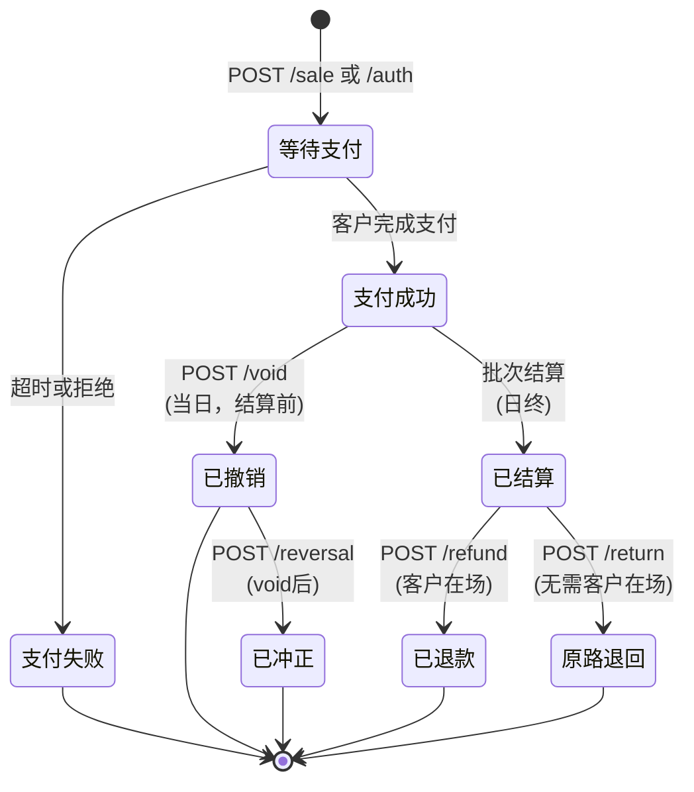
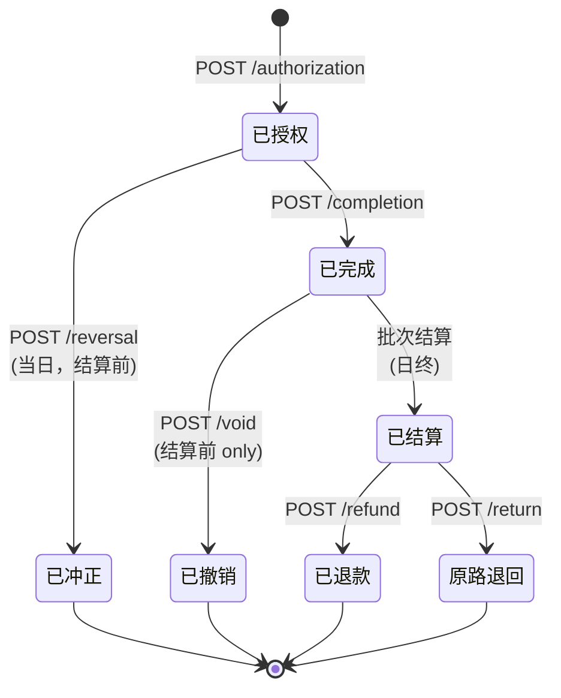

# 面对面支付 API 集成指南 v1.7

欢迎使用面对面支付 API 集成指南。本文档概述了构建无缝、安全的商户面对面（持卡人当面）支付体验所需的一切内容。

---

## 1. 概述与架构

本系统采用**半集成架构**。与信用卡数据流经销售点（POS）软件的传统系统不同，本系统将敏感数据完全隔离在 POS 之外。

* **工作原理：** 您的 POS 软件向支付 API 发送支付请求（金额、交易类型）。API 将其路由到实体支付终端。终端读取卡片、加密数据，并直接发送到处理器。
* **优势：** 这种方法大幅降低了商户的 PCI-DSS 合规范围，因为 POS 软件永远不会接触未加密的主账号（PAN）。

### 环境

* **沙盒环境：** `https://triposcert.vantiv.com`

### 关键要求

* **Authorization 请求头：** `Version=1.0`
* **ReferenceNumber：** 必填，唯一数字 ≤16 位
* **TicketNumber：** 交换所需，唯一数字 ≤6 位
* **格式：** 仅 JSON
* **处理：** 每个终端串行处理 - 无并发请求
* **响应检查：** 先检查 HTTP 状态，再检查系统状态码

---

## 2. 面对面支付流程

如果您习惯电子商务在线支付，面对面支付需要稍微转变思维。持卡人当面交易是**异步的**，严重依赖实体硬件交互。

### 支付状态转换图



### 预授权流程状态转换



### 状态转换说明

| 当前状态 | API 调用                | 目标状态    | 说明           |
| ---- | --------------------- | ------- | ------------ |
| 开始   | `POST /sale`          | 等待支付    | 发起销售交易       |
| 开始   | `POST /authorization` | 等待支付    | 发起预授权        |
| 等待支付 | 客户完成支付                | 支付成功/失败 | 终端交互完成       |
| 支付成功 | 批次结算                  | 已结算     | 日终自动结算       |
| 支付成功 | `POST /void`          | 已撤销     | 当日批次结算前取消    |
| 已撤销  | `POST /reversal`      | 已冲正     | void后冲正      |
| 已结算  | `POST /refund`        | 已退款     | 独立退款（客户在场）   |
| 已结算  | `POST /return`        | 原路退回    | 原路退回（无需客户在场） |
| 已授权  | `POST /completion`    | 已完成     | 完成预授权，扣款     |
| 已完成  | `POST /void`          | 已撤销     | 完成预授权后，结算前撤销 |
| 已完成  | 批次结算                  | 已结算     | 日终自动结算       |
| 已结算  | `POST /refund`        | 已退款     | 独立退款（客户在场）   |
| 已结算  | `POST /return`        | 原路退回    | 原路退回（无需客户在场） |
| 已授权  | `POST /reversal`      | 已冲正     | 冲正预授权（完成前）   |

### 标准交易流程

1. **发起：** POS 向 API 发送 POST 请求，包含交易金额。
2. **设备锁定：** API 锁定实体终端并在屏幕上显示金额。
3. **客户交互（等待）：** 终端提示客户拍卡、插卡或刷卡。*注意：在此步骤期间，您的 API 调用将保持打开并"等待"，根据客户操作可能需要 30-60 秒。*
4. **处理：** 终端加密卡片数据并直接与支付网关通信。
5. **响应：** API 将批准或拒绝的有效负载返回给 POS。
6. **收据：** POS 使用有效负载中返回的必需 EMV 数据打印收据。

### 重要时间考量

* **串行处理：** 同一终端/PIN 密码键盘不能处理并发请求。您必须等待上一个请求 100% 完成后才能发送下一个。
* **超时：** 如果客户未支付就离开，终端将超时。API 将返回指示 `超时` 的错误。POS 应清除交易状态。

---

## 3. 认证与终端管理

### 必需请求头

每个 API 请求必须包含以下请求头进行认证和路由：

| 请求头                        | 值                  | 说明            |
| -------------------------- | ------------------ | ------------- |
| `tp-application-id`        | 您的应用 ID            | 标识您的 POS 应用程序 |
| `tp-application-name`      | 您的应用名称             | 应用程序名称        |
| `tp-application-version`   | 版本字符串              | 应用程序版本        |
| `tp-authorization`         | `Version=1.0`      | 认证版本          |
| `tp-express-acceptor-id`   | 来自门户               | 商户接收方 ID      |
| `tp-express-account-id`    | 来自门户               | 商户账户 ID       |
| `tp-express-account-token` | 来自门户               | 商户账户令牌        |
| `tp-request-id`            | 每次请求的唯一 UUID       | 幂等性密钥（防止重复扣款） |
| `Content-Type`             | `application/json` | 用于 POST 请求    |

### 终端（通道）管理

在本系统中，实体终端被分配一个 `laneId`。发起请求时，您必须指定 `laneId`，以便 API 知道要激活哪个实体设备。

#### 创建通道 — `POST /cloudapi/v1/lanes/`

使用 PIN 密码键盘上显示的激活码配对 PIN 密码键盘终端。

**必需参数：**

* `laneId` — 通道标识符
* `terminalId` — 终端标识符
* `activationCode` — PIN 密码键盘上显示的代码

```bash
export TP_REQUEST_ID="$(uuidgen)"
curl -sS -X POST "\${HOST}/cloudapi/v1/lanes/" \
  -H "Content-Type: application/json" \
  -H "tp-application-id: \${TP_APP_ID}" \
  -H "tp-application-name: \${TP_APP_NAME}" \
  -H "tp-application-version: \${TP_APP_VERSION}" \
  -H "tp-request-id: \${TP_REQUEST_ID}" \
  -H "tp-express-acceptor-id: \${TP_EXPRESS_ACCEPTOR_ID}" \
  -H "tp-express-account-id: \${TP_EXPRESS_ACCOUNT_ID}" \
  -H "tp-express-account-token: \${TP_EXPRESS_ACCOUNT_TOKEN}" \
  -d @- <<EOF
{
  "laneId": "\${LANE_ID}",
  "terminalId": "\${TERMINAL_ID}",
  "activationCode": "\${ACTIVATION_CODE}"
}
EOF
```

#### 检查通道状态 — `GET /cloudapi/v1/lanes/{laneId}/connectionstatus`

在发送有效负载前使用此接口 ping 终端，确保其在线且空闲。

```bash
export TP_REQUEST_ID="$(uuidgen)"
curl -sS "\${HOST}/cloudapi/v1/lanes/\${LANE_ID}/connectionstatus" \
  -H "tp-application-id: \${TP_APP_ID}" \
  -H "tp-application-name: \${TP_APP_NAME}" \
  -H "tp-application-version: \${TP_APP_VERSION}" \
  -H "tp-request-id: \${TP_REQUEST_ID}" \
  -H "tp-express-acceptor-id: \${TP_EXPRESS_ACCEPTOR_ID}" \
  -H "tp-express-account-id: \${TP_EXPRESS_ACCOUNT_ID}" \
  -H "tp-express-account-token: \${TP_EXPRESS_ACCOUNT_TOKEN}"
```

#### 删除通道 — `DELETE /cloudapi/v1/lanes/{laneId}`

取消配对并移除终端设备（认证所需）。

```bash
export TP_REQUEST_ID="$(uuidgen)"
curl -sS -X DELETE "\${HOST}/cloudapi/v1/lanes/\${LANE_ID}" \
  -H "tp-application-id: \${TP_APP_ID}" \
  -H "tp-application-name: \${TP_APP_NAME}" \
  -H "tp-application-version: \${TP_APP_VERSION}" \
  -H "tp-request-id: \${TP_REQUEST_ID}" \
  -H "tp-express-acceptor-id: \${TP_EXPRESS_ACCEPTOR_ID}" \
  -H "tp-express-account-id: \${TP_EXPRESS_ACCOUNT_ID}" \
  -H "tp-express-account-token: \${TP_EXPRESS_ACCOUNT_TOKEN}"
```

---

## 4. 核心支付流程

### POST `/api/v1/sale` — 销售交易

#### 使用场景

立即捕获资金的主要端点（例如零售）。触发终端提示付款。这是最常见的交易类型，资金会立即从客户账户扣除并结算给商户。

#### 必需参数

| 参数                  | 类型      | 说明               |
| ------------------- | ------- | ---------------- |
| `laneId`            | integer | 通道 ID（终端标识符）     |
| `transactionAmount` | string  | 交易金额（例如 "10.00"） |

#### 强烈建议参数

| 参数                | 类型     | 说明                |
| ----------------- | ------ | ----------------- |
| `referenceNumber` | string | 唯一交易引用（最多 16 位数字） |
| `ticketNumber`    | string | 交换票据编号（最多 6 位数字）  |

#### 可选配置参数

| 参数                                    | 类型      | 说明                                  |
| ------------------------------------- | ------- | ----------------------------------- |
| `invokeManualEntry`                   | boolean | 强制手动卡片输入（用于手输交易）                    |
| `requestedCashbackAmount`             | string  | 请求的返现金额（仅限借记卡）                      |
| `configuration.allowPartialApprovals` | boolean | 允许部分批准（用于预付卡/礼品卡）                   |
| `configuration.allowDebit`            | boolean | 允许借记卡交易                             |
| `configuration.enableTipPrompt`       | boolean | 启用设备端小费提示                           |
| `configuration.tipPromptOptions`      | array   | 小费选项（例如 ["15", "18", "20", "none"]） |
| `tipAmount`                           | string  | 预置小费金额（与 enableTipPrompt 互斥）        |

#### Curl 示例

```bash
export TP_REQUEST_ID="$(uuidgen)"
curl -sS -X POST "\${HOST}/api/v1/sale" \
  -H "Content-Type: application/json" \
  -H "tp-application-id: \${TP_APP_ID}" \
  -H "tp-application-name: \${TP_APP_NAME}" \
  -H "tp-application-version: \${TP_APP_VERSION}" \
  -H "tp-request-id: \${TP_REQUEST_ID}" \
  -H "tp-authorization: \${TP_AUTH}" \
  -H "tp-express-acceptor-id: \${TP_EXPRESS_ACCEPTOR_ID}" \
  -H "tp-express-account-id: \${TP_EXPRESS_ACCOUNT_ID}" \
  -H "tp-express-account-token: \${TP_EXPRESS_ACCOUNT_TOKEN}" \
  -d @- <<EOF
{
  "laneId": \${LANE_ID},
  "transactionAmount": "10.00",
  "referenceNumber": "12345678901234",
  "ticketNumber": "123456"
}
EOF
```


---

### POST `/api/v1/authorization` — 预授权

#### 使用场景

冻结资金但暂不扣款的端点。常用于酒店、租车和餐厅等需要稍后完成交易的场景。预授权会冻结客户账户中的资金，但不会立即结算。

#### 必需参数

| 参数                  | 类型      | 说明           |
| ------------------- | ------- | ------------ |
| `laneId`            | integer | 通道 ID（终端标识符） |
| `transactionAmount` | string  | 预授权金额        |

#### 强烈建议参数

| 参数                | 类型     | 说明                |
| ----------------- | ------ | ----------------- |
| `referenceNumber` | string | 唯一交易引用（最多 16 位数字） |
| `ticketNumber`    | string | 交换票据编号（最多 6 位数字）  |

#### 可选配置参数

| 参数                                    | 类型      | 说明       |
| ------------------------------------- | ------- | -------- |
| `invokeManualEntry`                   | boolean | 强制手动卡片输入 |
| `configuration.allowPartialApprovals` | boolean | 允许部分批准   |
| `configuration.allowDebit`            | boolean | 允许借记卡    |

#### Curl 示例

```bash
export TP_REQUEST_ID="$(uuidgen)"
curl -sS -X POST "\${HOST}/api/v1/authorization" \
  -H "Content-Type: application/json" \
  -H "tp-application-id: \${TP_APP_ID}" \
  -H "tp-application-name: \${TP_APP_NAME}" \
  -H "tp-application-version: \${TP_APP_VERSION}" \
  -H "tp-request-id: \${TP_REQUEST_ID}" \
  -H "tp-authorization: \${TP_AUTH}" \
  -H "tp-express-acceptor-id: \${TP_EXPRESS_ACCEPTOR_ID}" \
  -H "tp-express-account-id: \${TP_EXPRESS_ACCOUNT_ID}" \
  -H "tp-express-account-token: \${TP_EXPRESS_ACCOUNT_TOKEN}" \
  -d @- <<EOF
{
  "laneId": \${LANE_ID},
  "transactionAmount": "100.00",
  "referenceNumber": "\${REFERENCE_NUMBER}",
  "ticketNumber": "\${TICKET_NUMBER}"
}
EOF
```


---

### POST `/api/v1/authorization/{transactionId}/completion` — 预授权完成

#### 使用场景

完成（捕获）先前预授权的交易，将冻结的资金转为实际扣款。完成金额可以与原始预授权金额不同（例如餐厅小费调整）。

#### 必需参数

| 参数                  | 类型      | 位置   | 说明            |
| ------------------- | ------- | ---- | ------------- |
| `transactionId`     | string  | Path | 来自预授权响应的交易 ID |
| `laneId`            | integer | Body | 通道 ID         |
| `transactionAmount` | string  | Body | 完成金额（可与预授权不同） |

#### Curl 示例

```bash
export TP_REQUEST_ID="$(uuidgen)"
export AUTH_TXN_ID="1234567890"
curl -sS -X POST "\${HOST}/api/v1/authorization/\${AUTH_TXN_ID}/completion" \
  -H "Content-Type: application/json" \
  -H "tp-application-id: \${TP_APP_ID}" \
  -H "tp-application-name: \${TP_APP_NAME}" \
  -H "tp-application-version: \${TP_APP_VERSION}" \
  -H "tp-request-id: \${TP_REQUEST_ID}" \
  -H "tp-authorization: \${TP_AUTH}" \
  -H "tp-express-acceptor-id: \${TP_EXPRESS_ACCEPTOR_ID}" \
  -H "tp-express-account-id: \${TP_EXPRESS_ACCOUNT_ID}" \
  -H "tp-express-account-token: \${TP_EXPRESS_ACCOUNT_TOKEN}" \
  -d @- <<EOF
{
  "laneId": \${LANE_ID},
  "transactionAmount": "100.00"
}
EOF
```


---

### POST `/api/v1/refund` — 独立退款

#### 使用场景

需要终端交互（持卡人当面）的独立退款操作。与原路退回不同，此端点不需要原始交易 ID，客户需要在终端上刷卡/插卡。

#### 必需参数

| 参数                  | 类型      | 说明    |
| ------------------- | ------- | ----- |
| `laneId`            | integer | 通道 ID |
| `transactionAmount` | string  | 退款金额  |

#### 强烈建议参数

| 参数                | 类型     | 说明     |
| ----------------- | ------ | ------ |
| `referenceNumber` | string | 唯一交易引用 |
| `ticketNumber`    | string | 交换票据编号 |

#### 可选配置参数

| 参数                         | 类型      | 说明      |
| -------------------------- | ------- | ------- |
| `configuration.allowDebit` | boolean | 允许借记卡退款 |

#### Curl 示例

```bash
export TP_REQUEST_ID="$(uuidgen)"
curl -sS -X POST "\${HOST}/api/v1/refund" \
  -H "Content-Type: application/json" \
  -H "tp-application-id: \${TP_APP_ID}" \
  -H "tp-application-name: \${TP_APP_NAME}" \
  -H "tp-application-version: \${TP_APP_VERSION}" \
  -H "tp-request-id: \${TP_REQUEST_ID}" \
  -H "tp-authorization: \${TP_AUTH}" \
  -H "tp-express-acceptor-id: \${TP_EXPRESS_ACCEPTOR_ID}" \
  -H "tp-express-account-id: \${TP_EXPRESS_ACCOUNT_ID}" \
  -H "tp-express-account-token: \${TP_EXPRESS_ACCOUNT_TOKEN}" \
  -d @- <<EOF
{
  "laneId": \${LANE_ID},
  "transactionAmount": "10.00",
  "referenceNumber": "\${REFERENCE_NUMBER}",
  "ticketNumber": "\${TICKET_NUMBER}"
}
EOF
```


---

### POST `/api/v1/return/{transactionId}/{paymentType}` — 原路退回

#### 使用场景

基于原始交易引用的退款操作（无需终端交互）。链接到原始交易，支持全额或部分退款。常用于当原始交易信息已知且不需要客户在场的情况。

#### 必需参数

| 参数                  | 类型      | 位置   | 说明                                 |
| ------------------- | ------- | ---- | ---------------------------------- |
| `transactionId`     | string  | Path | 原始交易 ID                            |
| `paymentType`       | string  | Path | 支付类型：`Credit`、`Debit`、`EBT`、`Gift` |
| `laneId`            | integer | Body | 通道 ID                              |
| `transactionAmount` | string  | Body | 退款金额（全额或部分）                        |

#### Curl 示例

```bash
export TP_REQUEST_ID="$(uuidgen)"
export ORIGINAL_TXN_ID="1234567890"
export PAYMENT_TYPE="Credit"
curl -sS -X POST "\${HOST}/api/v1/return/\${ORIGINAL_TXN_ID}/\${PAYMENT_TYPE}" \
  -H "Content-Type: application/json" \
  -H "tp-application-id: \${TP_APP_ID}" \
  -H "tp-application-name: \${TP_APP_NAME}" \
  -H "tp-application-version: \${TP_APP_VERSION}" \
  -H "tp-request-id: \${TP_REQUEST_ID}" \
  -H "tp-authorization: \${TP_AUTH}" \
  -H "tp-express-acceptor-id: \${TP_EXPRESS_ACCEPTOR_ID}" \
  -H "tp-express-account-id: \${TP_EXPRESS_ACCOUNT_ID}" \
  -H "tp-express-account-token: \${TP_EXPRESS_ACCOUNT_TOKEN}" \
  -d @- <<EOF
{
  "laneId": \${LANE_ID},
  "transactionAmount": "10.00"
}
EOF
```


---

### POST `/api/v1/reversal/{transactionId}/{paymentType}` — 冲正

#### 使用场景

交易的完全冲正/撤销操作（当天，批次结算前）。用于撤销已批准的交易，资金将返回客户账户。认证脚本要求执行全额冲正。

#### 必需参数

| 参数                  | 类型      | 位置   | 说明                                 |
| ------------------- | ------- | ---- | ---------------------------------- |
| `transactionId`     | string  | Path | 原始交易 ID                            |
| `paymentType`       | string  | Path | 支付类型：`Credit`、`Debit`、`EBT`、`Gift` |
| `laneId`            | integer | Body | 通道 ID                              |
| `transactionAmount` | string  | Body | 冲正金额（全额原始金额）                       |

#### Curl 示例

```bash
export TP_REQUEST_ID="$(uuidgen)"
export ORIGINAL_TXN_ID="1234567890"
export PAYMENT_TYPE="Credit"
curl -sS -X POST "\${HOST}/api/v1/reversal/\${ORIGINAL_TXN_ID}/\${PAYMENT_TYPE}" \
  -H "Content-Type: application/json" \
  -H "tp-application-id: \${TP_APP_ID}" \
  -H "tp-application-name: \${TP_APP_NAME}" \
  -H "tp-application-version: \${TP_APP_VERSION}" \
  -H "tp-request-id: \${TP_REQUEST_ID}" \
  -H "tp-authorization: \${TP_AUTH}" \
  -H "tp-express-acceptor-id: \${TP_EXPRESS_ACCEPTOR_ID}" \
  -H "tp-express-account-id: \${TP_EXPRESS_ACCOUNT_ID}" \
  -H "tp-express-account-token: \${TP_EXPRESS_ACCOUNT_TOKEN}" \
  -d @- <<EOF
{
  "laneId": \${LANE_ID},
  "transactionAmount": "10.00"
}
EOF
```


---

### POST `/api/v1/void/{transactionId}` — 撤销

#### 使用场景

在商户每日批次结算前取消已授权的交易。与冲正不同，撤销不需要金额参数，且只能在交易尚未结算前执行。

#### 必需参数

| 参数              | 类型      | 位置   | 说明        |
| --------------- | ------- | ---- | --------- |
| `transactionId` | string  | Path | 要撤销的交易 ID |
| `laneId`        | integer | Body | 通道 ID     |

#### Curl 示例

```bash
export TP_REQUEST_ID="$(uuidgen)"
export ORIGINAL_TXN_ID="1234567890"
curl -sS -X POST "\${HOST}/api/v1/void/\${ORIGINAL_TXN_ID}" \
  -H "Content-Type: application/json" \
  -H "tp-application-id: \${TP_APP_ID}" \
  -H "tp-application-name: \${TP_APP_NAME}" \
  -H "tp-application-version: \${TP_APP_VERSION}" \
  -H "tp-request-id: \${TP_REQUEST_ID}" \
  -H "tp-authorization: \${TP_AUTH}" \
  -H "tp-express-acceptor-id: \${TP_EXPRESS_ACCEPTOR_ID}" \
  -H "tp-express-account-id: \${TP_EXPRESS_ACCOUNT_ID}" \
  -H "tp-express-account-token: \${TP_EXPRESS_ACCOUNT_TOKEN}" \
  -d @- <<EOF
{
  "laneId": \${LANE_ID}
}
EOF
```


---

## 5. 美国特定工作流程：小费与分次付款

美国市场严重依赖小费。您必须根据商户环境支持正确的小费流程。

### 流程 A：设备端小费（快餐/柜台）

客户在支付前直接在支付终端上输入小费。根据卡组织要求，小费选择现在发生在卡片输入之前。

1. POS 向 `/api/v1/sale` 发送基本金额并设置 `enableTipPrompt: true`。
2. 终端提示客户："15%、18%、20%、none"（百分比）或 "\$5、\$10、\$15、other"（固定金额）。
3. 客户选择小费，然后拍卡/插卡。
4. API 将最终总额（基本金额 + 小费）返回给 POS。

**设备端小费示例：**

```bash
export TP_REQUEST_ID="$(uuidgen)"
curl -sS -X POST "\${HOST}/api/v1/sale" \
  -H "Content-Type: application/json" \
  -H "tp-application-id: \${TP_APP_ID}" \
  -H "tp-application-name: \${TP_APP_NAME}" \
  -H "tp-application-version: \${TP_APP_VERSION}" \
  -H "tp-request-id: \${TP_REQUEST_ID}" \
  -H "tp-authorization: \${TP_AUTH}" \
  -H "tp-express-acceptor-id: \${TP_EXPRESS_ACCEPTOR_ID}" \
  -H "tp-express-account-id: \${TP_EXPRESS_ACCOUNT_ID}" \
  -H "tp-express-account-token: \${TP_EXPRESS_ACCOUNT_TOKEN}" \
  -d @- <<EOF
{
  "laneId": \${LANE_ID},
  "transactionAmount": "50.00",
  "configuration": {
    "enableTipPrompt": true,
    "tipPromptOptions": ["15", "18", "20", "none"]
  },
  "referenceNumber": "\${REFERENCE_NUMBER}",
  "ticketNumber": "\${TICKET_NUMBER}"
}
EOF
```

**小费选项格式：**

* **百分比：** `"15"`、`"18"`、`"20"`（不要包含 % 符号）
* **固定金额：** `"5.00"`、`"10.00"`、`"15.00"`
* **特殊值：** `"none"`（无小费）、`"other"`（自定义金额输入）

**响应字段：**

* `subTotalAmount` — 原始金额（来自请求）
* `tipAmount` — 选定的小费金额（百分比自动计算）
* `transactionAmount` — 最终金额（小计 + 小费）

### 流程 B：预置小费（桌边服务餐厅）

商户在客户支付前指定小费金额。

1. 服务员在 POS 中输入小费金额。
2. POS 发送包含 `tipAmount` 字段的销售请求。
3. 客户支付总金额（小计 + 小费）。

**预置小费示例：**

```bash
export TP_REQUEST_ID="$(uuidgen)"
curl -sS -X POST "\${HOST}/api/v1/sale" \
  -H "Content-Type: application/json" \
  -H "tp-application-id: \${TP_APP_ID}" \
  -H "tp-application-name: \${TP_APP_NAME}" \
  -H "tp-application-version: \${TP_APP_VERSION}" \
  -H "tp-request-id: \${TP_REQUEST_ID}" \
  -H "tp-authorization: \${TP_AUTH}" \
  -H "tp-express-acceptor-id: \${TP_EXPRESS_ACCEPTOR_ID}" \
  -H "tp-express-account-id: \${TP_EXPRESS_ACCOUNT_ID}" \
  -H "tp-express-account-token: \${TP_EXPRESS_ACCOUNT_TOKEN}" \
  -d @- <<EOF
{
  "laneId": \${LANE_ID},
  "transactionAmount": "50.00",
  "tipAmount": "10.00",
  "referenceNumber": "\${REFERENCE_NUMBER}",
  "ticketNumber": "\${TICKET_NUMBER}"
}
EOF
```

### 部分批准（预付卡/礼品卡）

如果客户使用 \$20 的 Visa 礼品卡支付 \$50 的交易，API 将返回 \$20 的 `部分批准` 状态。POS 必须识别这一点，将 \$20 应用于账单，并提示用户使用其他支付方式支付剩余的 \$30。

启用部分批准：

```json
"configuration": {
  "allowPartialApprovals": true
}
```

---

## 附录：API 参考文档

> 本附录提供所有 triPOS Cloud API 端点的完整请求/响应字段定义。所有通用请求头（`tp-application-id`、`tp-application-name`、`tp-application-version`、`tp-authorization`、`tp-express-acceptor-id`、`tp-express-account-id`、`tp-express-account-token`、`tp-request-id`、`Content-Type`）适用于所有端点，此处不再重复列出。

---

### A.1 通道管理 API

#### POST /cloudapi/v1/lanes/ — 创建通道

> 📖 [官方文档](https://docs.worldpay.com/apis/tripos/tripos-cloud/tripos-lane/api-specification#tag/Lanes/operation/Lanes_Post)

使用 PIN 密码键盘上显示的激活码将终端配对到您的账户。

**请求体 (LaneRequest)：**

| 字段                      | 类型      | 必填  | 说明                                                                    |
| ----------------------- | ------- | --- | --------------------------------------------------------------------- |
| `laneId`                | integer | 是   | 通道标识符（1-999999）                                                       |
| `terminalId`            | string  | 是   | 终端标识符                                                                 |
| `activationCode`        | string  | 是   | PIN 密码键盘上显示的激活码                                                       |
| `description`           | string  | 否   | 通道描述                                                                  |
| `countryCode`           | string  | 否   | ISO 3166-1 国家代码（Usa/Can/Gum/Mnp/Fsm/Mhl/Plw/Pri/Vir），决定设备的当地法规合规设置    |
| `processor`             | string  | 否   | 处理器名称（Vantiv/VantivCanada），支持 Ingenico Tetra Lane 3000 和 Link 2500 设备 |
| `contactlessEmvEnabled` | string  | 否   | 启用非接触式 EMV（true/false），支持 Ingenico RBA ≥ 23.0.44                      |
| `contactlessMsdEnabled` | string  | 否   | 启用非接触式 MSD（true/false），支持 Ingenico RBA < 23.0.44                      |
| `quickChipEnabled`      | string  | 否   | 启用 Quick-Chip 功能（true/false），支持 Ingenico RBA ≥ 23.0.44                |
| `quickChipDataLifetime` | integer | 否   | Quick-Chip 预读数据有效期（30-600 秒）                                          |

**响应 (LaneDto)：**

| 字段                       | 类型      | 说明                             |
| ------------------------ | ------- | ------------------------------ |
| `laneId`                 | integer | 通道标识符                          |
| `terminalId`             | string  | 终端标识符                          |
| `description`            | string  | 通道描述                           |
| `countryCode`            | string  | 国家代码                           |
| `language`               | string  | 语言设置                           |
| `processor`              | string  | 处理器名称                          |
| `modelNumber`            | string  | 设备型号                           |
| `serialNumber`           | string  | 设备序列号                          |
| `securityVersion`        | string  | 安全版本                           |
| `applicationVersion1`    | string  | 应用版本 1                         |
| `applicationVersion2`    | string  | 应用版本 2                         |
| `emvKernelVersion`       | string  | EMV 内核版本                       |
| `operatingSystemVersion` | string  | 操作系统版本                         |
| `certificateThumbprint`  | string  | 证书指纹                           |
| `rawDeviceInformation`   | string  | 原始设备信息                         |
| `contactlessEmvEnabled`  | boolean | 是否启用非接触式 EMV                   |
| `contactlessMsdEnabled`  | boolean | 是否启用非接触式 MSD                   |
| `quickChipEnabled`       | boolean | 是否启用 Quick-Chip                |
| `quickChipDataLifetime`  | integer | Quick-Chip 预读数据过期时间上限（秒）       |
| `connectionStatus`       | object  | 连接状态（含 `status` 和 `timeStamp`） |
| `profile`                | object  | 配置文件（含 `idleMessage`）          |
| `_links`                 | array   | 资源链接列表                         |

---

#### GET /cloudapi/v1/lanes/ — 获取通道列表

> 📖 [官方文档](https://docs.worldpay.com/apis/tripos/tripos-cloud/tripos-lane/api-specification#tag/Lanes/operation/Lanes_GetList)

获取与账户关联的通道列表。**不要**用作定期健康检查端点。

**查询参数：**

| 字段          | 类型      | 必填  | 说明                                    |
| ----------- | ------- | --- | ------------------------------------- |
| `legacy`    | boolean | 否   | 设为 true 返回所有通道（默认 true）；设为 false 启用分页 |
| `page`      | integer | 否   | 页码（legacy=false 时使用）                  |
| `pageLimit` | integer | 否   | 每页通道数量（默认 50）                         |

**响应：** 返回 `LaneDto` 数组（字段同上）。

---

#### GET /cloudapi/v1/lanes/{laneId}/connectionstatus — 获取连接状态

> 📖 [官方文档](https://docs.worldpay.com/apis/tripos/tripos-cloud/tripos-lane/api-specification#tag/ConnectionStatus/operation/ConnectionStatus_ConnectionStatus)

获取指定通道的最近连接状态。triPOS Cloud 通过心跳和设备活动确定 PIN 密码键盘的连接状态，状态更新最多延迟 75 秒。可用作定期健康检查，**最大频率**：每 **2** 分钟一次。

**路径参数：**

| 字段       | 类型      | 必填  | 说明    |
| -------- | ------- | --- | ----- |
| `laneId` | integer | 是   | 通道 ID |

**响应 (ConnectionStatusDto)：**

| 字段          | 类型     | 说明              |
| ----------- | ------ | --------------- |
| `status`    | string | 连接状态            |
| `timeStamp` | string | 状态时间戳（ISO 8601） |

---

#### DELETE /cloudapi/v1/lanes/{laneId} — 删除通道

> 📖 [官方文档](https://docs.worldpay.com/apis/tripos/tripos-cloud/tripos-lane/api-specification#tag/Lanes/operation/Lanes_Delete)

从账户中删除（取消配对）指定通道。

**路径参数：**

| 字段       | 类型      | 必填  | 说明        |
| -------- | ------- | --- | --------- |
| `laneId` | integer | 是   | 要删除的通道 ID |

**响应：** HTTP 200 表示成功，无响应体。

---

### A.2 交易 API

#### POST /api/v1/sale — 销售交易

> 📖 [官方文档](https://developerengine.fisglobal.com/apis/tripos/tripos-cloud/tripos-transaction/api-specification#tag/Sale)

立即捕获资金的主要端点。触发终端提示付款，客户刷卡/插卡/拍卡后完成交易。

**请求体 (SaleRequest)：**

| 字段                              | 类型      | 必填  | 说明                                             |
| ------------------------------- | ------- | --- | ---------------------------------------------- |
| `laneId`                        | integer | 是   | 通道 ID（指定使用哪个终端）                                |
| `transactionAmount`             | string  | 是   | 交易金额（要从卡上扣除的资金总额）                              |
| `address`                       | object  | 否   | 持卡人地址信息（用于 AVS 验证）                             |
| `autoRental`                    | object  | 否   | 汽车租赁交易参数                                       |
| `cardHolderPresentCode`         | string  | 否   | 持卡人在场代码。建议设置；未设置时根据市场代码自动确定                    |
| `checkForPreReadId`             | boolean | 否   | 支持 Quick Chip 预读 ID 功能的标志，优先于 triPOS.config 配置 |
| `clerkNumber`                   | string  | 否   | 可选的店员编号（用于参考）                                  |
| `commercialCardCustomerCode`    | string  | 否   | 商业卡客户代码（Level II 数据）                           |
| `configuration`                 | object  | 否   | 请求级配置覆盖（覆盖 triPOS.config 中的对应值）                |
| `convenienceFeeAmount`          | number  | 否   | 手续费金额，将加到交易总额上向持卡人收取                           |
| `creditSurchargeAmount`         | number  | 否   | 信用卡附加费金额，将加到交易总额上向持卡人收取                        |
| `currencyCode`                  | string  | 否   | 交易货币代码                                         |
| `displayTransactionAmount`      | boolean | 否   | 在读卡期间是否在终端显示交易金额                               |
| `ebtType`                       | string  | 否   | EBT 卡类型（FoodStamp 或 CashBenefit）               |
| `estimatedAmountIndicator`      | string  | 否   | 预估金额指示符（标识金额是预估还是最终金额）                         |
| `fleet`                         | object  | 否   | 车队卡相关参数                                        |
| `foodStampAmount`               | number  | 否   | 食品券金额（EBT FoodStamp 交易时替代原始金额）                 |
| `getToken`                      | string  | 否   | 在交易中获取 Token                                   |
| `giftCardProgram`               | string  | 否   | Valutec 礼品/忠诚卡程序（01-05）                        |
| `giftProgramType`               | string  | 否   | Valutec 礼品/忠诚卡类型（0=礼品，1=忠诚）                    |
| `healthcare`                    | object  | 否   | 医疗保健合格金额信息                                     |
| `invokeManualEntry`             | boolean | 否   | 强制手动输入卡号                                       |
| `isCscSupported`                | string  | 否   | 手动输入时是否提示持卡人输入安全码                              |
| `lodging`                       | object  | 否   | 住宿交易参数                                         |
| `networkTransactionID`          | string  | 否   | 卡品牌特定的交易 ID（集成方应存储）                            |
| `nonFinancialExpected`          | boolean | 否   | 预期非金融卡读取（仅支持无人值守设备）                            |
| `pinlessPosConversionIndicator` | string  | 否   | 将信用卡销售交易转换为无 PIN 借记卡交易的标志                      |
| `preRead`                       | boolean | 否   | 标志：仅执行预读操作（后续调用 QuickChip）                     |
| `preReadId`                     | object  | 否   | 预读响应中返回的 preReadId（GUID 格式）                    |
| `quickChip`                     | boolean | 否   | 标志：作为 QuickChip 处理（已执行过预读）                     |
| `recurringPaymentType`          | string  | 否   | 凭证存储意图（定期支付类型）                                 |
| `referenceNumber`               | string  | 否   | 用户定义的参考号                                       |
| `requestedCashbackAmount`       | number  | 否   | 请求的返现金额（如卡支持，将加到总额；不支持则交易拒绝）                   |
| `salesTaxAmount`                | number  | 否   | 销售税金额（Level II，提交税额或 0.00 表示免税）                |
| `shiftId`                       | string  | 否   | 可选的班次 ID                                       |
| `storeCard`                     | object  | 否   | StoreCard 交易所需信息                               |
| `submissionType`                | string  | 否   | 初始交易与后续交易标识                                    |
| `ticketNumber`                  | string  | 否   | 可选的票据号                                         |
| `tipAmount`                     | number  | 否   | 小费金额（将加到交易总额上向持卡人收取）                           |

**响应 (SaleResponse)：**

| 字段                              | 类型      | 说明                                                                     |
| ------------------------------- | ------- | ---------------------------------------------------------------------- |
| `isApproved`                    | boolean | 主机是否批准该交易                                                              |
| `statusCode`                    | string  | 交易状态码                                                                  |
| `transactionId`                 | string  | 处理器返回的交易 ID                                                            |
| `transactionDateTime`           | string  | 交易日期/时间（ISO 8601 格式）                                                   |
| `approvalNumber`                | string  | 处理器返回的批准号（根据卡类型和处理器可能不返回）                                              |
| `approvedAmount`                | number  | 处理器批准的金额（实际扣款或退款金额）                                                    |
| `totalAmount`                   | number  | 交易总金额                                                                  |
| `subTotalAmount`                | number  | 交易原始金额                                                                 |
| `tipAmount`                     | number  | 小费金额                                                                   |
| `cashbackAmount`                | number  | 持卡人请求的返现金额                                                             |
| `convenienceFeeAmount`          | number  | 交易中的手续费                                                                |
| `creditSurchargeAmount`         | number  | 交易中的附加费金额                                                              |
| `accountNumber`                 | string  | 卡号（部分隐藏）                                                               |
| `accountType`                   | string  | 交易中使用的账户类型                                                             |
| `cardHolderName`                | string  | 持卡人姓名                                                                  |
| `cardLogo`                      | string  | 卡品牌（Visa、Mastercard、Discover、Amex、Diners Club、JCB、Carte Blanche、Other） |
| `paymentType`                   | string  | 支付类型描述                                                                 |
| `entryMode`                     | string  | 卡输入方式描述                                                                |
| `expirationMonth`               | string  | 卡有效期（月）                                                                |
| `expirationYear`                | string  | 卡有效期（年）                                                                |
| `currencyCode`                  | string  | 交易货币代码                                                                 |
| `countryCode`                   | string  | 交易国家代码                                                                 |
| `language`                      | string  | 交易使用的语言                                                                |
| `merchantId`                    | string  | 处理交易的商户 ID                                                             |
| `terminalId`                    | string  | 交易使用的终端 ID                                                             |
| `emv`                           | object  | EMV 收据字段（非 EMV 交易为 null）                                               |
| `signature`                     | object  | 签名数据                                                                   |
| `pinVerified`                   | boolean | PIN 是否已验证                                                              |
| `isCardInserted`                | boolean | 交易完成时 EMV 卡是否仍插入设备                                                     |
| `isOffline`                     | boolean | triPOS 是否与主机断开连接                                                       |
| `networkLabel`                  | string  | 交易路由到的授权网络标签                                                           |
| `networkTransactionId`          | string  | 卡品牌特定的交易 ID（集成方应存储）                                                    |
| `ebtType`                       | string  | EBT 卡类型                                                                |
| `binValue`                      | string  | 匹配卡号的 BIN 条目                                                           |
| `binAttributes`                 | object  | 卡的 BIN 属性                                                              |
| `fsaCard`                       | string  | 是否为 FSA 卡（Maybe=无 BIN 条目可判断）                                           |
| `tokenId`                       | string  | Token ID                                                               |
| `tokenProvider`                 | string  | Token 提供商                                                              |
| `preReadId`                     | object  | 预读唯一 ID（Quick Chip 后续交易需要）                                             |
| `quickChipMessage`              | string  | QuickChip 预读功能专用消息                                                     |
| `transactionStored`             | boolean | 交易无法在线处理，已存储（目前仅适用于移动设备）                                               |
| `pinlessPosConversionIndicator` | string  | 信用卡销售是否已转换为无 PIN 借记卡交易                                                 |
| `nonFinancialData`              | object  | 非金融数据                                                                  |
| `conversionRate`                | string  | 外币兑换率                                                                  |
| `foreignCurrencyCode`           | string  | 外币货币代码                                                                 |
| `foreignTransactionAmount`      | string  | 外币交易金额                                                                 |
| `_processor`                    | object  | 处理器响应信息                                                                |
| `_errors`                       | array   | 错误列表                                                                   |
| `_hasErrors`                    | boolean | 是否存在错误                                                                 |
| `_warnings`                     | array   | 警告列表                                                                   |
| `_logs`                         | array   | 请求日志条目列表（建议仅开发调试时使用）                                                   |
| `_links`                        | array   | 资源链接列表                                                                 |
| `_type`                         | string  | 结果中持有的对象类型                                                             |

---

#### POST /api/v1/authorization — 预授权

> 📖 [官方文档](https://developerengine.fisglobal.com/apis/tripos/tripos-cloud/tripos-transaction/api-specification#tag/Authorization)

冻结资金但暂不扣款。常用于酒店、租车和餐厅等需要稍后完成交易的场景。

**请求体 (AuthorizationRequest)：**

| 字段                           | 类型      | 必填  | 说明                |
| ---------------------------- | ------- | --- | ----------------- |
| `laneId`                     | integer | 是   | 通道 ID             |
| `transactionAmount`          | string  | 是   | 预授权金额             |
| `address`                    | object  | 否   | 持卡人地址信息           |
| `autoRental`                 | object  | 否   | 汽车租赁交易参数          |
| `cardHolderPresentCode`      | string  | 否   | 持卡人在场代码           |
| `checkForPreReadId`          | boolean | 否   | 预读 ID 检查标志        |
| `clerkNumber`                | string  | 否   | 店员编号              |
| `commercialCardCustomerCode` | string  | 否   | 商业卡客户代码（Level II） |
| `configuration`              | object  | 否   | 请求级配置覆盖           |
| `convenienceFeeAmount`       | number  | 否   | 手续费金额             |
| `creditSurchargeAmount`      | number  | 否   | 信用卡附加费金额          |
| `displayTransactionAmount`   | boolean | 否   | 读卡期间是否显示交易金额      |
| `estimatedAmountIndicator`   | string  | 否   | 预估金额指示符           |
| `getToken`                   | string  | 否   | 获取 Token          |
| `healthcare`                 | object  | 否   | 医疗保健合格金额          |
| `invokeManualEntry`          | boolean | 否   | 强制手动输入卡号          |
| `isCscSupported`             | string  | 否   | 手动输入时提示安全码        |
| `lodging`                    | object  | 否   | 住宿交易参数            |
| `networkTransactionID`       | string  | 否   | 卡品牌特定交易 ID        |
| `nonFinancialExpected`       | boolean | 否   | 预期非金融卡读取          |
| `preRead`                    | boolean | 否   | 仅执行预读操作           |
| `preReadId`                  | object  | 否   | 预读 ID（GUID）       |
| `quickChip`                  | boolean | 否   | QuickChip 处理标志    |
| `recurringPaymentType`       | string  | 否   | 凭证存储意图            |
| `referenceNumber`            | string  | 否   | 用户定义的参考号          |
| `salesTaxAmount`             | number  | 否   | 销售税金额（Level II）   |
| `shiftId`                    | string  | 否   | 班次 ID             |
| `submissionType`             | string  | 否   | 初始/后续交易标识         |
| `ticketNumber`               | string  | 否   | 票据号               |
| `tipAmount`                  | number  | 否   | 小费金额              |

**响应 (AuthorizationResponse)：**

与 SaleResponse 字段结构相同（参见 [POST /api/v1/sale 响应](#post-apiv1sale--销售交易)），含 `isApproved`、`statusCode`、`transactionId`、`approvalNumber`、`approvedAmount`、`accountNumber`、`cardHolderName`、`cardLogo`、`paymentType`、`entryMode`、`emv`、`signature` 等全部字段。

---

#### POST /api/v1/authorization/{transactionId}/completion — 预授权完成

> 📖 [官方文档](https://developerengine.fisglobal.com/apis/tripos/tripos-cloud/tripos-transaction/api-specification#tag/Authorization/operation/postv1authorizationtransactionIdcompletion)

完成（捕获）先前预授权的交易。完成金额可与原始预授权金额不同。

**路径参数：**

| 字段              | 类型     | 必填  | 说明          |
| --------------- | ------ | --- | ----------- |
| `transactionId` | string | 是   | 先前预授权交易的 ID |

**请求体 (AuthorizationCompletionRequest)：**

| 字段                           | 类型      | 必填  | 说明                |
| ---------------------------- | ------- | --- | ----------------- |
| `laneId`                     | integer | 是   | 通道 ID             |
| `transactionAmount`          | number  | 是   | 完成金额（可与预授权金额不同）   |
| `address`                    | object  | 否   | 持卡人地址信息           |
| `autoRental`                 | object  | 否   | 汽车租赁交易参数          |
| `cardHolderPresentCode`      | string  | 否   | 持卡人在场代码           |
| `clerkNumber`                | string  | 否   | 店员编号              |
| `commercialCardCustomerCode` | string  | 否   | 商业卡客户代码（Level II） |
| `configuration`              | object  | 否   | 请求级配置覆盖           |
| `convenienceFeeAmount`       | number  | 否   | 手续费金额             |
| `lodging`                    | object  | 否   | 住宿交易参数            |
| `networkTransactionID`       | string  | 否   | 卡品牌特定交易 ID        |
| `recurringPaymentType`       | string  | 否   | 凭证存储意图            |
| `referenceNumber`            | string  | 否   | 用户定义的参考号          |
| `salesTaxAmount`             | number  | 否   | 销售税金额（Level II）   |
| `shiftId`                    | string  | 否   | 班次 ID             |
| `submissionType`             | string  | 否   | 交易类型标识            |
| `ticketNumber`               | string  | 否   | 票据号               |
| `tipAmount`                  | number  | 否   | 小费金额              |

**响应 (AuthorizationCompletionResponse)：**

与 SaleResponse 字段结构相同（含 `isApproved`、`statusCode`、`transactionId`、`approvalNumber`、`approvedAmount` 等全部字段）。注意：不含 `cashbackAmount`、`requestedCashbackAmount` 等销售特有字段。

---

#### POST /api/v1/refund — 独立退款

> 📖 [官方文档](https://developerengine.fisglobal.com/apis/tripos/tripos-cloud/tripos-transaction/api-specification#tag/Refund) · [退款说明](https://triposcert.vantiv.com/api/help/kb/refund.html)

需要终端交互（持卡人当面）的独立退款。不需要原始交易 ID，客户需在终端刷卡/插卡。

**请求体 (RefundRequest)：**

| 字段                              | 类型      | 必填  | 说明                      |
| ------------------------------- | ------- | --- | ----------------------- |
| `laneId`                        | integer | 是   | 通道 ID                   |
| `transactionAmount`             | string  | 是   | 退款金额                    |
| `address`                       | object  | 否   | 持卡人地址信息                 |
| `autoRental`                    | object  | 否   | 汽车租赁交易参数                |
| `cardHolderPresentCode`         | string  | 否   | 持卡人在场代码                 |
| `checkForPreReadId`             | boolean | 否   | 预读 ID 检查标志              |
| `clerkNumber`                   | string  | 否   | 店员编号                    |
| `commercialCardCustomerCode`    | string  | 否   | 商业卡客户代码（Level II）       |
| `configuration`                 | object  | 否   | 请求级配置覆盖                 |
| `convenienceFeeAmount`          | number  | 否   | 手续费金额                   |
| `displayTransactionAmount`      | boolean | 否   | 读卡期间显示交易金额              |
| `fleet`                         | object  | 否   | 车队卡参数                   |
| `getToken`                      | string  | 否   | 获取 Token                |
| `giftCardProgram`               | string  | 否   | Valutec 礼品/忠诚卡程序        |
| `giftProgramType`               | string  | 否   | Valutec 礼品/忠诚卡类型        |
| `invokeManualEntry`             | boolean | 否   | 强制手动输入卡号                |
| `isCscSupported`                | string  | 否   | 手动输入时提示安全码              |
| `lodging`                       | object  | 否   | 住宿交易参数                  |
| `pinlessPosConversionIndicator` | string  | 否   | 将信用卡退款转换为无 PIN 借记卡交易的标志 |
| `preRead`                       | boolean | 否   | 仅执行预读操作                 |
| `preReadId`                     | object  | 否   | 预读 ID                   |
| `quickChip`                     | boolean | 否   | QuickChip 处理标志          |
| `referenceNumber`               | string  | 否   | 用户定义的参考号                |
| `salesTaxAmount`                | number  | 否   | 销售税金额（Level II）         |
| `shiftId`                       | string  | 否   | 班次 ID                   |
| `storeCard`                     | object  | 否   | StoreCard 交易信息          |
| `ticketNumber`                  | string  | 否   | 票据号                     |

**响应 (RefundResponse)：**

| 字段                              | 类型      | 说明                |
| ------------------------------- | ------- | ----------------- |
| `isApproved`                    | boolean | 主机是否批准该交易         |
| `statusCode`                    | string  | 交易状态码             |
| `transactionId`                 | string  | 处理器返回的交易 ID       |
| `transactionDateTime`           | string  | 交易日期/时间（ISO 8601） |
| `approvalNumber`                | string  | 批准号               |
| `totalAmount`                   | number  | 交易总金额             |
| `accountNumber`                 | string  | 卡号（部分隐藏）          |
| `accountType`                   | string  | 账户类型              |
| `cardHolderName`                | string  | 持卡人姓名             |
| `cardLogo`                      | string  | 卡品牌               |
| `paymentType`                   | string  | 支付类型              |
| `entryMode`                     | string  | 卡输入方式             |
| `expirationMonth`               | string  | 卡有效期（月）           |
| `expirationYear`                | string  | 卡有效期（年）           |
| `currencyCode`                  | string  | 货币代码              |
| `countryCode`                   | string  | 国家代码              |
| `merchantId`                    | string  | 商户 ID             |
| `terminalId`                    | string  | 终端 ID             |
| `convenienceFeeAmount`          | number  | 手续费金额             |
| `emv`                           | object  | EMV 收据字段          |
| `signature`                     | object  | 签名数据              |
| `pinVerified`                   | boolean | PIN 是否已验证         |
| `isOffline`                     | boolean | 是否离线              |
| `networkLabel`                  | string  | 授权网络标签            |
| `binValue`                      | string  | 匹配的 BIN 条目        |
| `binAttributes`                 | object  | 卡的 BIN 属性         |
| `tokenId`                       | string  | Token ID          |
| `tokenProvider`                 | string  | Token 提供商         |
| `pinlessPosConversionIndicator` | string  | 是否已转换为无 PIN 借记卡交易 |
| `preReadId`                     | object  | 预读 ID             |
| `quickChipMessage`              | string  | QuickChip 消息      |
| `language`                      | string  | 交易语言              |
| `_processor`                    | object  | 处理器响应信息           |
| `_errors`                       | array   | 错误列表              |
| `_hasErrors`                    | boolean | 是否存在错误            |
| `_warnings`                     | array   | 警告列表              |
| `_logs`                         | array   | 日志条目列表            |
| `_links`                        | array   | 资源链接列表            |
| `_type`                         | string  | 结果对象类型            |

---

#### POST /api/v1/return/{transactionId}/{paymentType} — 原路退回

> 📖 [官方文档](https://developerengine.fisglobal.com/apis/tripos/tripos-cloud/tripos-transaction/api-specification#tag/Return) · [退回说明](https://triposcert.vantiv.com/api/help/kb/return.html)

基于原始交易引用的退款，无需终端交互。链接到原始交易，支持全额或部分退款。

**路径参数：**

| 字段              | 类型     | 必填  | 说明                          |
| --------------- | ------ | --- | --------------------------- |
| `transactionId` | string | 是   | 原始交易 ID                     |
| `paymentType`   | string | 是   | 支付类型（Credit、Debit、EBT、Gift） |

**请求体 (ReturnRequest)：**

| 字段                           | 类型      | 必填  | 说明                |
| ---------------------------- | ------- | --- | ----------------- |
| `laneId`                     | integer | 是   | 通道 ID             |
| `transactionAmount`          | number  | 是   | 退回金额（全额或部分）       |
| `address`                    | object  | 否   | 持卡人地址信息           |
| `autoRental`                 | object  | 否   | 汽车租赁交易参数          |
| `cardHolderPresentCode`      | string  | 否   | 持卡人在场代码           |
| `clerkNumber`                | string  | 否   | 店员编号              |
| `commercialCardCustomerCode` | string  | 否   | 商业卡客户代码（Level II） |
| `configuration`              | object  | 否   | 请求级配置覆盖           |
| `fleet`                      | object  | 否   | 车队卡参数             |
| `giftCardProgram`            | string  | 否   | Valutec 礼品卡程序     |
| `giftProgramType`            | string  | 否   | Valutec 礼品卡类型     |
| `lodging`                    | object  | 否   | 住宿交易参数            |
| `referenceNumber`            | string  | 否   | 用户定义的参考号          |
| `salesTaxAmount`             | number  | 否   | 销售税金额（Level II）   |
| `shiftId`                    | string  | 否   | 班次 ID             |
| `storeCard`                  | object  | 否   | StoreCard 交易信息    |
| `ticketNumber`               | string  | 否   | 票据号               |

**响应 (ReturnResponse)：**

| 字段                    | 类型      | 说明                            |
| --------------------- | ------- | ----------------------------- |
| `isApproved`          | boolean | 主机是否批准该交易                     |
| `statusCode`          | string  | 交易状态码                         |
| `transactionId`       | string  | 交易 ID                         |
| `transactionDateTime` | string  | 交易日期/时间（ISO 8601）             |
| `approvalNumber`      | string  | 批准号                           |
| `totalAmount`         | number  | 交易总金额                         |
| `accountNumber`       | string  | 卡号（部分隐藏）                      |
| `accountType`         | string  | 账户类型                          |
| `cardHolderName`      | string  | 持卡人姓名                         |
| `cardLogo`            | string  | 卡品牌                           |
| `paymentType`         | string  | 支付类型                          |
| `entryMode`           | string  | 卡输入方式（注：此端点无终端交互，无 entryMode） |
| `currencyCode`        | string  | 货币代码                          |
| `countryCode`         | string  | 国家代码                          |
| `merchantId`          | string  | 商户 ID                         |
| `terminalId`          | string  | 终端 ID                         |
| `signature`           | object  | 签名数据                          |
| `pinVerified`         | boolean | PIN 是否已验证                     |
| `isOffline`           | boolean | 是否离线                          |
| `networkLabel`        | string  | 授权网络标签                        |
| `binValue`            | string  | 匹配的 BIN 条目                    |
| `binAttributes`       | object  | BIN 属性                        |
| `preReadId`           | object  | 预读 ID                         |
| `language`            | string  | 交易语言                          |
| `_processor`          | object  | 处理器响应信息                       |
| `_errors`             | array   | 错误列表                          |
| `_hasErrors`          | boolean | 是否存在错误                        |
| `_warnings`           | array   | 警告列表                          |
| `_logs`               | array   | 日志条目列表                        |
| `_links`              | array   | 资源链接列表                        |
| `_type`               | string  | 结果对象类型                        |

---

#### POST /api/v1/reversal/{transactionId}/{paymentType} — 冲正

> 📖 [官方文档](https://developerengine.fisglobal.com/apis/tripos/tripos-cloud/tripos-transaction/api-specification#tag/Reversal)

交易的完全冲正/撤销（当天，批次结算前）。用于撤销已批准的交易。

**路径参数：**

| 字段              | 类型     | 必填  | 说明                          |
| --------------- | ------ | --- | --------------------------- |
| `transactionId` | string | 是   | 原始交易 ID                     |
| `paymentType`   | string | 是   | 支付类型（Credit、Debit、EBT、Gift） |

**请求体 (ReversalRequest)：**

| 字段                      | 类型      | 必填  | 说明                                   |
| ----------------------- | ------- | --- | ------------------------------------ |
| `laneId`                | integer | 是   | 通道 ID                                |
| `transactionAmount`     | number  | 是   | 原始交易金额                               |
| `cardHolderPresentCode` | string  | 否   | 持卡人在场代码                              |
| `clerkNumber`           | string  | 否   | 店员编号                                 |
| `configuration`         | object  | 否   | 请求级配置覆盖                              |
| `convenienceFeeAmount`  | number  | 否   | 手续费金额                                |
| `ebtType`               | string  | 否   | 原始交易的 EBT 卡类型（paymentType 为 EBT 时必填） |
| `getToken`              | string  | 否   | 获取 Token                             |
| `giftCardProgram`       | string  | 否   | Valutec 礼品卡程序                        |
| `giftProgramType`       | string  | 否   | Valutec 礼品卡类型                        |
| `networkTransactionID`  | string  | 否   | 卡品牌特定交易 ID                           |
| `recurringPaymentType`  | string  | 否   | 凭证存储意图                               |
| `referenceNumber`       | string  | 否   | 用户定义的参考号                             |
| `shiftId`               | string  | 否   | 班次 ID                                |
| `storeCard`             | object  | 否   | StoreCard 交易信息                       |
| `submissionType`        | string  | 否   | 初始/后续交易标识                            |
| `ticketNumber`          | string  | 否   | 票据号                                  |
| `type`                  | string  | 否   | 冲正类型                                 |

**响应 (ReversalResponse)：**

| 字段                     | 类型      | 说明                             |
| ---------------------- | ------- | ------------------------------ |
| `isApproved`           | boolean | 主机是否批准该交易                      |
| `statusCode`           | string  | 交易状态码                          |
| `transactionId`        | string  | 交易 ID                          |
| `transactionDateTime`  | string  | 交易日期/时间（ISO 8601）              |
| `approvalNumber`       | string  | 批准号                            |
| `totalAmount`          | number  | 交易总金额                          |
| `accountNumber`        | string  | 卡号                             |
| `cardLogo`             | string  | 卡品牌                            |
| `paymentType`          | string  | 原始卡支付类型（Credit、Debit、Gift、EBT） |
| `merchantId`           | string  | 商户 ID                          |
| `terminalId`           | string  | 终端 ID                          |
| `balanceAmount`        | number  | 礼品卡余额                          |
| `convenienceFeeAmount` | number  | 手续费金额                          |
| `isOffline`            | boolean | 是否离线                           |
| `tokenId`              | string  | Token ID                       |
| `tokenProvider`        | string  | Token 提供商                      |
| `giftPointsBalance`    | string  | Valutec 礼品/忠诚卡积分余额             |
| `giftRewardLevel`      | string  | Valutec 礼品/忠诚卡奖励等级             |
| `_processor`           | object  | 处理器响应信息                        |
| `_errors`              | array   | 错误列表                           |
| `_hasErrors`           | boolean | 是否存在错误                         |
| `_warnings`            | array   | 警告列表                           |
| `_logs`                | array   | 日志条目列表                         |
| `_links`               | array   | 资源链接列表                         |
| `_type`                | string  | 结果对象类型                         |

---

#### POST /api/v1/void/{transactionId} — 撤销

> 📖 [官方文档](https://developerengine.fisglobal.com/apis/tripos/tripos-cloud/tripos-transaction/api-specification#tag/Void)

在商户每日批次结算前取消已授权的交易。

**路径参数：**

| 字段              | 类型     | 必填  | 说明        |
| --------------- | ------ | --- | --------- |
| `transactionId` | string | 是   | 要撤销的交易 ID |

**请求体 (VoidRequest)：**

| 字段                      | 类型      | 必填  | 说明       |
| ----------------------- | ------- | --- | -------- |
| `laneId`                | integer | 是   | 通道 ID    |
| `cardHolderPresentCode` | string  | 否   | 持卡人在场代码  |
| `clerkNumber`           | string  | 否   | 店员编号     |
| `configuration`         | object  | 否   | 请求级配置覆盖  |
| `referenceNumber`       | string  | 否   | 用户定义的参考号 |
| `shiftId`               | string  | 否   | 班次 ID    |
| `ticketNumber`          | string  | 否   | 票据号      |

**响应 (VoidResponse)：**

| 字段                    | 类型      | 说明                |
| --------------------- | ------- | ----------------- |
| `isApproved`          | boolean | 主机是否批准该交易         |
| `statusCode`          | string  | 交易状态码             |
| `transactionId`       | string  | 交易 ID             |
| `transactionDateTime` | string  | 交易日期/时间（ISO 8601） |
| `approvalNumber`      | string  | 批准号               |
| `accountNumber`       | string  | 主机返回的卡号           |
| `cardLogo`            | string  | 卡品牌               |
| `merchantId`          | string  | 商户 ID             |
| `terminalId`          | string  | 终端 ID             |
| `isOffline`           | boolean | 是否离线              |
| `_processor`          | object  | 处理器响应信息           |
| `_errors`             | array   | 错误列表              |
| `_hasErrors`          | boolean | 是否存在错误            |
| `_warnings`           | array   | 警告列表              |
| `_logs`               | array   | 日志条目列表            |
| `_links`              | array   | 资源链接列表            |
| `_type`               | string  | 结果对象类型            |

---

#### POST /api/v1/force/credit — 强制信用

> 📖 [官方文档](https://developerengine.fisglobal.com/apis/tripos/tripos-cloud/tripos-transaction/api-specification#tag/Force)

使用语音授权号强制完成信用交易。用于终端交互失败但已通过电话获得授权的场景。

**请求体 (ForceCreditRequest)：**

| 字段                           | 类型      | 必填  | 说明                |
| ---------------------------- | ------- | --- | ----------------- |
| `laneId`                     | integer | 是   | 通道 ID             |
| `transactionAmount`          | string  | 是   | 交易金额              |
| `approvalNumber`             | string  | 是   | 语音授权批准号           |
| `address`                    | object  | 否   | 持卡人地址信息           |
| `autoRental`                 | object  | 否   | 汽车租赁交易参数          |
| `cardHolderPresentCode`      | string  | 否   | 持卡人在场代码           |
| `checkForPreReadId`          | boolean | 否   | 预读 ID 检查标志        |
| `clerkNumber`                | string  | 否   | 店员编号              |
| `commercialCardCustomerCode` | string  | 否   | 商业卡客户代码（Level II） |
| `configuration`              | object  | 否   | 请求级配置覆盖           |
| `displayTransactionAmount`   | boolean | 否   | 读卡期间显示交易金额        |
| `invokeManualEntry`          | boolean | 否   | 强制手动输入卡号          |
| `isCscSupported`             | string  | 否   | 手动输入时提示安全码        |
| `lodging`                    | object  | 否   | 住宿交易参数            |
| `networkTransactionID`       | string  | 否   | 卡品牌特定交易 ID        |
| `preRead`                    | boolean | 否   | 仅执行预读操作           |
| `preReadId`                  | object  | 否   | 预读 ID             |
| `quickChip`                  | boolean | 否   | QuickChip 处理标志    |
| `recurringPaymentType`       | string  | 否   | 凭证存储意图            |
| `referenceNumber`            | string  | 否   | 用户定义的参考号          |
| `salesTaxAmount`             | number  | 否   | 销售税金额（Level II）   |
| `shiftId`                    | string  | 否   | 班次 ID             |
| `submissionType`             | string  | 否   | 交易类型标识            |
| `ticketNumber`               | string  | 否   | 票据号               |

**响应 (CreditCardForceResponse)：**

与 SaleResponse 字段结构类似，含 `isApproved`、`statusCode`、`transactionId`、`approvalNumber`、`accountNumber`、`cardHolderName`、`cardLogo`、`paymentType`、`entryMode`、`emv`、`signature`、`totalAmount`、`terminalId`、`merchantId` 等字段，以及 `_processor`、`_errors`、`_hasErrors`、`_warnings`、`_logs`、`_links`、`_type` 通用响应字段。

---

#### GET /api/v1/binQuery/{laneId} — BIN 查询

> 📖 [官方文档](https://developerengine.fisglobal.com/apis/tripos/tripos-cloud/tripos-transaction/api-specification#tag/BinQuery)

查询卡的 BIN 信息以确定卡类型属性。

**路径参数：**

| 字段       | 类型      | 必填  | 说明    |
| -------- | ------- | --- | ----- |
| `laneId` | integer | 是   | 通道 ID |

**查询参数：**

| 字段    | 类型     | 必填  | 说明       |
| ----- | ------ | --- | -------- |
| `bin` | string | 是   | 卡 BIN 号码 |

**响应 (BinQueryResponse)：**

| 字段                    | 类型      | 说明               |
| --------------------- | ------- | ---------------- |
| `credit`              | boolean | 是否为信用卡           |
| `debit`               | boolean | 是否为借记卡           |
| `ebt`                 | boolean | 是否为 EBT 卡        |
| `gift`                | boolean | 是否为礼品卡           |
| `fleet`               | boolean | 是否为车队卡           |
| `commercial`          | boolean | 是否为商业卡           |
| `prepaid`             | boolean | 是否为预付卡           |
| `hsaFsa`              | boolean | 是否为 HSA/FSA 卡    |
| `check`               | boolean | 是否为支票卡           |
| `wic`                 | boolean | 是否为 WIC 卡        |
| `internationalBin`    | boolean | 是否为国际 BIN        |
| `pinlessBillPay`      | boolean | 是否支持无 PIN 账单支付   |
| `durbinBinRegulation` | string  | Durbin BIN 监管指示符 |
| `_processor`          | object  | 处理器响应信息          |
| `_errors`             | array   | 错误列表             |
| `_hasErrors`          | boolean | 是否存在错误           |
| `_warnings`           | array   | 警告列表             |
| `_logs`               | array   | 日志条目列表           |
| `_links`              | array   | 资源链接列表           |
| `_type`               | string  | 结果对象类型           |

---

### A.3 设备控制 API

#### POST /api/v1/display — 显示文本

> 📖 [官方文档](https://docs.worldpay.com/apis/tripos/tripos-cloud/tripos-transaction/api-specification#tag/Display) · [显示说明](https://triposcert.vantiv.com/api/help/kb/display.html)

在 PIN 密码键盘屏幕上显示自定义文本。triPOS 会根据屏幕尺寸自动分行。

**请求体 (DisplayRequest)：**

| 字段       | 类型      | 必填  | 说明                                                |
| -------- | ------- | --- | ------------------------------------------------- |
| `laneId` | integer | 是   | 通道 ID                                             |
| `text`   | string  | 否   | 要在 PIN 密码键盘上显示的全部文本（triPOS 根据屏幕大小自动分行，建议实际测试显示效果） |

**响应 (DisplayResponse)：**

| 字段           | 类型      | 说明     |
| ------------ | ------- | ------ |
| `_errors`    | array   | 错误列表   |
| `_hasErrors` | boolean | 是否存在错误 |
| `_warnings`  | array   | 警告列表   |
| `_logs`      | array   | 日志条目列表 |
| `_links`     | array   | 资源链接列表 |
| `_type`      | string  | 结果对象类型 |

---

#### POST /api/v1/idle — 空闲状态

> 📖 [官方文档](https://docs.worldpay.com/apis/tripos/tripos-cloud/tripos-transaction/api-specification#tag/Idle)

将 PIN 密码键盘重置为空闲状态。

**请求体 (IdleRequest)：**

| 字段       | 类型      | 必填  | 说明    |
| -------- | ------- | --- | ----- |
| `laneId` | integer | 是   | 通道 ID |

**响应 (IdleResponse)：**

| 字段           | 类型      | 说明     |
| ------------ | ------- | ------ |
| `_errors`    | array   | 错误列表   |
| `_hasErrors` | boolean | 是否存在错误 |
| `_warnings`  | array   | 警告列表   |
| `_logs`      | array   | 日志条目列表 |
| `_links`     | array   | 资源链接列表 |
| `_type`      | string  | 结果对象类型 |

---

#### GET /api/v1/input/{laneId} — 获取输入

> 📖 [官方文档](https://docs.worldpay.com/apis/tripos/tripos-cloud/tripos-transaction/api-specification#tag/Input) · [输入说明](https://triposcert.vantiv.com/api/help/kb/input.html)

通过 PIN 密码键盘获取持卡人的文本输入。

**路径参数：**

| 字段       | 类型      | 必填  | 说明    |
| -------- | ------- | --- | ----- |
| `laneId` | integer | 是   | 通道 ID |

**查询参数：**

| 字段              | 类型      | 必填  | 说明               |
| --------------- | ------- | --- | ---------------- |
| `format`        | string  | 是   | 输入格式             |
| `text`          | string  | 否   | 向持卡人显示的提示文本（使用 ` |
| `multiLineText` | string  | 否   | 多行提示文本（使用 `      |
| `minimumLength` | integer | 否   | 输入最小长度           |
| `maximumLength` | integer | 否   | 输入最大长度           |

**响应 (InputResponse)：**

| 字段                 | 类型      | 说明                           |
| ------------------ | ------- | ---------------------------- |
| `inputText`        | string  | 持卡人在 PIN 密码键盘输入框中输入的原始未格式化文本 |
| `cardholderAction` | string  | 持卡人与 PIN 密码键盘的交互行为           |
| `_errors`          | array   | 错误列表                         |
| `_hasErrors`       | boolean | 是否存在错误                       |
| `_warnings`        | array   | 警告列表                         |
| `_logs`            | array   | 日志条目列表                       |
| `_links`           | array   | 资源链接列表                       |
| `_type`            | string  | 结果对象类型                       |

---

#### GET /api/v1/selection/{laneId} — 获取选择

> 📖 [官方文档](https://docs.worldpay.com/apis/tripos/tripos-cloud/tripos-transaction/api-specification#tag/Selection/operation/getv1selectionlaneId) · [选择说明](https://triposcert.vantiv.com/api/help/kb/selection.html)

通过 PIN 密码键盘获取持卡人的选择。

**路径参数：**

| 字段       | 类型     | 必填  | 说明    |
| -------- | ------ | --- | ----- |
| `laneId` | string | 是   | 通道 ID |

**查询参数：**

| 字段              | 类型     | 必填  | 说明                                                         |
| --------------- | ------ | --- | ---------------------------------------------------------- |
| `form`          | string | 是   | 要显示的选择表单类型                                                 |
| `header`        | string | 否   | 向持卡人显示的标题文本（仅 YesNoTextArea 或 MultiOptionTextArea 表单）      |
| `subHeader`     | string | 否   | 副标题文本（仅 YesNoTextArea 或 MultiOptionTextArea 表单）            |
| `text`          | string | 否   | 向持卡人显示的文本。MultiOption 表单为提示文本；YesNoTextArea 表单为文本区域内容。使用 ` |
| `multiLineText` | string | 否   | 多行提示文本，各行用 `                                               |
| `options`       | string | 否   | 提供给持卡人的选择选项，各选项用 `                                         |

**响应 (SelectionResponse)：**

| 字段               | 类型      | 说明                                                           |
| ---------------- | ------- | ------------------------------------------------------------ |
| `selectionIndex` | integer | 持卡人选择的索引。YesNoTextArea 表单：0=否、1=是；MultiOption 表单：从 0 开始的选项索引 |
| `_errors`        | array   | 错误列表                                                         |
| `_hasErrors`     | boolean | 是否存在错误                                                       |
| `_warnings`      | array   | 警告列表                                                         |
| `_logs`          | array   | 日志条目列表                                                       |
| `_links`         | array   | 资源链接列表                                                       |
| `_type`          | string  | 结果对象类型                                                       |

---

#### GET /api/v1/signature/{laneId} — 获取签名

> 📖 [官方文档](https://docs.worldpay.com/apis/tripos/tripos-cloud/tripos-transaction/api-specification#tag/Signature/operation/getv1signaturelaneId) · [签名说明](https://triposcert.vantiv.com/api/help/kb/signature.html)

通过 PIN 密码键盘获取持卡人签名。

**路径参数：**

| 字段       | 类型     | 必填  | 说明    |
| -------- | ------ | --- | ----- |
| `laneId` | string | 是   | 通道 ID |

**响应 (SignatureResponse)：**

| 字段           | 类型      | 说明     |
| ------------ | ------- | ------ |
| `_errors`    | array   | 错误列表   |
| `_hasErrors` | boolean | 是否存在错误 |
| `_warnings`  | array   | 警告列表   |
| `_logs`      | array   | 日志条目列表 |
| `_links`     | array   | 资源链接列表 |
| `_type`      | string  | 结果对象类型 |

> 注：签名数据通常包含在交易响应的 `signature` 对象中（含 `data`、`format`、`statusCode` 字段），而非此独立端点的响应中。

---

#### GET /api/v1/status/host — 主机状态

> 📖 [官方文档](https://docs.worldpay.com/apis/tripos/tripos-cloud/tripos-transaction/api-specification#tag/Status/operation/getv1statushost)

检查 triPOS 与主机之间的连接状态。可用作定期健康检查，**最大频率**：每 **2** 分钟一次。

**响应 (HostStatusResponse)：**

| 字段                    | 类型      | 说明                |
| --------------------- | ------- | ----------------- |
| `hostStatus`          | string  | triPOS 与主机之间的连接状态 |
| `merchantId`          | string  | 商户 ID             |
| `transactionDateTime` | string  | 交易日期/时间（ISO 8601） |
| `_processor`          | object  | 处理器响应信息           |
| `_errors`             | array   | 错误列表              |
| `_hasErrors`          | boolean | 是否存在错误            |
| `_warnings`           | array   | 警告列表              |
| `_logs`               | array   | 日志条目列表            |
| `_links`              | array   | 资源链接列表            |
| `_type`               | string  | 结果对象类型            |

---

#### POST /api/v1/cancel — 取消交易

> 📖 [取消说明](https://triposcert.vantiv.com/api/help/kb/cancel.html)

取消当前正在进行的交易。

**请求体 (CancelTransactionRequest)：**

| 字段       | 类型      | 必填  | 说明          |
| -------- | ------- | --- | ----------- |
| `laneId` | integer | 是   | 要取消交易的通道 ID |

**响应 (CancelTransactionResponse)：**

| 字段           | 类型      | 说明     |
| ------------ | ------- | ------ |
| `_errors`    | array   | 错误列表   |
| `_hasErrors` | boolean | 是否存在错误 |
| `_warnings`  | array   | 警告列表   |
| `_logs`      | array   | 日志条目列表 |
| `_links`     | array   | 资源链接列表 |
| `_type`      | string  | 结果对象类型 |

---

#### POST /api/v1/receipt — 打印收据

> 📖 [官方文档](https://docs.worldpay.com/apis/tripos/tripos-cloud/tripos-transaction/api-specification#tag/Receipt/operation/postv1receipt) · [收据说明](https://triposcert.vantiv.com/api/help/kb/Receipt.html)

通过 PIN 密码键盘打印交易收据。

**请求体 (ReceiptRequest)：**

| 字段                    | 类型      | 必填  | 说明                                    |
| --------------------- | ------- | --- | ------------------------------------- |
| `laneId`              | integer | 是   | 通道 ID                                 |
| `accountNumber`       | string  | 是   | 交易中使用的卡号                              |
| `cardLogo`            | string  | 是   | 交易中使用的卡品牌                             |
| `entryMode`           | string  | 是   | 卡输入方式（刷卡、芯片等）                         |
| `isApproved`          | boolean | 是   | 交易是否已批准                               |
| `referenceNumber`     | string  | 是   | 交易参考号                                 |
| `subTotalAmount`      | number  | 是   | 交易小计金额                                |
| `terminalId`          | string  | 是   | 交易使用的终端 ID                            |
| `transactionDateTime` | string  | 是   | 交易日期时间                                |
| `accountType`         | string  | 否   | 账户类型（Checking/Savings）                |
| `approvalNumber`      | string  | 否   | 交易批准号                                 |
| `cardHolderName`      | string  | 否   | 持卡人姓名                                 |
| `cashbackAmount`      | number  | 否   | 返现金额                                  |
| `copyType`            | string  | 否   | 收据副本类型（Merchant Copy 或 Customer Copy） |
| `countryCode`         | string  | 否   | 国家代码                                  |
| `currencyCode`        | string  | 否   | 货币代码                                  |
| `customTemplate`      | string  | 否   | 自定义收据模板（替代默认模板）                       |
| `emv`                 | object  | 否   | EMV 卡的 EMV 信息                         |
| `fleet`               | object  | 否   | 车队卡信息                                 |
| `footer`              | array   | 否   | 收据底部显示的文本行列表                          |
| `header`              | array   | 否   | 收据顶部显示的文本行列表                          |
| `hostResponseCode`    | string  | 否   | 处理主机返回的响应代码                           |
| `language`            | string  | 否   | 交易使用的语言                               |
| `pinVerified`         | boolean | 否   | PIN 是否已验证                             |
| `receiptType`         | string  | 否   | 收据类型                                  |
| `surchargeAmount`     | number  | 否   | 附加费金额                                 |
| `tipAmount`           | number  | 否   | 小费金额                                  |
| `totalAmount`         | number  | 否   | 交易总金额                                 |
| `transactionId`       | string  | 否   | 交易 ID                                 |

**响应 (ReceiptResponse)：**

| 字段            | 类型      | 说明     |
| ------------- | ------- | ------ |
| `laneId`      | integer | 通道 ID  |
| `printResult` | string  | 打印操作结果 |
| `_errors`     | array   | 错误列表   |
| `_hasErrors`  | boolean | 是否存在错误 |
| `_warnings`   | array   | 警告列表   |
| `_logs`       | array   | 日志条目列表 |
| `_links`      | array   | 资源链接列表 |
| `_type`       | string  | 结果对象类型 |

---

### A.4 通道配置

> 通过 `PATCH /cloudapi/v1/lanes/{laneId}/configuration` 端点更新通道配置。

**LaneConfigurationRequest：**

| 字段                                               | 类型      | 必填  | 说明                                                                                                  |
| ------------------------------------------------ | ------- | --- | --------------------------------------------------------------------------------------------------- |
| `allowDebit`                                     | boolean | 否   | 允许借记卡交易                                                                                             |
| `allowEMVContactlessPINBypass`                   | boolean | 否   | 允许 EMV 非接触式 PIN 绕过（默认 false）                                                                        |
| `allowPartialApprovals`                          | boolean | 否   | 允许部分批准（设为 true 启用）                                                                                  |
| `cashbackOptions`                                | object  | 否   | 返现选项配置                                                                                              |
| `checkForDuplicateTransactions`                  | boolean | 否   | 对所有交易启用重复检查（设为 true 启用）                                                                             |
| `confirmConvenienceFeeAmount`                    | boolean | 否   | 在 PIN 密码键盘上提示持卡人确认手续费                                                                               |
| `confirmOriginalAmount`                          | boolean | 否   | 获取卡信息后确认原始交易金额                                                                                      |
| `contactlessEmvEnabled`                          | string  | 否   | 启用非接触式 EMV（true/false），支持的设备型号有限                                                                    |
| `contactlessEventDelayTime`                      | number  | 否   | 非接触式卡检测延迟时间（秒，默认 1）                                                                                 |
| `contactlessMsdEnabled`                          | string  | 否   | 启用非接触式 MSD（true/false）                                                                              |
| `countryCode`                                    | string  | 否   | triPOS 使用的国家代码（Usa/Can）                                                                             |
| `creditAvsEntryCondition`                        | string  | 否   | 信用交易 AVS 输入条件（Always/Never/Keyed）                                                                   |
| `currencyCode`                                   | string  | 否   | 所有交易使用的货币代码（USD/None）                                                                               |
| `displayTotalsSummaryTimer`                      | string  | 否   | 总额摘要显示计时器                                                                                           |
| `emvFallbackAllowed`                             | string  | 否   | 芯片卡刷卡回退行为（NeverAllow/AllowAfterChipError）                                                           |
| `isAmexDebitAllowed`                             | boolean | 否   | 允许 Amex 借记卡交易（默认 false）                                                                             |
| `isCSCSupported`                                 | string  | 否   | 手动输入时提示安全码                                                                                          |
| `isCashbackAllowed`                              | boolean | 否   | 允许返现                                                                                                |
| `isConfirmCreditSurchargeScreenDisplayed`        | boolean | 否   | 显示确认信用卡附加费屏幕（默认 false）                                                                              |
| `isConfirmTotalAmountScreenDisplayed`            | boolean | 否   | 显示确认总金额屏幕（默认 true）                                                                                  |
| `isConvenienceFeeToBeDisplayed`                  | boolean | 否   | 显示手续费（默认 false）                                                                                     |
| `isDebitRefundSupported`                         | boolean | 否   | 支持借记卡退款（并非所有处理器支持）                                                                                  |
| `isDisplayCustomAidScreen`                       | boolean | 否   | 开启/关闭自定义多 AID 选择屏幕                                                                                  |
| `isDynamicCurrencyConversionEnabled`             | boolean | 否   | 启用动态货币转换屏幕（默认 false）                                                                                |
| `isEbtCashBenefitSupported`                      | boolean | 否   | 允许 EBT Cash Benefit 卡                                                                               |
| `isEbtFoodStampSupported`                        | boolean | 否   | 允许 EBT Food Stamp 卡                                                                                 |
| `isEbtRefundSupported`                           | boolean | 否   | 允许 EBT 卡退款                                                                                          |
| `isEmvSupported`                                 | boolean | 否   | 启用 EMV 交易支持                                                                                         |
| `isFleetSupported`                               | boolean | 否   | 启用车队卡支持（默认 false）                                                                                   |
| `isGiftSupported`                                | string  | 否   | 允许仅礼品卡使用                                                                                            |
| `isHealthcareSupported`                          | boolean | 否   | 允许医疗保健数据（IIAS 系统）                                                                                   |
| `isHostedSurchargeEnabled`                       | boolean | 否   | 启用托管信用卡附加费（默认 false）                                                                                |
| `isManualEntryAllowed`                           | string  | 否   | 允许在 PIN 密码键盘上手动输入卡号                                                                                 |
| `isPostResponseCleanupEnabled`                   | boolean | 否   | 交易响应后立即返回（默认 false）                                                                                 |
| `isSurchargeAmountToBeDisplayed`                 | boolean | 否   | 显示附加费金额（默认 false）                                                                                   |
| `isTipAllowed`                                   | boolean | 否   | 允许添加小费                                                                                              |
| `isTipPromptAllowed`                             | boolean | 否   | 启用"是否留小费？"确认提示                                                                                      |
| `isTotalAmountToBeDisplayed`                     | boolean | 否   | 显示总金额（默认 false）                                                                                     |
| `laneLockingEnabled`                             | boolean | 否   | 启用通道锁定                                                                                              |
| `language`                                       | string  | 否   | 默认语言（English/French）                                                                                |
| `marketCode`                                     | string  | 否   | 市场代码（Default/AutoRental/DirectMarketing/ECommerce/FoodRestaurant/HotelLodging/Petroleum/Retail/QSR） |
| `pinPadType`                                     | string  | 否   | PIN 密码键盘类型                                                                                          |
| `preferredAid`                                   | string  | 否   | 首选 AID 选择（0=卡上最高优先级、1=US Common Debit、2=Global Debit）                                               |
| `processMaestroDebitAidWithOffLinePinCvmAsDebit` | string  | 否   | 允许 Maestro 借记 AID 在 CVM 为 Offline PIN 时作为借记处理                                                       |
| `processor`                                      | string  | 否   | 处理器名称                                                                                               |
| `promptToRemoveCardAtTransactionStart`           | boolean | 否   | 交易开始时如卡已插入则提示取卡（默认 true）                                                                            |
| `provisionalAmount`                              | string  | 否   | QuickChip 交易的临时金额覆盖（默认 $1.00）                                                                       |
| `quickChipDataLifetime`                          | string  | 否   | Quick-Chip 预读数据有效期（30-600 秒）                                                                        |
| `quickChipEnabled`                               | string  | 否   | 启用 Quick-Chip 功能（true/false）                                                                        |
| `rebootTime`                                     | string  | 否   | 设备重启时间（24 小时制 HH:MM 或 HHMM）                                                                         |
| `signatureFormat`                                | string  | 否   | 签名数据格式（PointsLittleEndian/PointsBigEndian/Ascii3Byte）                                               |
| `thresholdAmount`                                | number  | 否   | promptForSignature 为 UseThreshold 时的签名门槛金额                                                          |
| `tipSelections`                                  | string  | 否   | CSV 格式的小费金额选项                                                                                       |
| `userInputTimeout`                               | string  | 否   | 用户输入超时时间（毫秒，如 30 秒=30000）                                                                           |

---

